# 🗺️ Diagramas de Arquitectura — DevSecOps Process Tracker

> Documentación técnica de arquitectura con diagramas Mermaid.  
> Renderiza correctamente en GitHub, GitLab, Notion y VSCode con la extensión Markdown Preview Mermaid Support.

---

## 📑 Índice

1. [Contexto del Sistema (C4 L1)](#1-contexto-del-sistema-c4-l1)
2. [Arquitectura de Contenedores (C4 L2)](#2-arquitectura-de-contenedores-c4-l2)
3. [Capas de la Aplicación Next.js](#3-capas-de-la-aplicación-nextjs)
4. [Jerarquía del Schema YAML](#4-jerarquía-del-schema-yaml)
5. [Modelo de Datos en Runtime (ProcessState)](#5-modelo-de-datos-en-runtime-processstate)
6. [Arquitectura de Stores Zustand](#6-arquitectura-de-stores-zustand)
7. [Máquina de Estados: Tarea](#7-máquina-de-estados-tarea)
8. [Máquina de Estados: Proceso (Tray)](#8-máquina-de-estados-proceso-tray)
9. [Flujo: Carga y Ejecución de Proceso](#9-flujo-carga-y-ejecución-de-proceso)
10. [Flujo: Captura de Evidencia y Completado de Tarea](#10-flujo-captura-de-evidencia-y-completado-de-tarea)
11. [Flujo: BPMN Studio — Diseño Bidireccional](#11-flujo-bpmn-studio--diseño-bidireccional)
12. [Pipeline de Exportación Excel](#12-pipeline-de-exportación-excel)
13. [Pipeline de Exportación Word](#13-pipeline-de-exportación-word)
14. [Tipos de Tarea y sus Configuraciones](#14-tipos-de-tarea-y-sus-configuraciones)
15. [Flujo: Autenticación OAuth (Planificado)](#15-flujo-autenticación-oauth-planificado)
16. [Arquitectura: Colaboración Multi-Usuario (Planificado)](#16-arquitectura-colaboración-multi-usuario-planificado)

---

## 1. Contexto del Sistema (C4 L1)

Vista de alto nivel: actores externos y sistemas con los que interactúa la plataforma.

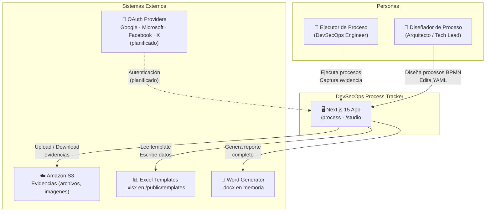

---

## 2. Arquitectura de Contenedores (C4 L2)

Unidades desplegables y su responsabilidad dentro del sistema.

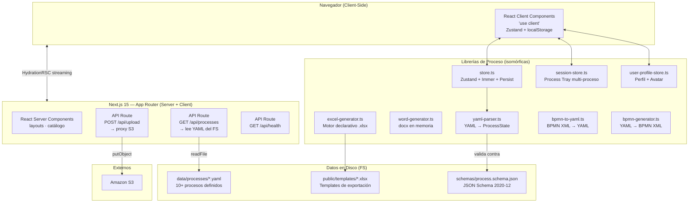

---

## 3. Capas de la Aplicación Next.js

Organización interna por responsabilidad dentro de `nextjs_space/`.

```mermaid
graph LR
    subgraph UI["🖼️ UI Layer — app/"]
        HOME["app/page.tsx\nHome · Catálogo"]
        PROC_PAGE["app/process/page.tsx\nEjecutor de Proceso"]
        STUDIO_PAGE["app/studio/page.tsx\nBPMN Studio"]
        COMP["app/process/_components/\ntask-card · phase-panel\nevidence-input · export-button"]
        STUDIO_COMP["app/studio/_components/\nbpmn-modeler · yaml-preview\nstudio-toolbar"]
    end

    subgraph STATE["⚙️ State Layer — lib/stores"]
        STORE_P["store.ts\nProcessStore (Zustand)"]
        STORE_S["session-store.ts\nSessionStore (Tray)"]
        STORE_U["user-profile-store.ts\nUserProfileStore"]
        STORE_C["config-store.ts\nConfigStore"]
    end

    subgraph LOGIC["🧠 Business Logic — lib/"]
        YAML_P["yaml-parser.ts"]
        WORD_G2["word-generator.ts"]
        EXCEL_G2["excel-generator.ts"]
        BPMN_L["bpmn-to-yaml.ts\nbpmn-generator.ts"]
        HELPERS["helpers.ts\nupdateProgress · blockedStatus"]
        MERGE["process-merge.ts\nextractProgress · mergeProgress"]
    end

    subgraph API_L["🔌 API Layer — app/api/"]
        API_P2["GET /api/processes"]
        API_U2["POST /api/upload"]
        API_H2["GET /api/health"]
    end

    subgraph INFRA["🏗️ Infrastructure — lib/infra"]
        PERSIST["persist-storage.ts\nLZ-compress + localStorage"]
        S3_L["s3.ts · aws-config.ts"]
        RATE["rate-limit.ts"]
        DB_L["db.ts · Prisma Client"]
    end

    UI --> STATE
    UI --> LOGIC
    UI --> API_L
    STATE --> LOGIC
    STATE --> INFRA
    API_L --> INFRA
    LOGIC --> INFRA
```

---

## 4. Jerarquía del Schema YAML

Estructura completa del archivo `.yaml` de proceso tal como lo parsea `yaml-parser.ts`.

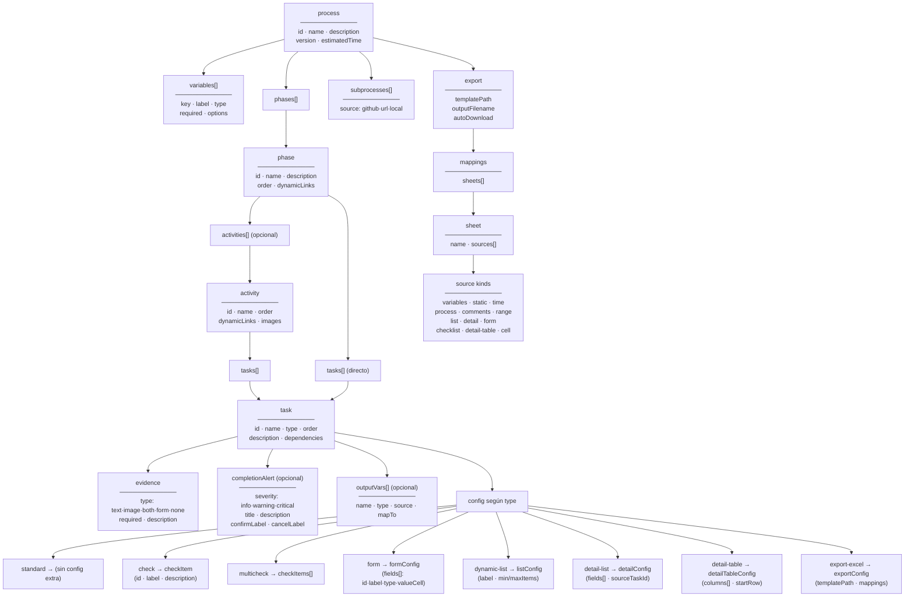

---

## 5. Modelo de Datos en Runtime (ProcessState)

Estructura en memoria que mantiene `store.ts` durante la ejecución de un proceso.

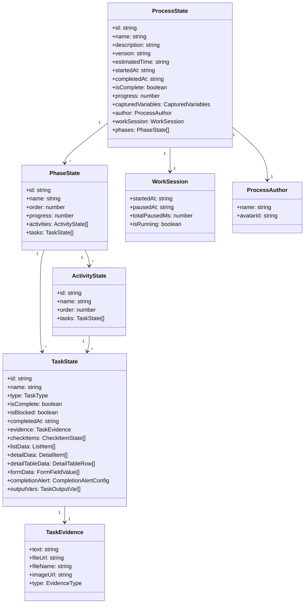

---

## 6. Arquitectura de Stores Zustand

Tres stores independientes con persistencia comprimida en `localStorage` y sus relaciones.

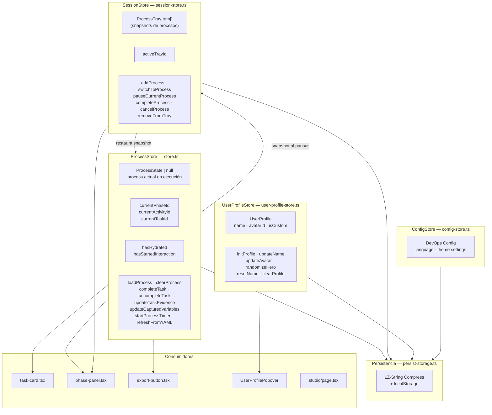

---

## 7. Máquina de Estados: Tarea

Ciclo de vida completo de una `TaskState` durante la ejecución de un proceso.

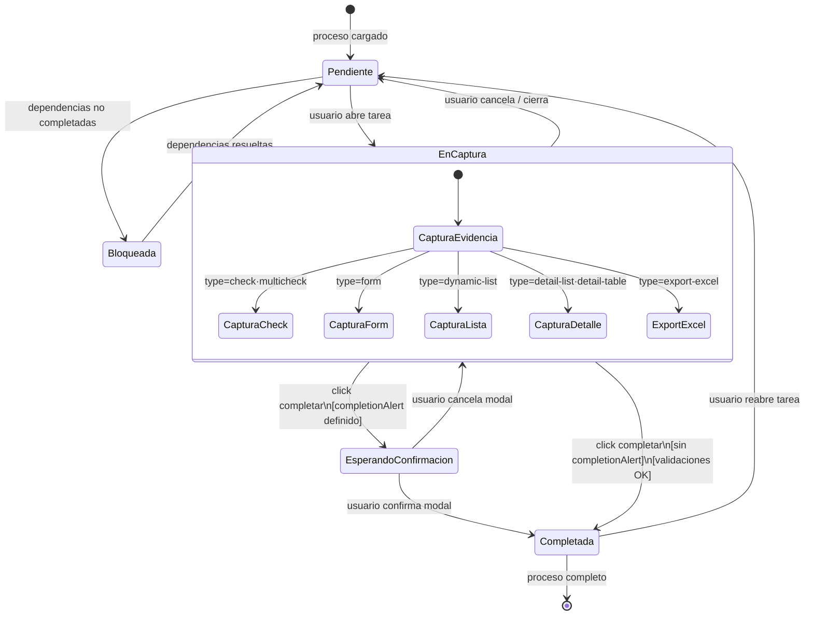

---

## 8. Máquina de Estados: Proceso (Tray)

Ciclo de vida de un proceso dentro del `SessionStore` (bandeja multi-proceso).

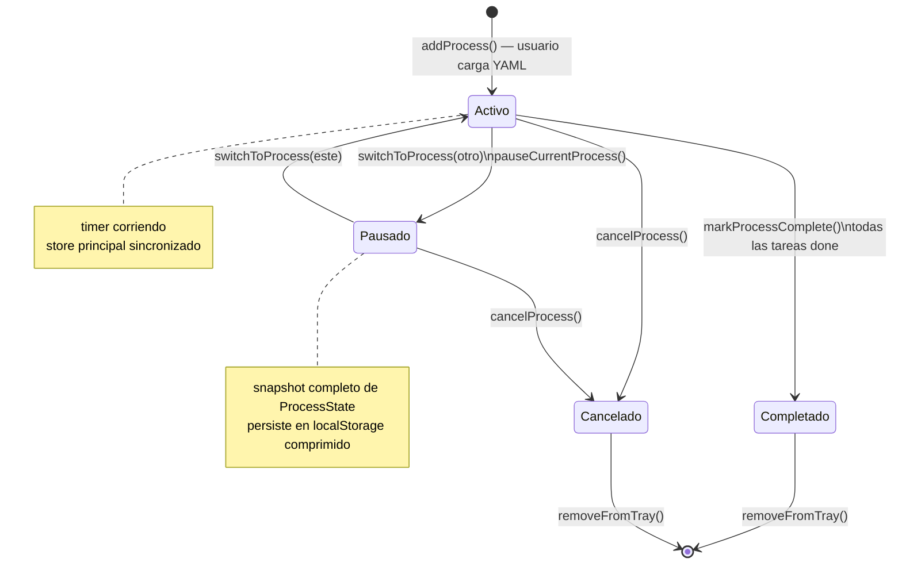

---

## 9. Flujo: Carga y Ejecución de Proceso

Secuencia completa desde que el usuario selecciona un proceso hasta que lo completa.

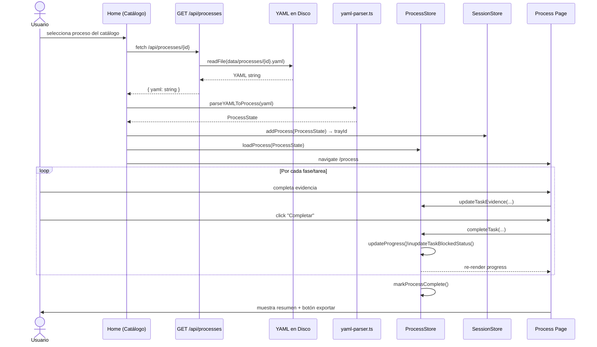

---

## 10. Flujo: Captura de Evidencia y Completado de Tarea

Detalle del proceso de completado con y sin `completionAlert`.

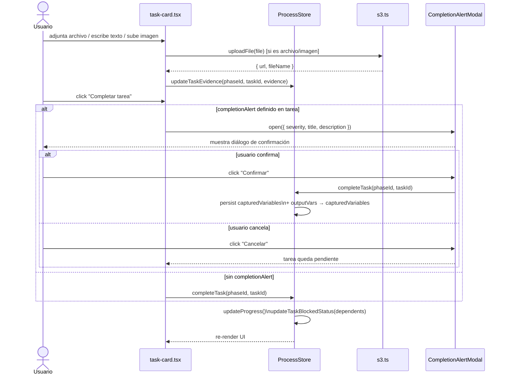

---

## 11. Flujo: BPMN Studio — Diseño Bidireccional

Cómo el editor BPMN y el preview YAML se mantienen sincronizados.

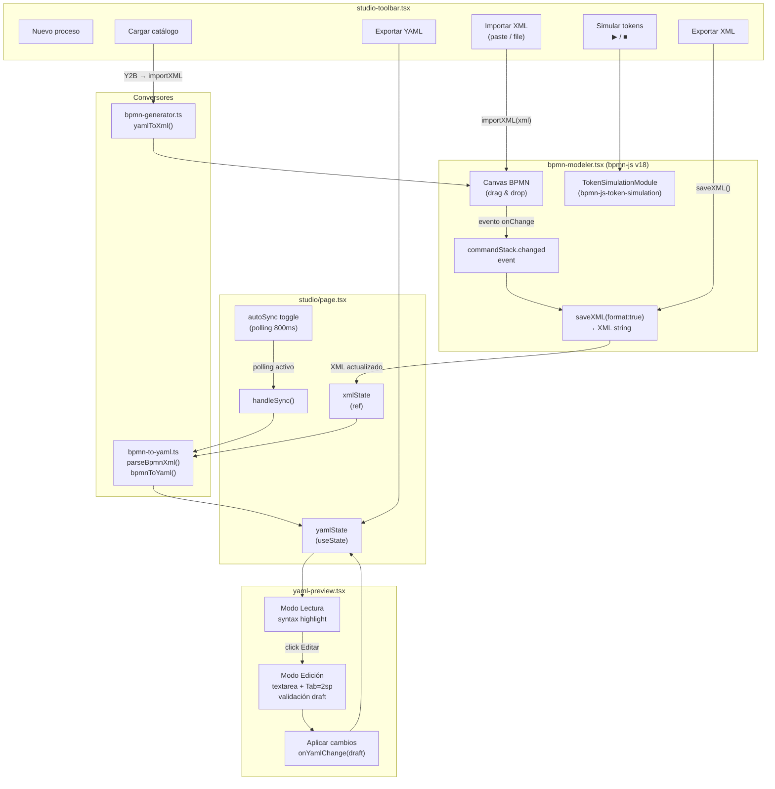

---

## 12. Pipeline de Exportación Excel

Motor declarativo `excel-generator.ts` que rellena un template `.xlsx` con datos del proceso.

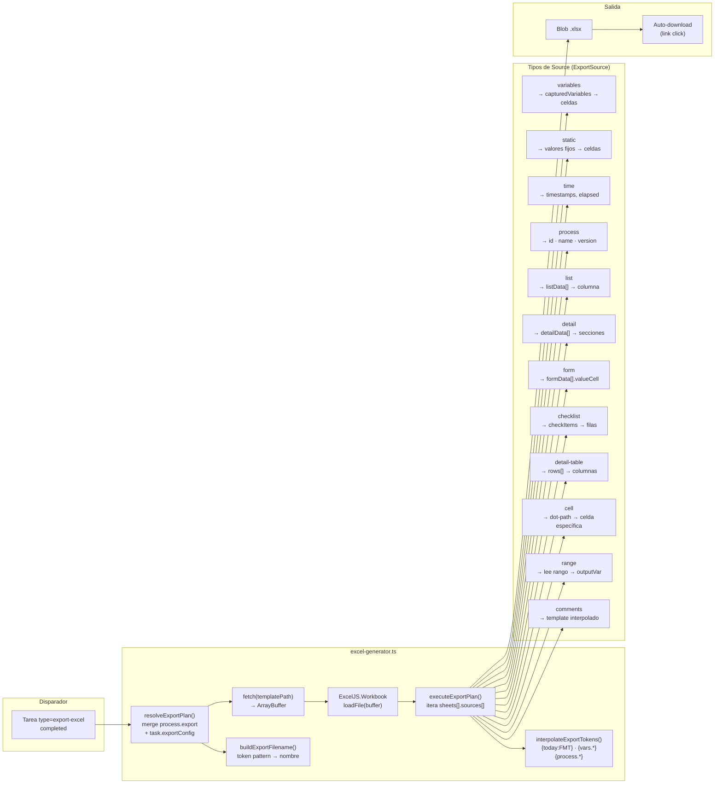

---

## 13. Pipeline de Exportación Word

Generación de documento `.docx` como reporte de auditoría del proceso completado.

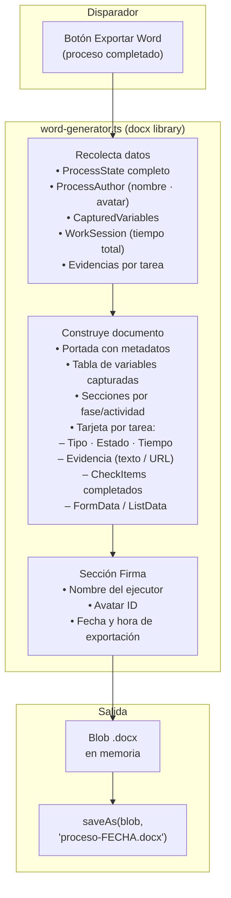

---

## 14. Tipos de Tarea y sus Configuraciones

Mapa de los 8 tipos de tarea YAML y qué datos producen / consumen.

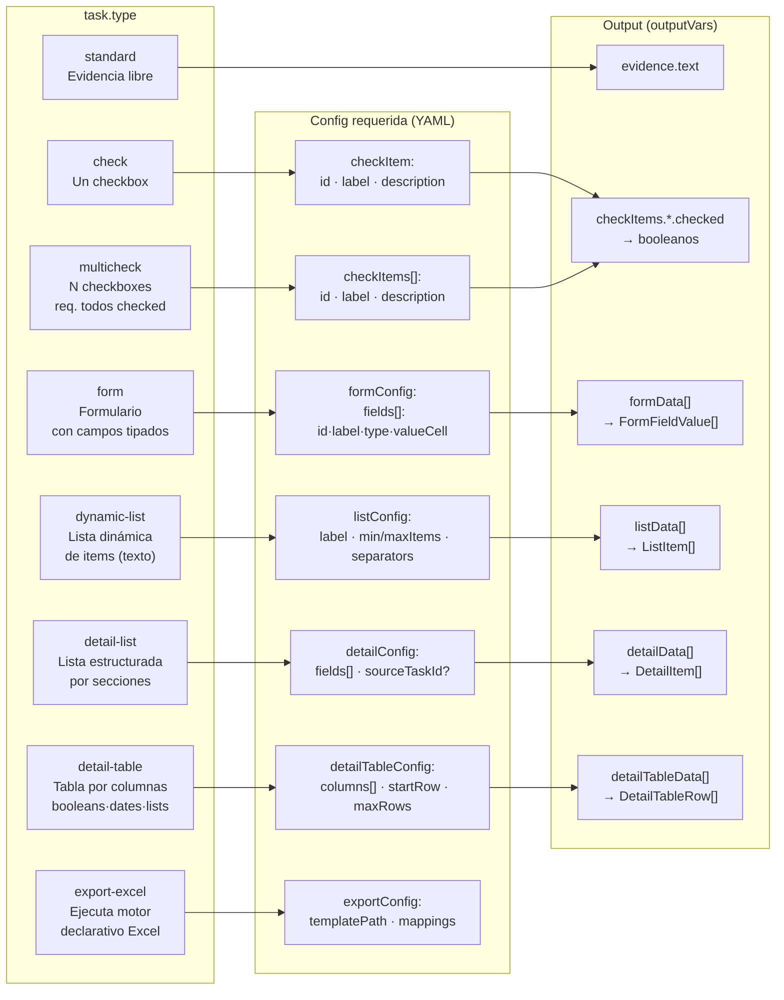

---

## 15. Flujo: Autenticación OAuth (Planificado)

Secuencia de autenticación con NextAuth.js v4 y sincronización con el store Zustand.

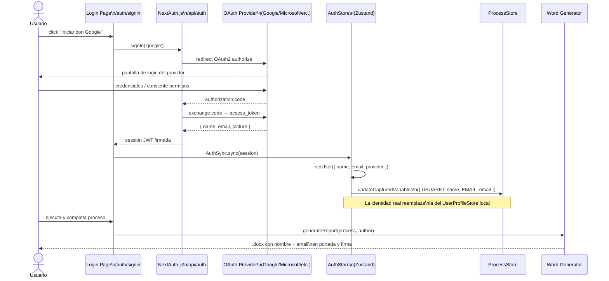

---

## 16. Arquitectura: Colaboración Multi-Usuario (Planificado)

Visión objetivo de la arquitectura con backend real para trabajo simultáneo.

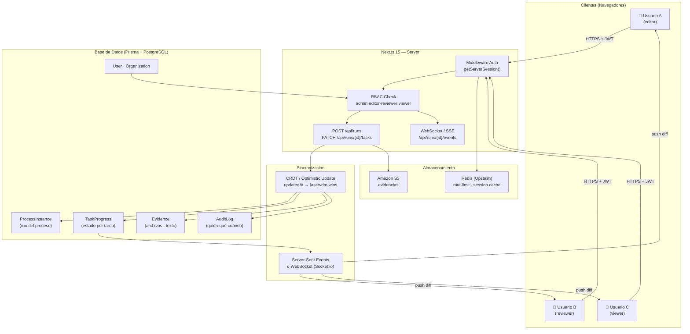

---

## 📎 Referencias

| Recurso | Descripción |
|---|---|
| [`README.features.md`](README.features.md) | Inventario de features con estado y esfuerzo |
| [`README.history.md`](README.history.md) | Historial completo de versiones |
| [`docs/features/`](docs/features/) | Documentos de diseño por feature |
| [`schemas/process.schema.json`](schemas/process.schema.json) | JSON Schema 2020-12 del YAML |
| [`nextjs_space/lib/types.ts`](nextjs_space/lib/types.ts) | Tipos TypeScript canónicos |

---

*Última actualización: 2026-06-02 · Versión actual: v3.0.3 · Diagramas generados con [Mermaid](https://mermaid.js.org)*
