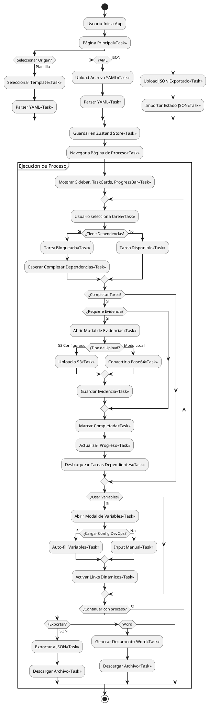
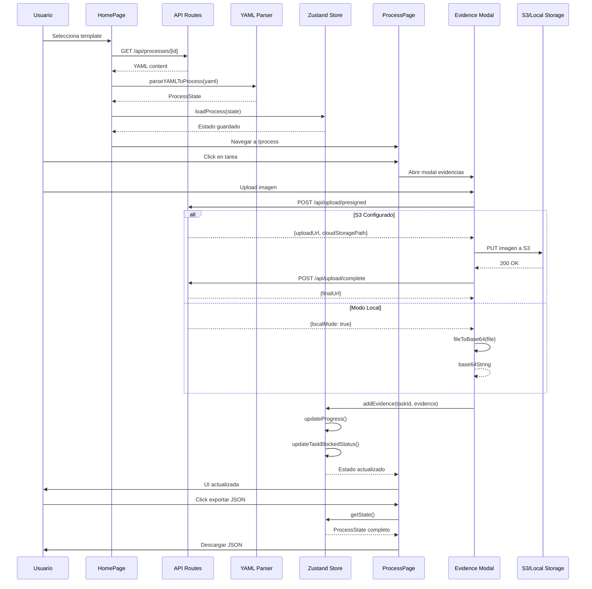

# DevSecOps Process Tracker

Aplicación web para gestión y seguimiento de procesos DevSecOps con soporte para evidencias, dependencias entre tareas, links dinámicos y exportación de resultados.

## 📊 Diagramas

### Flujo del Proceso de la Aplicación (BPMN)



### Arquitectura del Sistema (Diagrama de Componentes)

```plantuml
@startuml
!define COMPONENT_COLOR #60a5fa
!define STORAGE_COLOR #a78bfa
!define SERVICE_COLOR #34d399
!define TEST_COLOR #f472b6

skinparam component {
  BackgroundColor COMPONENT_COLOR
  BorderColor #1e40af
}

skinparam database {
  BackgroundColor STORAGE_COLOR
  BorderColor #6b21a8
}

package "Frontend Layer" {
  component "UI Components" as UI {
    [TaskCard]
    [ProcessSidebar]
    [EvidenceModal]
    [VariablesForm]
    [ConfigUpload]
    [ProgressBar]
  }
  
  component "Pages" as Pages {
    [HomePage]
    [ProcessPage]
  }
  
  component "Layouts" as Layouts {
    [RootLayout]
  }
}

package "State Management" {
  database "Zustand Store" as Store {
    + ProcessState
    + localStorage persistence
  }
  
  database "Config Store" as ConfigStore {
    + DevOps Configuration
  }
}

package "Business Logic (lib/)" {
  component "YAML Parser" as Parser {
    + parseYAMLToProcess()
  }
  
  component "Helpers" as Helpers {
    + calculateProgress()
    + checkDependencies()
    + validateEvidence()
  }
  
  component "JSON Utils" as JSONUtils {
    + importProcessFromJSON()
    + exportProcessToJSON()
  }
  
  component "Word Generator" as WordGen {
    + generateWordDocument()
  }
  
  component "S3 Utils" as S3Utils {
    + uploadToS3()
    + getPresignedUrl()
    + deleteFromS3()
  }
  
  component "i18n Context" as I18n {
    + ES/EN translations
  }
}

package "API Routes (app/api/)" {
  component "Process API" as ProcessAPI {
    GET /api/processes
    GET /api/processes/[id]
  }
  
  component "Upload API" as UploadAPI {
    POST /api/upload/presigned
    POST /api/upload/complete
    POST /api/upload/delete
  }
}

package "Data Sources" {
  database "YAML Templates" as Templates {
    it-security-audit.yaml
    devops-release.yaml
    incident-response.yaml
    devops-pipeline.yaml
    pull-request-validation.yaml
  }
  
  database "DevOps Config" as DevOpsConfigFile {
    devops-config.json
  }
}

package "External Services" <<Cloud>> {
  component "AWS S3" as S3 #SERVICE_COLOR {
    Image Storage
  }
  
  component "NextAuth" as Auth #SERVICE_COLOR {
    Authentication
  }
  
  database "Prisma + DB" as DB #SERVICE_COLOR {
    Persistence
  }
}

package "Testing" {
  component "Vitest" as Vitest #TEST_COLOR {
    51 unit tests
  }
  
  component "Playwright" as Playwright #TEST_COLOR {
    E2E tests
  }
}

' Frontend connections
Pages --> UI : uses
Layouts --> Pages : contains
UI --> Store : reads/writes
UI --> ConfigStore : reads/writes

' Business Logic connections
Pages --> Parser : uses
Pages --> Helpers : uses
Pages --> JSONUtils : uses
Pages --> WordGen : uses
Pages --> I18n : uses
UI --> S3Utils : uses

' API connections
Pages --> ProcessAPI : calls
Pages --> UploadAPI : calls
ProcessAPI --> Templates : reads
ConfigStore --> DevOpsConfigFile : loads
UploadAPI --> S3Utils : uses

' External Services (optional)
S3Utils ..> S3 : optional
S3Utils ..> "Base64\nLocal Storage" : fallback
Pages ..> Auth : optional
Store ..> DB : optional

' Testing connections
Vitest ..> Helpers : tests
Vitest ..> Parser : tests
Vitest ..> JSONUtils : tests
Playwright ..> Pages : tests
Playwright ..> UI : tests

note right of S3
  Servicios externos
  opcionales
end note

note bottom of Store
  Persistencia automática
  en localStorage
end note

@enduml
```

### Flujo de Datos



## 🚀 Stack Tecnológico

| Tecnología | Versión | Descripción |
|------------|---------|-------------|
| **Next.js** | 15.5.14 | Framework React con App Router |
| **TypeScript** | 5.2.2 | Tipado estático |
| **Tailwind CSS** | 3.3.3 + shadcn/ui | Estilos y componentes UI |
| **Zustand** | 5.0.12 | Estado global con persistencia localStorage |
| **Vitest** | 4.1.2 | Tests unitarios |
| **Playwright** | 1.40.0 | Tests E2E |
| **Vite** | 6.4.1 | Build tool y dev server para tests |
| **AWS SDK** | 3.1019.0 | Integración S3 (opcional) |
| **next-auth** | 4.24.13 | Autenticación (opcional) |
| **Prisma** | 6.7.0 | ORM para base de datos (opcional) |
| **js-yaml** | 4.1.1 | Parseo de YAML |
| **docx** | 9.6.1 | Generación de documentos Word |
| **Lucide React** | 0.446.0 | Iconos |
| **lodash** | 4.17.23 | Utilidades JavaScript |
| **webpack** | 5.105.4 | Bundler (usado por Next.js) |

## 📁 Estructura del Proyecto

```
nextjs_space/
├── app/                          # Next.js App Router
│   ├── page.tsx                 # Página principal - selección de plantillas
│   ├── layout.tsx               # Layout raíz con providers
│   ├── globals.css              # Estilos globales + Tailwind
│   ├── process/                 # Página de proceso activo
│   │   ├── page.tsx            # Vista principal del proceso
│   │   └── _components/        # Componentes específicos del proceso
│   │       ├── task-card.tsx       # Tarjeta de tarea individual
│   │       ├── process-sidebar.tsx # Sidebar de navegación de fases
│   │       ├── progress-bar.tsx    # Barra de progreso visual
│   │       ├── evidence-modal.tsx  # Modal de gestión de evidencias
│   │       ├── variables-form.tsx  # Formulario de variables dinámicas
│   │       ├── config-upload.tsx   # Upload de configuración DevOps
│   │       └── dynamic-link-button.tsx # Botones con URLs dinámicas
│   └── api/                     # API Routes (Next.js)
│       ├── processes/          # GET /api/processes - listar plantillas
│       │   └── [id]/          # GET /api/processes/[id] - detalle
│       └── upload/             # Gestión de uploads
│           ├── presigned/     # POST - URL prefirmada S3 o modo local
│           ├── complete/      # POST - URL final del archivo
│           └── delete/        # POST - eliminar de S3
│
├── components/                  # Componentes UI reutilizables (50+ de shadcn)
│   └── ui/                     # Botones, inputs, modals, etc.
│
├── lib/                         # Lógica de negocio central
│   ├── types.ts                # Tipos TypeScript principales
│   ├── store.ts                # Zustand store - proceso actual
│   ├── config-store.ts         # Zustand store - config DevOps
│   ├── helpers.ts              # Funciones: progreso, dependencias, validación
│   ├── yaml-parser.ts          # Parser YAML → ProcessState
│   ├── json-utils.ts           # Import/Export JSON con evidencias
│   ├── word-generator.ts       # Generador de documentos Word
│   ├── i18n-context.tsx        # Contexto de internacionalización (ES/EN)
│   ├── aws-config.ts           # Config AWS S3 (modo local si no hay credenciales)
│   ├── s3.ts                   # Utilidades S3 (upload, download, delete)
│   ├── config-loader.ts        # Carga y parseo de config DevOps
│   └── devops-config-types.ts  # Tipos para configuración DevOps
│
├── data/                        # Datos estáticos
│   ├── processes/              # Procesos YAML predefinidos
│   │   ├── index.json         # Catálogo: 5 plantillas
│   │   ├── it-security-audit.yaml      # 3 fases, 13 tareas
│   │   ├── devops-release.yaml         # 3 fases, 10 tareas
│   │   ├── incident-response.yaml        # 4 fases, 12 tareas
│   │   ├── devops-pipeline.yaml        # Con variables y links dinámicos
│   │   └── pull-request-validation.yaml # 6 fases, 21 tareas, 8 variables
│   └── devops-config.example.json      # Template de configuración
│
├── __tests__/                   # Tests
│   ├── unit/lib/               # Tests unitarios (51 tests)
│   │   ├── helpers.test.ts    # Progreso, dependencias, validación
│   │   ├── yaml-parser.test.ts # Parseo YAML
│   │   └── json-utils.test.ts  # Import/export JSON
│   ├── e2e/flows/              # Tests E2E con Playwright
│   │   ├── load-process.spec.ts    # Carga plantillas/YAML/JSON
│   │   ├── dependencies.spec.ts    # Flujo de dependencias
│   │   └── export-results.spec.ts  # Exportación JSON y Word
│   └── fixtures/               # Archivos de prueba
│       ├── simple-process.yaml
│       ├── complex-dependencies.yaml
│       ├── sample-export.json
│       └── invalid-yaml.yaml
│
├── prisma/
│   └── schema.prisma           # Schema opcional para persistencia
│
└── scripts/
    └── safe-seed.ts            # Seed de datos iniciales
```

## 🚀 Inicio Rápido

### Prerequisitos
- Node.js 20+
- npm 8+

### Instalación

```bash
# Entrar al directorio
cd nextjs_space

# Instalar dependencias
npm install

# Iniciar servidor de desarrollo
npm run dev
```

La aplicación estará disponible en `http://localhost:3000` (o `3001` si 3000 está ocupado).

## 🔧 Configuración

### Variables de Entorno (Opcional)

Crear `.env.local` para activar modo S3 (sin esto, usa base64 local):

```env
# AWS S3 Configuration
AWS_BUCKET_NAME=tu-bucket-s3
AWS_FOLDER_PREFIX=process-tracker/
AWS_REGION=us-east-1
AWS_ACCESS_KEY_ID=tu-access-key
AWS_SECRET_ACCESS_KEY=tu-secret-key

# Opcional: NextAuth
NEXTAUTH_SECRET=tu-secret
NEXTAUTH_URL=http://localhost:3000
```

**Sin configurar S3**: Las imágenes se convierten a base64 y se almacenan en localStorage.

### Configuración DevOps (JSON)

Template para autocompletado de variables:

```json
{
  "version": "1.0.0",
  "engineer": {
    "name": "Tu Nombre",
    "email": "tu.email@empresa.com"
  },
  "azureDevOps": {
    "organization": "mi-org",
    "projects": ["proyecto-1"],
    "repositories": ["backend-api"],
    "environments": ["dev", "staging", "prod"]
  },
  "aws": {
    "regions": ["us-east-1"],
    "clusters": [{"name": "eks-prod", "region": "us-east-1"}],
    "s3Buckets": ["artifacts"]
  },
  "defaults": {
    "project": "proyecto-1",
    "environment": "staging"
  }
}
```

## ✨ Funcionalidades Principales

### 1. Gestión de Procesos
- **5 Plantillas predefinidas**: Auditoría IT, DevOps Release, Incident Response, Pipeline DevOps, PR Validation
- **Carga YAML**: Importar procesos personalizados
- **Importación JSON**: Cargar estado guardado
- **Progreso visual**: Barras de progreso por fase y global

### 2. Sistema de Tareas
- **Fases organizadas**: Agrupación lógica de tareas
- **Dependencias**: Tareas bloqueadas hasta completar dependencias
- **Evidencias**: Soporte texto + imágenes (archivo o URL)
- **Estados**: Visualización de Completado/Pendiente/Bloqueado

### 3. Evidencias
| Tipo | Modo S3 | Modo Local |
|------|---------|------------|
| **Texto** | Guardado en JSON | Guardado en localStorage |
| **Imágenes archivo** | Upload a S3 | Conversión base64 |
| **Imágenes URL** | Descarga + S3 | Descarga + base64 |

**Ventaja modo local**: Funciona sin internet, sin costos AWS, portable.

### 4. Variables y Configuración
- **Variables dinámicas**: Definidas en YAML (texto, select, número)
- **Config DevOps**: JSON con datos de entornos, clusters, repositorios
- **Auto-fill**: Variables se completan automáticamente desde config
- **Links dinámicos**: URLs con variables interpoladas (ej: `https://github.com/{org}/{repo}`)

### 5. Exportación
- **JSON**: Estado completo con evidencias base64 (para reanudar)
- **Word**: Documento formal con portada, fases, tareas, evidencias

## 🧪 Testing

El proyecto tiene **51 tests unitarios** (100% pasando) y tests E2E con Playwright.

### Tests Unitarios (Vitest)

```bash
npm run test              # Modo watch interactivo
npm run test:run          # Ejecutar una vez
npm run test:coverage     # Con reporte de cobertura
```

**Cobertura de Tests**:
- ✅ **51 tests** pasando en 3 archivos
- Cálculo de progreso (`calculateTaskProgress`, `calculatePhaseProgress`, `calculateProcessProgress`)
- Gestión de dependencias (`checkTaskDependencies`, `updateTaskBlockedStatus`)
- Validación de evidencias (`validateTaskEvidence`, `canCompleteTask`)
- Parseo de YAML (`parseYAMLToProcess`) - 14 tests
- Import/Export JSON (`importProcessFromJSON`, `exportProcessToJSON`) - 6 tests
- Helpers de proceso (`updateProgress`) - 31 tests

**Ubicación**: `__tests__/unit/lib/`

### Tests E2E (Playwright)

#### Preparación
```bash
# Instalar navegadores de Playwright (solo primera vez)
npx playwright install chromium
```

#### Ejecución

**Opción A - Automático** (Playwright levanta el servidor):
```bash
npm run test:e2e          # Ejecutar todos los tests E2E
npm run test:e2e:ui       # Modo UI interactivo
```

**Opción B - Manual** (mejor para debugging):
```bash
# Terminal 1: Servidor de desarrollo
npm run dev

# Terminal 2: Ejecutar tests
npx playwright test --project=chromium
npx playwright test --headed              # Ver navegador
npx playwright test --ui                  # Modo UI
npx playwright test load-process          # Test específico
```

#### Flujos E2E Cubiertos

1. **Load Process** (`load-process.spec.ts`):
   - Carga desde plantillas predefinidas
   - Upload de archivos YAML
   - Importación de JSON exportado
   - Validación de errores en YAML inválido

2. **Dependencies** (`dependencies.spec.ts`):
   - Bloqueo de tareas con dependencias
   - Desbloqueo al completar dependencias
   - Cadenas de dependencias múltiples

3. **Export Results** (`export-results.spec.ts`):
   - Exportación a JSON con evidencias
   - Generación de documentos Word
   - Verificación de contenido exportado

#### Selectores data-testid

Componentes con selectores estables para tests:
- `app-header` - Header principal
- `process-template` - Cards de plantillas
- `process-sidebar` - Navegación de fases
- `task-card-{id}` - Tarjetas de tareas
- `task-checkbox` - Checkbox de completado
- `progress-bar` - Barra de progreso
- `export-json-btn`, `export-word-btn` - Botones de exportación

#### Reportes y Artefactos

- **HTML Report**: `playwright-report/index.html` (abrir en navegador)
- **JSON Results**: `test-results.json`
- **Screenshots**: `test-results/` (solo en fallos)
- **Videos**: `test-results/` (si está habilitado)

### Ejecutar Todos los Tests

```bash
npm run test:all          # Unitarios + E2E en secuencia
```

## 📚 Estructura de Procesos YAML

```yaml
process:
  id: example-process
  name: Ejemplo de Proceso
  description: Descripción
  version: "1.0.0"
  
  # Variables globales
  variables:
    - key: project
      label: Proyecto
      type: text          # text | select | number
      required: true
    - key: environment
      label: Ambiente
      type: select
      options: ["dev", "staging", "prod"]
  
  phases:
    - id: phase-1
      name: Fase Inicial
      order: 1
      
      # Links dinámicos a nivel de fase
      dynamicLinks:
        - label: "Dashboard"
          urlTemplate: "https://dash.com/{project}"
          behavior: click           # auto | click
          requiresVariables: ["project"]
      
      tasks:
        - id: task-1
          name: Primera Tarea
          order: 1
          evidence:
            type: both          # text | image | both
            required: true
          references:
            - text: "Documentación"
              url: "https://docs.example.com"
          
        - id: task-2
          name: Segunda Tarea
          order: 2
          dependencies: ["task-1"]    # Depende de task-1
          evidence:
            type: text
            required: false
```

### Tipos de Datos TypeScript

**ProcessState** - Estado completo del proceso:
```typescript
interface ProcessState {
  id: string;
  name: string;
  description: string;
  version: string;
  phases: PhaseState[];
  progress: number;              # 0.0 - 1.0
  variableDefinitions: ProcessVariableYAML[];
  capturedVariables: Record<string, string>;
  loadedAt?: string;
  exportedAt?: string;
  completedAt?: string;
}
```

**TaskState** - Tarea individual:
```typescript
interface TaskState {
  id: string;
  name: string;
  description: string;
  completed: boolean;
  completedAt?: string;
  evidenceConfig: { type: 'text' | 'image' | 'both'; required: boolean };
  evidence?: { text?: string; images?: EvidenceImage[] };
  dependencies: string[];          # IDs de tareas requeridas
  isBlocked?: boolean;             # Calculado automáticamente
  dynamicLinks?: DynamicLink[];
}
```

**EvidenceImage** - Imagen de evidencia:
```typescript
interface EvidenceImage {
  id: string;
  name: string;
  cloudStoragePath?: string;     # Solo modo S3
  url: string;                   # URL S3 o data URL base64
  isPublic: boolean;
  source: 'file' | 'url';
  originalUrl?: string;          # Para imágenes de URL
  uploadedAt: string;
}
```

## 🔌 API Routes

### GET /api/processes
Retorna catálogo de plantillas disponibles.

**Response**:
```json
{
  "processes": [
    {
      "id": "it-security-audit",
      "name": "Auditoría de Seguridad IT",
      "description": "Proceso completo de auditoría...",
      "category": "security",
      "icon": "shield",
      "file": "it-security-audit.yaml",
      "version": "1.0.0"
    }
  ]
}
```

### GET /api/processes/[id]
Retorna contenido YAML de un proceso específico.

### POST /api/upload/presigned
Genera URL prefirmada para S3 o indica modo local.

**Request**:
```json
{
  "fileName": "imagen.jpg",
  "contentType": "image/jpeg",
  "isPublic": false
}
```

**Response Modo S3**:
```json
{
  "uploadUrl": "https://s3.amazonaws.com/...",
  "cloudStoragePath": "uploads/1234567890-imagen.jpg"
}
```

**Response Modo Local**:
```json
{
  "localMode": true,
  "fileName": "imagen.jpg",
  "contentType": "image/jpeg"
}
```

## 🧩 Componentes UI Principales

### TaskCard
```typescript
interface TaskCardProps {
  task: TaskState;
  phaseId: string;
  onOpenEvidence: () => void;
}
```
- Checkbox de completado (deshabilitado si bloqueado)
- Badge de evidencias (texto/imagen)
- Icono de bloqueo si tiene dependencias
- Botón "Ver Detalles" para evidencias

### EvidenceModal
Modal de gestión de evidencias:
- **Tab Texto**: Textarea para notas
- **Tab Imágenes**: 
  - Upload drag & drop de archivos
  - Input URL para imágenes externas
  - Grid de previews con botón eliminar
- Conversión automática a base64 en modo local

### ProcessSidebar
Sidebar izquierdo:
- Lista de fases con badge de progreso
- Navegación por click
- Resumen de tareas completadas/total

### VariablesForm
Formulario dinámico:
- Generado desde `variableDefinitions`
- Soporte: text, select, number
- Validación de requeridos
- Botón "Auto-fill" desde config DevOps

### ConfigUpload
Upload de configuración:
- Drag & drop de JSON
- Validación de estructura
- Template generator basado en variables del proceso

## 🛠️ Desarrollo

### Comandos Disponibles

```bash
# Instalación
npm install              # Instalar todas las dependencias

# Desarrollo
npm run dev              # Servidor en localhost:3000 (o 3001)
npm run build            # Build de producción
npm run start            # Ejecutar build de producción
npm run lint             # Linting con ESLint

# Testing
npm run test             # Tests unitarios (modo watch)
npm run test:run         # Tests unitarios (una vez)
npm run test:coverage    # Tests con cobertura
npm run test:e2e         # Tests E2E con Playwright
npm run test:e2e:ui      # Tests E2E en modo UI
npm run test:all         # Todos los tests (unitarios + E2E)
```

### Scripts de Desarrollo

- **dev**: Inicia servidor de desarrollo con hot-reload
- **build**: Genera build optimizado para producción
- **start**: Ejecuta la aplicación en modo producción
- **lint**: Verifica código con ESLint
- **test**: Ejecuta Vitest en modo watch
- **test:run**: Ejecuta tests unitarios una sola vez
- **test:coverage**: Genera reporte de cobertura de código
- **test:e2e**: Ejecuta tests E2E (levanta servidor automáticamente)
- **test:e2e:ui**: Abre interfaz interactiva de Playwright
- **test:all**: Ejecuta todos los tests en secuencia

### Estructura de Desarrollo

```bash
# Workflow típico de desarrollo
1. npm install           # Instalar dependencias
2. npm run dev           # Levantar servidor
3. npm run test          # Tests en modo watch (opcional)
4. npm run build         # Verificar build antes de commit
5. npm run test:all      # Ejecutar todos los tests
```

## 🐳 Docker

```bash
# Construir y ejecutar
docker-compose up --build

# Acceder en http://localhost:3000
```

## 📊 Historial de Cambios

| Fecha | Versión | Descripción |
|-------|---------|-------------|
| 2026-03-29 | 1.5.0 | Tests E2E con Playwright, modo local base64 para imágenes, 0 vulnerabilidades, actualización Next.js 15.5.14 |
| 2026-03-27 | 1.4.1 | Generación automática de template JSON basado en variables |
| 2026-03-27 | 1.4.0 | Configuración DevOps con auto-fill de variables |
| 2026-03-27 | 1.3.0 | Nuevo proceso `pull-request-validation.yaml` (6 fases, 21 tareas) |
| 2026-03-27 | 1.2.0 | Variables de proceso y links dinámicos parametrizables |
| 2026-03-27 | 1.1.0 | Procesos precargados, API `/api/processes` |
| 2026-03-01 | 1.0.0 | Versión inicial con carga YAML/JSON, evidencias, exportación Word |

## 📄 Licencia

MIT License - Libre para uso educativo y comercial.

---

**DevSecOps Process Tracker** © 2026 - Desarrollado por **Harold Adrian** con ❤️ usando Next.js y TypeScript
