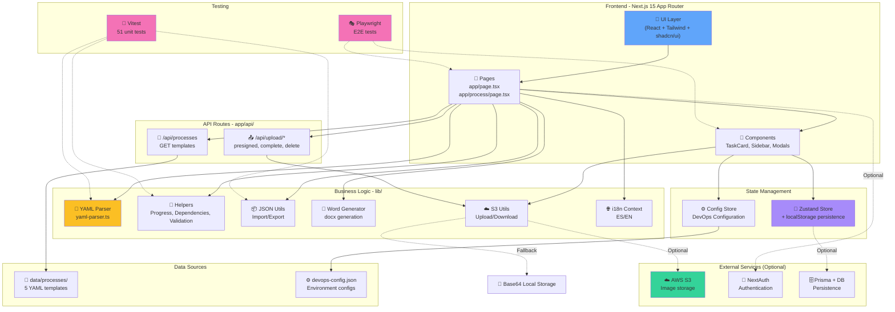

# Arquitectura del Sistema

Este diagrama representa la arquitectura completa de la aplicación, mostrando las diferentes capas, componentes y sus interacciones.

## Descripción

La aplicación está construida con una arquitectura en capas que separa claramente las responsabilidades:

### Capas Principales

1. **Frontend Layer**: Interfaz de usuario construida con Next.js 15, React y Tailwind CSS
2. **State Management**: Gestión de estado global con Zustand y persistencia en localStorage
3. **Business Logic**: Lógica de negocio modular en la carpeta `lib/`
4. **API Routes**: Endpoints REST para operaciones del servidor
5. **Data Sources**: Plantillas YAML y configuraciones DevOps
6. **External Services**: Servicios opcionales (S3, NextAuth, Prisma)
7. **Testing**: Suite de pruebas con Vitest y Playwright

### Características Arquitectónicas

- **Separación de responsabilidades**: Cada capa tiene un propósito específico
- **Modularidad**: Componentes reutilizables y desacoplados
- **Persistencia dual**: localStorage para estado + opcional DB con Prisma
- **Storage flexible**: S3 para producción, Base64 local para desarrollo
- **Testing completo**: 51 tests unitarios + E2E con Playwright

## Diagrama

## Componentes Detallados

### Frontend Layer
- **UI Components**: TaskCard, ProcessSidebar, EvidenceModal, VariablesForm, ConfigUpload, ProgressBar
- **Pages**: HomePage (selección de templates), ProcessPage (ejecución de proceso)
- **Layouts**: RootLayout con providers y configuración global

### State Management
- **Zustand Store**: Estado global del proceso activo con persistencia automática
- **Config Store**: Configuración DevOps para auto-completado de variables

### Business Logic
- **YAML Parser**: Convierte definiciones YAML a objetos ProcessState
- **Helpers**: Cálculo de progreso, validación de dependencias, validación de evidencias
- **JSON Utils**: Importación/exportación de procesos completos
- **Word Generator**: Generación de documentos Word con resultados
- **S3 Utils**: Gestión de uploads a S3 con presigned URLs
- **i18n Context**: Soporte multiidioma (ES/EN)

### API Routes
- **Process API**: `GET /api/processes` (lista templates), `GET /api/processes/[id]` (obtener YAML)
- **Upload API**: `POST /api/upload/presigned`, `POST /api/upload/complete`, `POST /api/upload/delete`

### Data Sources
- **Templates**: 5 procesos YAML predefinidos (IT Security, DevOps Release, Incident Response, etc.)
- **DevOps Config**: Archivo JSON con configuraciones de entornos

### External Services (Opcionales)
- **AWS S3**: Almacenamiento de imágenes en producción
- **NextAuth**: Sistema de autenticación
- **Prisma + DB**: Persistencia en base de datos

### Testing
- **Vitest**: 51 tests unitarios cubriendo helpers, parsers y utils
- **Playwright**: Tests E2E para flujos completos de usuario

## Patrones de Diseño

- **Repository Pattern**: Separación de lógica de datos (API Routes)
- **Service Layer**: Business logic encapsulada en `lib/`
- **Component Composition**: UI construida con componentes reutilizables
- **State Management Pattern**: Zustand para estado global reactivo
- **Adapter Pattern**: S3Utils con fallback a Base64 local
