# Arquitectura del Sistema

> Última revisión: 2026-04-21 · sincronizado con `develop`

Este diagrama representa la arquitectura del tracker DevSecOps, mostrando capas, módulos y sus interacciones reales según el código actual.

## Resumen técnico

- **Framework**: Next.js 16.2 (App Router, Turbopack) + React 18.3 + TypeScript 5.2
- **UI**: Tailwind CSS 3.3 + shadcn/ui (Radix primitives) + Lucide icons + Framer Motion
- **Estado**: Zustand 5 (5 stores con persistencia selectiva + LZ-string compression)
- **Formularios**: React Hook Form + Zod/Yup/Formik (según componente)
- **Generación**: `exceljs`, `docx`, `bpmn-js` (vista BPMN 2.0)
- **Almacenamiento de evidencias**: AWS S3 (presigned URLs) o Azure Blob, con fallback Base64 local
- **Testing**: Vitest 4 (529+ tests unitarios) + Playwright (E2E)
- **Validación**: JSON Schema (`schemas/process.schema.json`) + parser custom con invariantes cruzadas
- **i18n**: ES / EN vía `lib/i18n-context.tsx`

## Capas principales

1. **UI Layer** — App Router de Next.js, páginas server-first con componentes `'use client'` donde aplica. shadcn/ui como sistema de diseño.
2. **State Management** — Cinco stores Zustand con responsabilidades separadas:
   - `store.ts` — proceso activo (tareas, fases, actividades, timer, variables).
   - `session-store.ts` — bandeja multi-proceso (N procesos en paralelo con estados active/paused/completed/cancelled).
   - `config-store.ts` — configuración DevOps cargada desde JSON.
   - `loading-store.ts` — operaciones async globales (spinners coordinados).
   - `user-profile-store.ts` — identidad del operador para trazabilidad.
3. **Business Logic (`lib/`)** — 29 módulos, puros y testables.
4. **API Routes (`app/api/`)** — endpoints REST con rate-limit + validación Zod.
5. **Data Sources** — 7 plantillas YAML en `data/processes/`, schema JSON en `schemas/`.
6. **External Services** — S3/Azure opcionales, NextAuth + Prisma opcionales.
7. **Testing** — Vitest (unit) + Playwright (E2E) + validación contínua del schema.

## Diagrama

```mermaid
graph TB
    subgraph "Frontend — Next.js 16 App Router"
      UI["UI Layer<br/>shadcn/ui + Tailwind + Lucide"]
      Pages["Pages<br/>app/page.tsx · app/process/page.tsx"]
      ComponentsGlobal["Global Components<br/>CommandPalette · ProcessTabs · ProcessTray<br/>UserProfile · ThemeToggle · ErrorBoundary"]
      ComponentsProcess["Process Components<br/>TaskCard · ActivityCard · ProcessSidebar<br/>EvidenceModal · VariablesForm · ConfigUpload<br/>FormRenderer · DynamicListInput · DetailListInput<br/>DynamicLinkButton · CompletionAlertDialog<br/>ProcessTimer · BpmnViewer · ProgressBar"]
    end

    subgraph "State Management — Zustand"
      ProcessStore["ProcessStore<br/>(active process + timer)"]
      SessionStore["SessionStore<br/>(multi-process tray)"]
      ConfigStore["ConfigStore<br/>(DevOps config)"]
      LoadingStore["LoadingStore"]
      UserProfileStore["UserProfileStore"]
      PersistStorage["persist-storage<br/>LZ-string compression"]
    end

    subgraph "Business Logic — lib/"
      Parser["yaml-parser<br/>YAML → ProcessState"]
      Helpers["helpers<br/>progress · dependencies · validation"]
      JSONUtils["json-utils<br/>import/export JSON"]
      WordGen["word-generator<br/>DOCX"]
      ExcelGen["excel-generator<br/>declarative export plan"]
      ExcelHelper["excel-template-helper"]
      BpmnGen["bpmn-generator<br/>BPMN 2.0 XML"]
      SubprocessLoader["subprocess-loader<br/>github · url · local"]
      ConfigLoader["config-loader"]
      AlertFeedback["alert-feedback<br/>severity styles + reduced motion"]
      Sanitize["sanitize<br/>text/URL hardening"]
      Errors["errors<br/>typed error classes"]
      OptimisticUpdates["optimistic-updates"]
      I18n["i18n-context"]
      S3Utils["s3 / aws-config"]
      ApiSchemas["api-schemas<br/>Zod for API"]
      RateLimit["rate-limit"]
    end

    subgraph "API Routes — app/api/"
      HealthAPI["/api/health"]
      ProcessAPI["/api/processes<br/>GET list · GET by id"]
      UploadAPI["/api/upload/*<br/>presigned · complete · delete"]
    end

    subgraph "Data Sources"
      Templates["data/processes/<br/>7 YAML templates + index.json"]
      DevOpsConfig["devops-config.json"]
      Schema["schemas/process.schema.json"]
    end

    subgraph "External Services (optional)"
      S3["AWS S3 / Azure Blob"]
      Auth["NextAuth"]
      DB["Prisma + DB"]
    end

    subgraph "Testing"
      Vitest["Vitest<br/>529+ unit tests"]
      Playwright["Playwright<br/>E2E"]
      SchemaCI["validate:processes<br/>Ajv + schema"]
    end

    UI --> Pages
    Pages --> ComponentsGlobal
    Pages --> ComponentsProcess

    ComponentsProcess --> ProcessStore
    ComponentsGlobal --> SessionStore
    ComponentsProcess --> ConfigStore
    ComponentsProcess --> LoadingStore
    ComponentsGlobal --> UserProfileStore
    ProcessStore --- PersistStorage
    SessionStore --- PersistStorage

    Pages --> Parser
    Pages --> JSONUtils
    Pages --> WordGen
    Pages --> ExcelGen
    Pages --> BpmnGen
    Pages --> SubprocessLoader
    Pages --> I18n

    ComponentsProcess --> Helpers
    ComponentsProcess --> AlertFeedback
    ComponentsProcess --> Sanitize
    ComponentsProcess --> OptimisticUpdates
    ComponentsProcess --> S3Utils
    ExcelGen --> ExcelHelper
    Parser --> Schema

    Pages --> ProcessAPI
    Pages --> UploadAPI
    ProcessAPI --> ApiSchemas
    UploadAPI --> ApiSchemas
    ProcessAPI --> RateLimit
    UploadAPI --> RateLimit
    ProcessAPI --> Errors
    UploadAPI --> Errors

    ProcessAPI --> Templates
    ConfigStore --> ConfigLoader
    ConfigLoader --> DevOpsConfig
    UploadAPI --> S3Utils
    S3Utils -.->|optional| S3
    S3Utils -.->|fallback| LocalBase64["Base64 local"]

    Pages -.->|optional| Auth
    ProcessStore -.->|optional| DB

    Vitest -.-> Helpers
    Vitest -.-> Parser
    Vitest -.-> JSONUtils
    Vitest -.-> ExcelGen
    Vitest -.-> BpmnGen
    Vitest -.-> AlertFeedback
    SchemaCI -.-> Templates
    SchemaCI -.-> Schema
    Playwright -.-> Pages
    Playwright -.-> ComponentsProcess

    style UI fill:#60a5fa
    style ProcessStore fill:#a78bfa
    style SessionStore fill:#a78bfa
    style Parser fill:#fbbf24
    style BpmnGen fill:#fbbf24
    style ExcelGen fill:#fbbf24
    style S3 fill:#34d399
    style Vitest fill:#f472b6
    style Playwright fill:#f472b6
    style SchemaCI fill:#f472b6
```

## Componentes detallados

### UI global (`components/`)

- **shadcn/ui** (`components/ui/*`): 49 componentes Radix-based (dialog, alert-dialog, select, popover, command, etc.).
- **CommandPalette** + **GlobalCommandPalette**: navegación por teclado entre procesos, fases y tareas.
- **ProcessTabs** + **ProcessTray**: UI de bandeja multi-proceso (cambio entre procesos paralelos).
- **UserProfilePopover** + **Avatars**: identidad del operador persistida.
- **VirtualizedTaskList**: virtualización para fases con muchas tareas (`@tanstack/react-virtual`).
- **ErrorBoundary**, **ThemeToggle** (`next-themes`), **ToastProvider** (`sonner`), **GlobalProgressIndicator**.

### Componentes de proceso (`app/process/_components/`)

- **TaskCard**: renderizado por tipo de tarea (`standard`, `check`, `multicheck`, `export-excel`, `dynamic-list`, `detail-list`, `form`). Gate opcional `CompletionAlertDialog` antes de finalizar.
- **ActivityCard**: nivel intermedio entre fase y tarea (agrupación lógica).
- **ProcessSidebar**: navegación jerárquica Phase → Activity → Task, con estados.
- **ProcessTimer**: tiempo transcurrido, start/pause/resume/stop, comparación con `estimatedTime`.
- **EvidenceModal**: captura de evidencia texto/imágenes/ambas, con S3 o Base64.
- **VariablesForm** + **ConfigUpload**: captura de variables del proceso + auto-fill desde `devops-config.json`.
- **FormRenderer** + **FormInput**: sub-formularios dentro de tareas tipo `form`.
- **DynamicListInput** + **DetailListInput**: tareas de listas con items y detalles correlacionados.
- **DynamicLinkButton**: links con templates `{variable}` resueltos en runtime.
- **BpmnViewer**: vista BPMN 2.0 del proceso con navegación click-a-tarea.
- **CompletionAlertDialog**: confirmación modal opcional antes de marcar una tarea como completada (severity info/warning/critical).

### State management

- **ProcessStore** (`lib/store.ts`): proceso activo. Actions clave: `loadProcess`, `completeTask`/`uncompleteTask`, `toggleCheckItem`, `updateListData`/`updateDetailData`/`updateFormData`, `updateCapturedVariables`, `updateTaskEvidence`, `markProcessComplete` y controles del timer.
- **SessionStore** (`lib/session-store.ts`): bandeja de N procesos simultáneos, snapshot + restore al cambiar entre ellos.
- **ConfigStore** (`lib/config-store.ts`): configuración DevOps cargada de JSON.
- **LoadingStore** (`lib/loading-store.ts`): coordinación de spinners async por `operationId`.
- **UserProfileStore** (`lib/user-profile-store.ts`): datos del operador para metadata de exports.
- **Persistencia** (`lib/persist-storage.ts`): wrapper Zustand con LZ-string compression para no saturar localStorage.

### Business logic (`lib/`)

- **`yaml-parser.ts`**: YAML → `ProcessState`. Valida invariantes cruzadas (referencias, cellRefs, export plan, severidades de alerta).
- **`helpers.ts`**: `canCompleteTask`, `checkTaskDependencies`, `calculateProgress`, `updateTaskBlockedStatus`, `getAllDependentTasks`.
- **`json-utils.ts`**: import/export del estado completo con round-trip seguro.
- **`word-generator.ts`**: DOCX con ACL de secciones y referencias.
- **`excel-generator.ts`**: motor **declarativo** — resuelve un `ProcessExportConfig` combinando `process.export` y `task.exportConfig` (con `inherit`). Aplica mappings estáticos, variables, task sources (`list` / `detail` / `form` / `checklist`), evidencias e interpolación de tokens (`{today:FMT}`, `{vars.xxx}`, `{process.name}`).
- **`excel-template-helper.ts`**: helpers de template (fetch, integridad sha256, filename).
- **`bpmn-generator.ts`**: genera XML BPMN 2.0 desde el proceso; soporta exclusive gateway para futuras decisiones.
- **`subprocess-loader.ts`**: carga subprocesos desde GitHub (tag/branch), URL o path local; merge en el proceso padre.
- **`alert-feedback.ts`**: fuente única de verdad para estilos por severidad + hook `useReducedMotion` (WCAG 1.4.1).
- **`sanitize.ts`**: endurecimiento de texto y URLs antes de render.
- **`errors.ts`**: clases tipadas para errores de API.
- **`api-schemas.ts`** + **`rate-limit.ts`**: validación Zod y rate limit por route/bucket.
- **`optimistic-updates.ts`**: patrón para actualizaciones optimistas sobre el store.
- **`config-loader.ts`** + **`devops-config-types.ts`**: parsing y typing de `devops-config.json`.
- **`i18n-context.tsx`**: strings ES/EN.
- **`s3.ts`** + **`aws-config.ts`**: firma/upload a S3.

### API Routes

- `GET /api/health` — healthcheck simple.
- `GET /api/processes` — lista plantillas desde `index.json`.
- `GET /api/processes/[id]` — contenido YAML por id (validado con Zod + rate-limit).
- `POST /api/upload/presigned` · `POST /api/upload/complete` · `POST /api/upload/delete` — ciclo de upload a S3/Azure con presigned URLs.

Todos los endpoints aplican `withRateLimit` (buckets: `upload`, `strict`, default) y `validateSchema` antes de ejecutar la lógica.

### Data sources

- **Templates YAML** (7): `devops-pipeline`, `devops-release`, `incident-response`, `it-security-audit`, `pull-request-validation`, `release-checklist`, `index.json`.
- **Schema**: `schemas/process.schema.json` validado en CI y por el parser.
- **DevOps config**: `data/devops-config.json`.

### Testing

- **Vitest**: 529+ tests unitarios cubren parser, helpers, stores, generadores, sanitize y componentes clave.
- **Playwright**: escenarios E2E (carga, completar tarea, evidencia, export).
- **Validación de schema**: `npm run validate:processes` (Ajv) ejecuta contra las 10 fixtures + plantillas en cada PR.

## Patrones de diseño

- **Single source of truth por preocupación**: un store por dominio, no un megastore.
- **Declarative over imperative**: export Excel se describe en YAML (`process.export.mappings`), no en código.
- **Discriminated unions** (`ExportTaskSource.kind`, `TaskYAML.type`) con validación en runtime.
- **Schema-first**: el JSON Schema es contrato público, validado en CI y snippets de VS Code.
- **Adapter pattern**: S3/Azure/Base64 intercambiables vía `s3.ts` + `aws-config.ts`.
- **Fallbacks seguros**: sin S3 → Base64; sin config DevOps → input manual; sin auth → flujo local.
