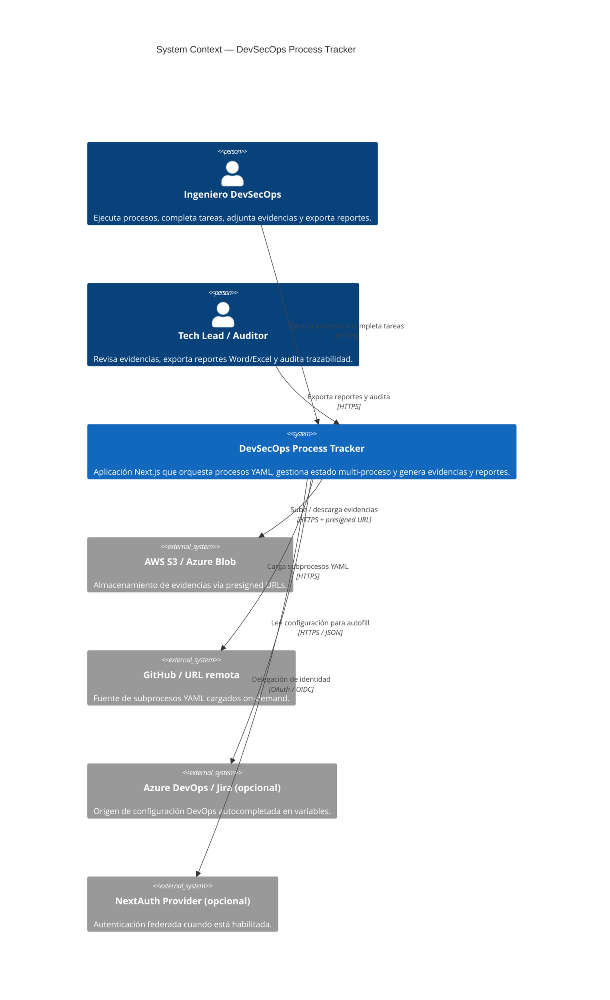
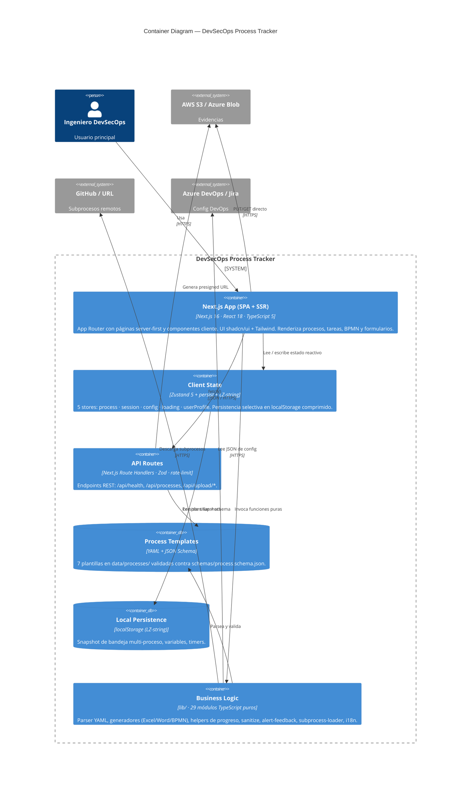
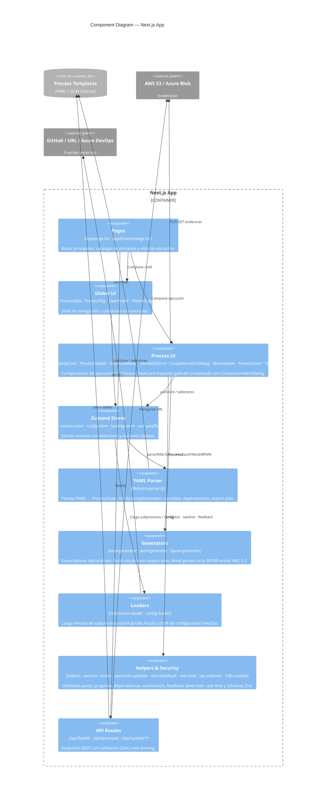

# Modelo C4 — DevSecOps Process Tracker

> Última revisión: 2026-04-21 · sincronizado con `develop`

Este documento describe la arquitectura del tracker siguiendo el [modelo C4](https://c4model.com/) de Simon Brown, con tres niveles de abstracción: **Context**, **Container** y **Component**. Los diagramas están codificados en Mermaid para integrarse con el resto de la documentación (`arquitectura-sistema.md`, `flujo-proceso.md`, `flujo-datos.md`).

---

## Nivel 1 — System Context

Visión general del sistema desde la perspectiva de sus usuarios y los sistemas externos con los que interactúa.

---

## Nivel 2 — Containers

Despliegue lógico del sistema: procesos, almacenes y servicios que componen el tracker.

---

## Nivel 3 — Components (Next.js App)

Detalle de los componentes dentro del container **Next.js App**, agrupados por responsabilidad.

---

## Notas de lectura

- **Context** responde *¿quién usa el sistema y con qué se integra?*
- **Container** responde *¿qué piezas desplegables lo componen?*
- **Component** responde *¿cómo se organiza internamente la SPA?*
- El **nivel 4 (Code)** se omite intencionalmente: los diagramas UML de clases suelen quedar obsoletos; en su lugar, consúltese el código en `nextjs_space/lib/` y `nextjs_space/app/`, cubierto por 529+ tests unitarios.

## Referencias cruzadas

- Arquitectura detallada: [`arquitectura-sistema.md`](./arquitectura-sistema.md)
- Flujo de proceso end-to-end: [`flujo-proceso.md`](./flujo-proceso.md)
- Secuencias de datos: [`flujo-datos.md`](./flujo-datos.md)
- Schema YAML: [`../../schemas/process.schema.json`](../../schemas/process.schema.json)
- Guía de procesos YAML: [`../../README.process.md`](../../README.process.md)
