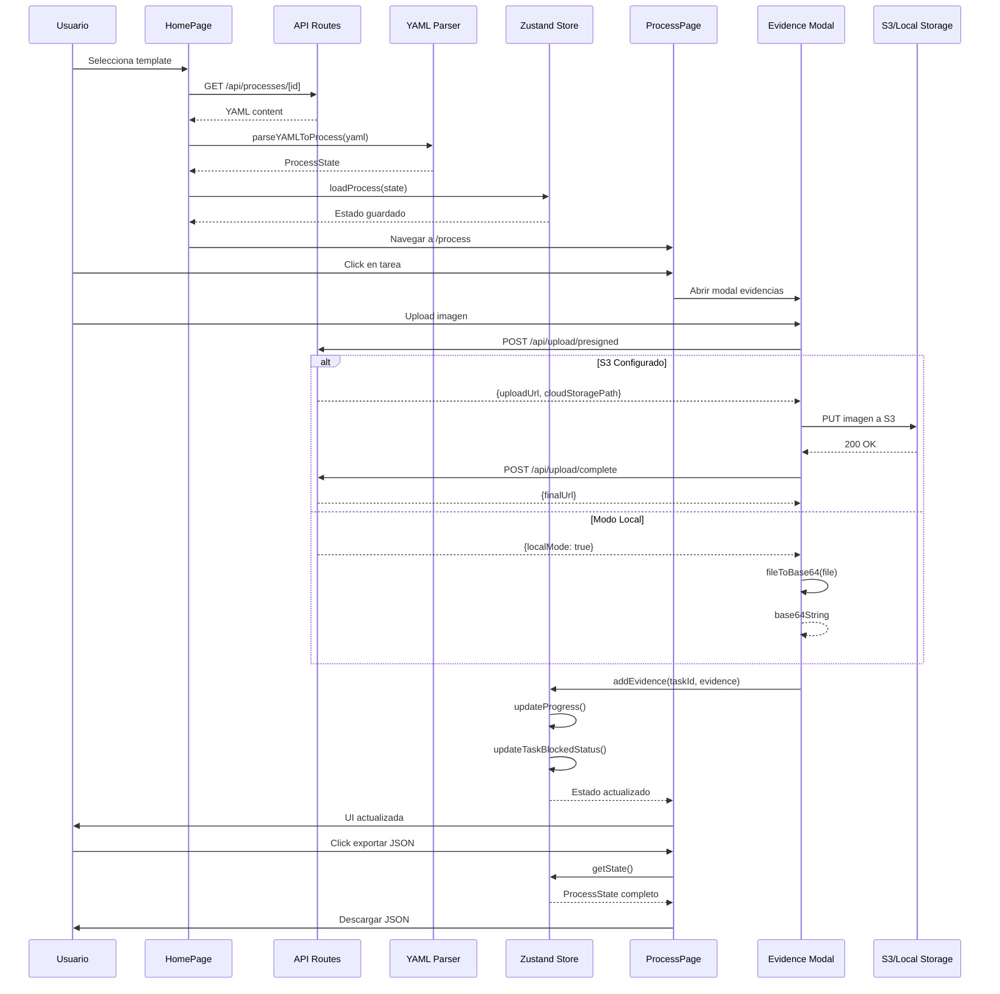

# Flujo de Datos

Este diagrama de secuencia muestra las interacciones temporales entre los diferentes componentes de la aplicación durante operaciones clave.

## Descripción

El diagrama ilustra dos flujos principales:

### 1. Carga de Proceso
Muestra cómo un usuario selecciona un template, el sistema lo procesa y lo carga en el estado global:
1. Usuario selecciona template en HomePage
2. API devuelve contenido YAML
3. Parser convierte YAML a ProcessState
4. Store guarda el estado con persistencia
5. Navegación a ProcessPage

### 2. Gestión de Evidencias
Detalla el proceso de upload de imágenes con dos modos:
- **Modo S3**: Upload a AWS S3 usando presigned URLs
- **Modo Local**: Conversión a Base64 para almacenamiento local

### 3. Exportación de Resultados
Muestra cómo el usuario puede exportar el estado completo del proceso en formato JSON.

## Diagrama

## Flujos Detallados

### Carga de Template
1. **Selección**: Usuario elige template en la página principal
2. **Fetch**: API route lee archivo YAML del filesystem
3. **Parsing**: YAML Parser convierte a estructura TypeScript
4. **Persistencia**: Zustand Store guarda en memoria + localStorage
5. **Navegación**: Redirección automática a página de proceso

### Upload de Evidencias (Modo S3)
1. **Solicitud**: Modal solicita presigned URL al backend
2. **Generación**: API genera URL temporal de S3 (15 min)
3. **Upload**: Cliente sube imagen directamente a S3
4. **Confirmación**: API marca upload como completo
5. **Actualización**: Store registra evidencia y actualiza UI

### Upload de Evidencias (Modo Local)
1. **Detección**: API detecta ausencia de configuración S3
2. **Conversión**: Modal convierte imagen a Base64
3. **Almacenamiento**: String Base64 se guarda en Store
4. **Persistencia**: localStorage mantiene la evidencia
5. **Visualización**: UI muestra imagen desde Base64

### Exportación JSON
1. **Trigger**: Usuario hace click en botón exportar
2. **Serialización**: Store serializa estado completo
3. **Download**: Navegador descarga archivo JSON
4. **Reutilización**: JSON puede reimportarse posteriormente

## Ventajas del Diseño

- **Desacoplamiento**: Componentes se comunican a través de interfaces claras
- **Flexibilidad**: Modo S3 vs Local sin cambios en UI
- **Persistencia**: Estado sobrevive a recargas de página
- **Trazabilidad**: Cada interacción está claramente definida
- **Testabilidad**: Flujos pueden probarse de forma aislada
