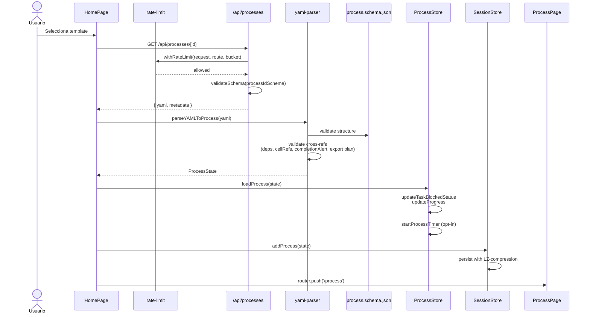
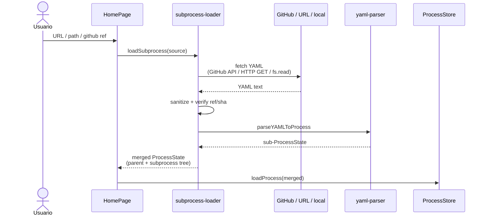
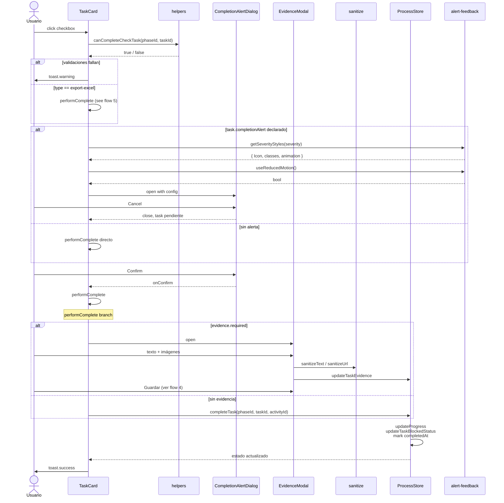
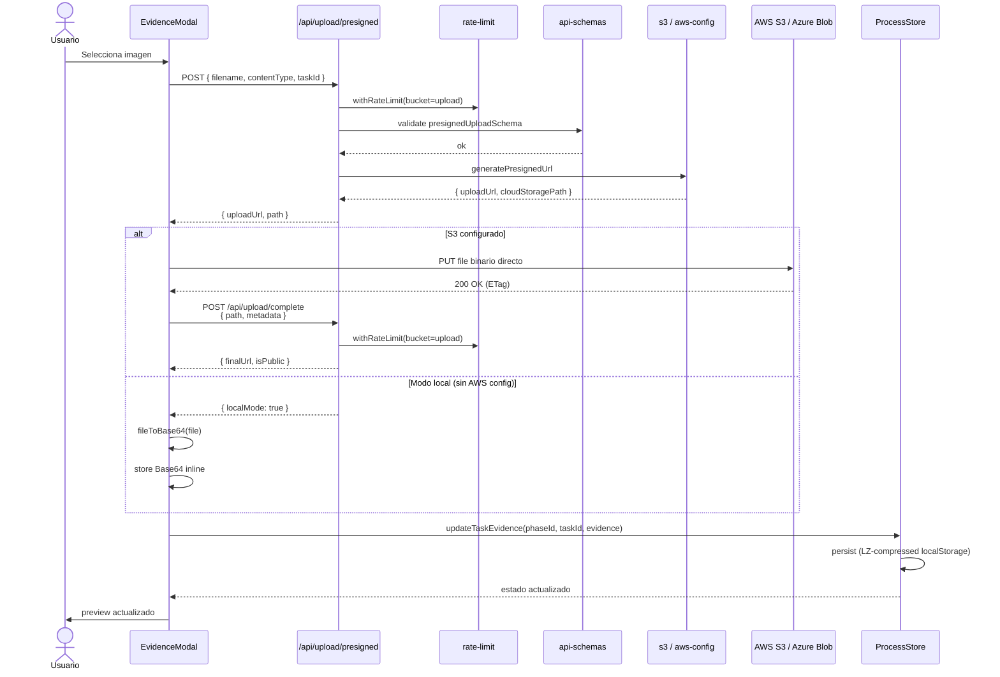
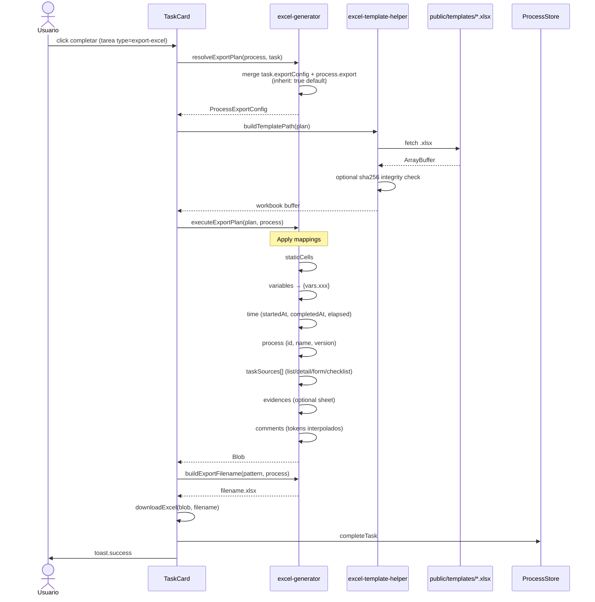
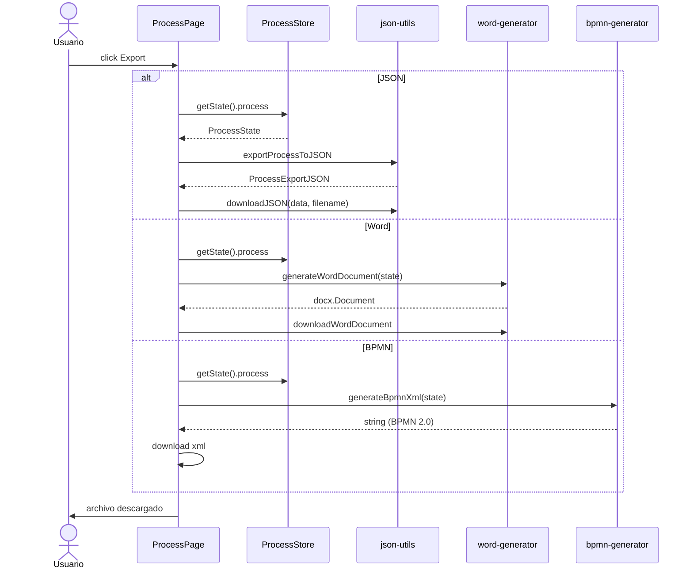
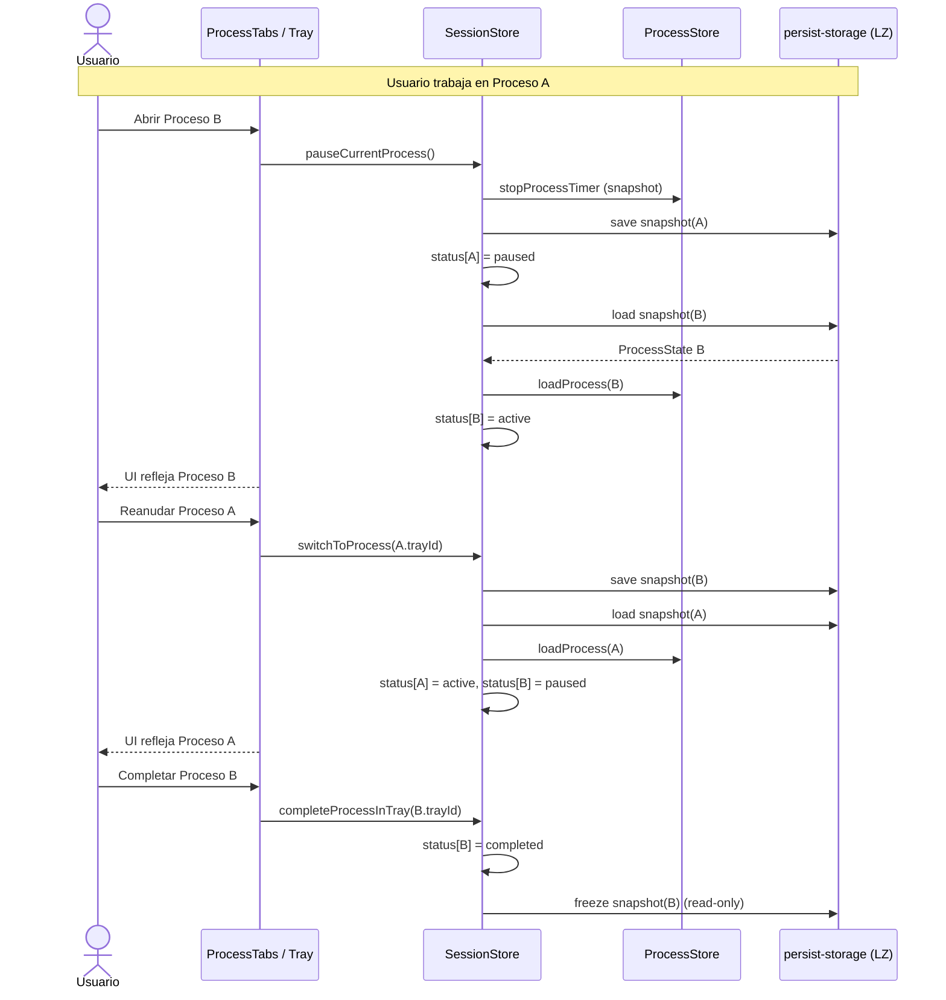
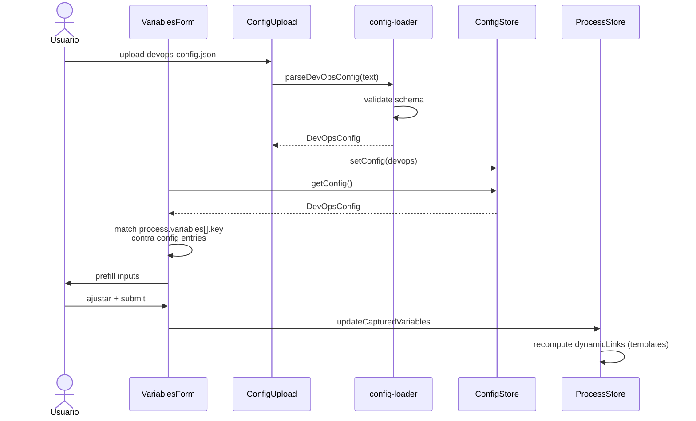

# Flujo de Datos

> Última revisión: 2026-04-21 · sincronizado con `develop`

Diagramas de secuencia de las operaciones clave entre actores, stores, helpers, API routes y servicios externos. Todos los flujos aplican rate-limit + validación Zod en los endpoints.

## 1. Carga de proceso desde plantilla

## 2. Carga de subproceso externo

## 3. Completar una tarea con el gate opcional `completionAlert`

## 4. Upload de evidencia (S3 con presigned URL)

## 5. Export declarativo (Excel) al completar una tarea `export-excel`

## 6. Exportación manual (JSON / Word / BPMN)

## 7. Bandeja multi-proceso (SessionStore)

## 8. Autocompletado de variables desde config DevOps

## Notas transversales

### Rate limiting

Todas las API routes envuelven su lógica con `withRateLimit(request, routeName, bucket)`. Buckets declarados en `lib/rate-limit.ts`:

- `upload` — endpoints de subida/descarga.
- `strict` — operaciones destructivas (`/api/upload/delete`).
- default — resto.

Si se supera la ventana, se responde `429 Too Many Requests` antes de la validación Zod.

### Validación Zod

Todas las routes ejecutan `validateSchema(schema, body)` (`lib/api-schemas.ts`) antes de tocar lógica. Falla → `400` con detalle por campo.

### Sanitización

Texto libre en evidencias y referencias pasa por `sanitizeText` / `sanitizeUrl` antes de persistir en el store y antes de renderizar. Protege contra XSS en redisplay y al exportar a Word/Excel.

### Persistencia

`lib/persist-storage.ts` envuelve `zustand/middleware/persist` con LZ-string compression. Es transparente para los stores; permite procesos grandes (>1 MB) sin saturar la cuota de localStorage.

### Errores tipados

Los errores surgidos en API o en generadores se envuelven con clases de `lib/errors.ts` (nombres semánticos tipo `ProcessValidationError`, `ExportTemplateError`). La UI los traduce a toasts i18n.

## Ventajas del diseño

- **Separación nítida de preocupaciones**: un store por dominio, un helper por responsabilidad.
- **Flujos reversibles**: uncomplete restaura estado y propaga al grafo de dependencias.
- **Resilencia**: sin S3 → Base64; sin config → manual; sin auth → local.
- **Trazabilidad**: cada escritura pasa por un punto único que recalcula `updateProgress` + `updateTaskBlockedStatus`.
- **Auditable**: exports Excel/Word/JSON/BPMN cubren todas las audiencias (operativa, cumplimiento, ingeniería).
- **Testable**: cada flujo mapeado aquí tiene tests unitarios o E2E asociados.
