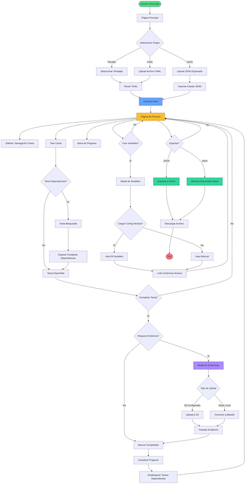

# Flujo del Proceso de la Aplicación

Este diagrama muestra el flujo completo de interacción del usuario con la aplicación, desde la selección inicial del proceso hasta la exportación de resultados.

## Descripción

El flujo comienza cuando el usuario accede a la aplicación y selecciona una de tres opciones:
- **Plantilla predefinida**: Selecciona uno de los 5 templates YAML disponibles
- **Archivo YAML personalizado**: Sube su propio archivo de definición de proceso
- **JSON exportado**: Importa un proceso previamente guardado

Una vez cargado el proceso, el usuario puede:
- Navegar entre fases y tareas
- Completar tareas respetando dependencias
- Adjuntar evidencias (imágenes con S3 o modo local Base64)
- Gestionar variables dinámicas
- Auto-completar configuraciones desde archivos DevOps
- Exportar resultados en JSON o Word

## Diagrama

## Elementos Clave

### Nodos de Inicio/Fin
- **Verde**: Punto de entrada de la aplicación
- **Rojo**: Finalización del flujo

### Nodos de Proceso
- **Azul**: Almacenamiento en Zustand Store
- **Amarillo**: Página principal de proceso
- **Morado**: Modal de evidencias
- **Verde claro**: Opciones de exportación

### Decisiones Principales
1. **Selección de origen**: Template, YAML o JSON
2. **Dependencias**: Verifica si la tarea está bloqueada
3. **Evidencias**: Determina si se requiere adjuntar pruebas
4. **Tipo de upload**: S3 configurado vs modo local
5. **Variables**: Uso de configuración dinámica
6. **Exportación**: JSON vs Word
