# Flujo del Proceso

> Última revisión: 2026-04-21 · sincronizado con `develop`

Recorrido completo del usuario: desde la carga inicial hasta la finalización y exportación, incluyendo tipos de tarea, gates de confirmación, bandeja multi-proceso, timer, variables y vistas Lista/BPMN.

## Entradas soportadas

- **Plantilla predefinida** (7 disponibles): fetch de `GET /api/processes/[id]`.
- **Archivo YAML personalizado**: upload local, parser validado contra schema.
- **JSON exportado**: restauración de un proceso guardado (round-trip completo).
- **Subproceso externo**: GitHub (tag/branch), URL o path local vía `subprocess-loader`.

## Estructura jerárquica de un proceso

```text
Process
  └─ Phase (n)
       ├─ Task (n)                  ← directas en la fase
       └─ Activity (n)              ← nivel intermedio
             └─ Task (n)            ← tareas dentro de la actividad
```

## Tipos de tarea

| type | UI | Regla de completado |
|---|---|---|
| `standard` | Checkbox simple | click → validar evidencia → completar |
| `check` | Un solo checkitem obligatorio | checkitem ✓ + evidencia |
| `multicheck` | N checkitems (algunos required) | todos los required ✓ |
| `dynamic-list` | Captura de lista de items | `minItems` ≤ items ≤ `maxItems` |
| `detail-list` | Detalle por cada item de otra tarea | detalle por cada `sourceItem` |
| `form` | Form con campos tipados | campos `required` rellenos |
| `export-excel` | Botón que genera Excel al completar | evidencia opcional + export |

Cada tarea puede declarar además: `dependencies`, `evidence` (text / image / both), `references`, `dynamicLinks`, y el nuevo `completionAlert` (gate opcional de confirmación).

## Diagrama

```mermaid
flowchart TD
    Start([Usuario inicia app]) --> HomePage[HomePage]
    HomePage --> Choice{Origen del proceso}

    Choice -->|Template| Template[Seleccionar template<br/>GET /api/processes/id]
    Choice -->|YAML| UploadYAML[Upload YAML local]
    Choice -->|JSON| UploadJSON[Import JSON exportado]
    Choice -->|Subproceso| Subprocess[subprocess-loader<br/>github · url · local]

    Template --> Parse[yaml-parser<br/>ValidateSchema]
    UploadYAML --> Parse
    Subprocess --> Parse
    UploadJSON --> ImportJSON[json-utils.importProcessFromJSON]

    Parse --> Store[ProcessStore.loadProcess]
    ImportJSON --> Store
    Store --> Tray[SessionStore.addProcess<br/>Bandeja multi-proceso]
    Tray --> ProcessPage[ProcessPage]

    ProcessPage --> ViewMode{Vista}
    ViewMode -->|Lista| ListView[Sidebar + TaskCards + ProgressBar]
    ViewMode -->|BPMN| BpmnView[BpmnViewer]
    BpmnView -.->|click tarea| ListView

    ProcessPage --> Timer[ProcessTimer<br/>start · pause · resume · stop]
    ProcessPage --> VarsDecision{Variables pendientes?}
    VarsDecision -->|Sí| Vars[VariablesForm]
    Vars --> ConfigDecision{Cargar DevOps config?}
    ConfigDecision -->|Sí| ConfigUp[ConfigUpload → auto-fill]
    ConfigDecision -->|No| ManualInput[Input manual]
    ConfigUp --> Dynamic[DynamicLinks activos]
    ManualInput --> Dynamic
    Dynamic --> ListView
    VarsDecision -->|No| ListView

    ListView --> TaskType{Tipo de tarea}
    TaskType -->|standard| Deps{Dependencias satisfechas?}
    TaskType -->|check/multicheck| CheckItems[Toggle checkitems<br/>requireds]
    TaskType -->|dynamic-list| ListInput[DynamicListInput<br/>min/max items]
    TaskType -->|detail-list| DetailInput[DetailListInput<br/>por cada sourceItem]
    TaskType -->|form| FormCapture[FormRenderer<br/>campos required]
    TaskType -->|export-excel| ExportTask[exportConfig<br/>resolve plan]

    Deps -->|No| Blocked[isBlocked = true<br/>Lock icon]
    Deps -->|Sí| Available[Disponible]
    CheckItems --> Available
    ListInput --> Available
    DetailInput --> Available
    FormCapture --> Available
    ExportTask --> Available

    Available --> Evidence{evidence.required?}
    Evidence -->|Sí| EvidenceModal[EvidenceModal<br/>text / image / both]
    EvidenceModal --> UploadBranch{Storage}
    UploadBranch -->|S3 configurado| S3Upload[presigned URL → S3]
    UploadBranch -->|Local| Base64[fileToBase64]
    S3Upload --> SaveEv[updateTaskEvidence]
    Base64 --> SaveEv
    SaveEv --> AlertGate
    Evidence -->|No| AlertGate

    AlertGate{task.completionAlert?}
    AlertGate -->|Sí| Confirm[CompletionAlertDialog<br/>info · warning · critical]
    Confirm -->|Cancel| ListView
    Confirm -->|Confirm| Complete
    AlertGate -->|No| Complete

    Complete[completeTask<br/>updateProgress · unblock downstream]
    Complete --> ExportExcelIfAny{type == export-excel?}
    ExportExcelIfAny -->|Sí| GenExcel[excel-generator<br/>executeExportPlan]
    GenExcel --> DownloadExcel[Descargar Excel]
    ExportExcelIfAny -->|No| ListView
    DownloadExcel --> ListView

    Blocked --> WaitDeps[Esperar dependencias]
    WaitDeps --> Deps

    ListView --> ProcessComplete{Todas las tareas completas?}
    ProcessComplete -->|No| ListView
    ProcessComplete -->|Sí| MarkDone[markProcessComplete<br/>stop timer]
    MarkDone --> AutoExport[Auto-export JSON + DOCX]
    AutoExport --> End([Fin])

    ProcessPage --> ExportDecision{Exportar manualmente?}
    ExportDecision -->|JSON| ExpJSON[json-utils.exportProcessToJSON]
    ExportDecision -->|Word| ExpWord[word-generator]
    ExportDecision -->|BPMN| ExpBpmn[bpmn-generator<br/>BPMN 2.0 XML]
    ExpJSON --> DownloadExp[Descargar]
    ExpWord --> DownloadExp
    ExpBpmn --> DownloadExp
    DownloadExp --> ListView

    ProcessPage --> TrayActions{Acción en tray}
    TrayActions -->|Pausar| PauseP[SessionStore.pauseCurrentProcess]
    TrayActions -->|Cambiar| SwitchP[SessionStore.switchToProcess]
    TrayActions -->|Cerrar| CloseP[SessionStore.cancel]
    PauseP --> Tray
    SwitchP --> Store
    CloseP --> Tray

    style Start fill:#4ade80
    style End fill:#f87171
    style Store fill:#60a5fa
    style Tray fill:#60a5fa
    style ProcessPage fill:#fbbf24
    style EvidenceModal fill:#a78bfa
    style Confirm fill:#fb923c
    style GenExcel fill:#34d399
    style ExpJSON fill:#34d399
    style ExpWord fill:#34d399
    style ExpBpmn fill:#34d399
```



## Gates y reglas clave

### Gate 1 — Dependencias (`helpers.checkTaskDependencies`)

Si alguna `dependencies[]` apunta a una tarea no completada, `isBlocked = true`. El checkbox se renderiza con `Lock` y no responde al click.

### Gate 2 — Validación por tipo

Antes de permitir completar se validan:

- `check`/`multicheck` → `canCompleteCheckTask` (todos los required ✓).
- `dynamic-list` → `items.length ≥ minItems`.
- `detail-list` → detalle por cada `sourceItem` del task origen.
- `form` → todos los campos `required` completos.

### Gate 3 — Evidencia (`helpers.canCompleteTask`)

Si `evidenceConfig.required`, se exige:

- `type: text` → `evidence.text` no vacío.
- `type: image` → al menos una `EvidenceImage`.
- `type: both` → ambas.

Se abre `EvidenceModal`. El modal sanitiza texto y URL antes de persistir.

### Gate 4 — Confirmación opcional (`completionAlert`) — feature activa

Cuando una tarea declara `completionAlert` en su YAML, se muestra un `CompletionAlertDialog` modal antes de ejecutar `completeTask`. Severidades:

- `info` → azul, sin pulso.
- `warning` → ámbar, pulso suave.
- `critical` → rojo, pulso fuerte + botón destructivo.

Respeta `prefers-reduced-motion: reduce` y WCAG 1.4.1 (color no es único canal — icono + texto cambian también).

Cancelar no modifica estado. Confirmar ejecuta el flujo original (incluyendo export-excel y evidence modal aguas abajo).

### Gate 5 — Export declarativo

Para tareas `export-excel`, `excel-generator.resolveExportPlan` fusiona `process.export` + `task.exportConfig` (con `inherit: true` por defecto). Aplica:

- `staticCells` — valores literales por celda.
- `variables` — `{vars.xxx}` → celda.
- `time` — startedAt/completedAt/elapsed.
- `process` — id/name/version.
- `taskSources[]` — tipos `list` / `detail` / `form` / `checklist`.
- `evidences` — sheet opcional con tabla de evidencias.
- `comments` — template con tokens (`{today:YYYYMMDD}`, `{process.name}`, `{vars.xxx}`).

## Bandeja multi-proceso (SessionStore)

El usuario puede trabajar en **N procesos en paralelo**. Cada uno tiene estado independiente:

- `active` — proceso actualmente visible.
- `paused` — snapshot guardado, timer detenido, reanudable.
- `completed` — finalizado, disponible para re-exportar.
- `cancelled` — cerrado por el usuario, eliminable.

Cambiar de proceso hace snapshot del store actual y restaura el nuevo sin perder evidencias ni progreso.

## Auto-exportación al finalizar

Al completarse el último gate, `markProcessComplete` dispara automáticamente:

1. Stop del timer.
2. `exportProcessToJSON` → descarga.
3. `generateWordDocument` → descarga.

Exports manuales (JSON, Word, Excel, BPMN) están disponibles en cualquier momento desde el header.

## Elementos visuales del diagrama

- **Verde** (`#4ade80`): inicio.
- **Rojo** (`#f87171`): fin.
- **Azul** (`#60a5fa`): stores.
- **Amarillo** (`#fbbf24`): página principal de ejecución.
- **Morado** (`#a78bfa`): modales de captura (evidencia).
- **Naranja** (`#fb923c`): gate de confirmación opcional.
- **Verde claro** (`#34d399`): exportadores.
