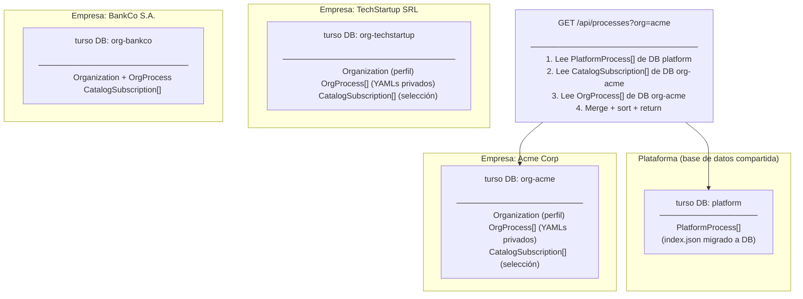
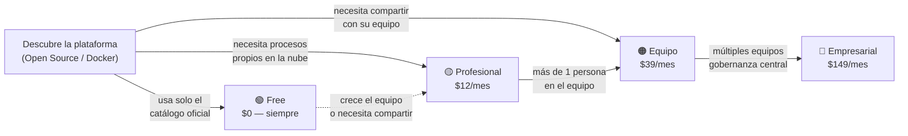
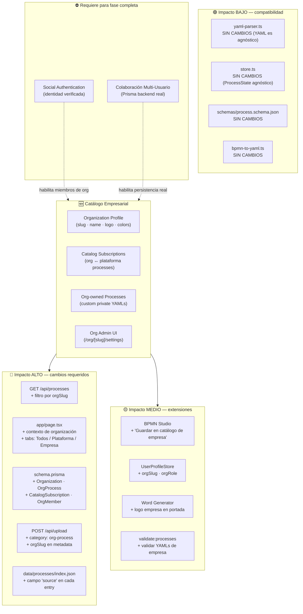
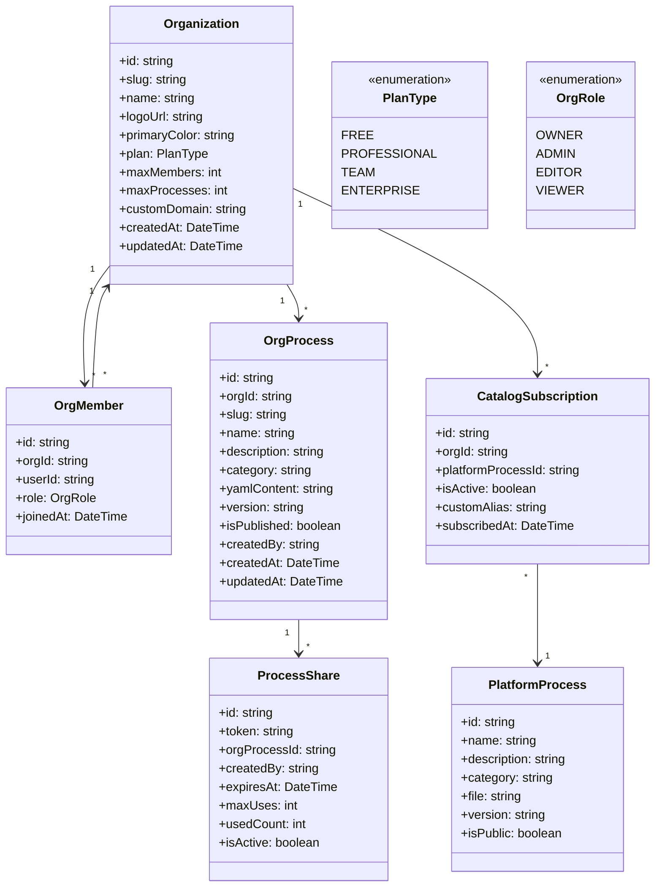
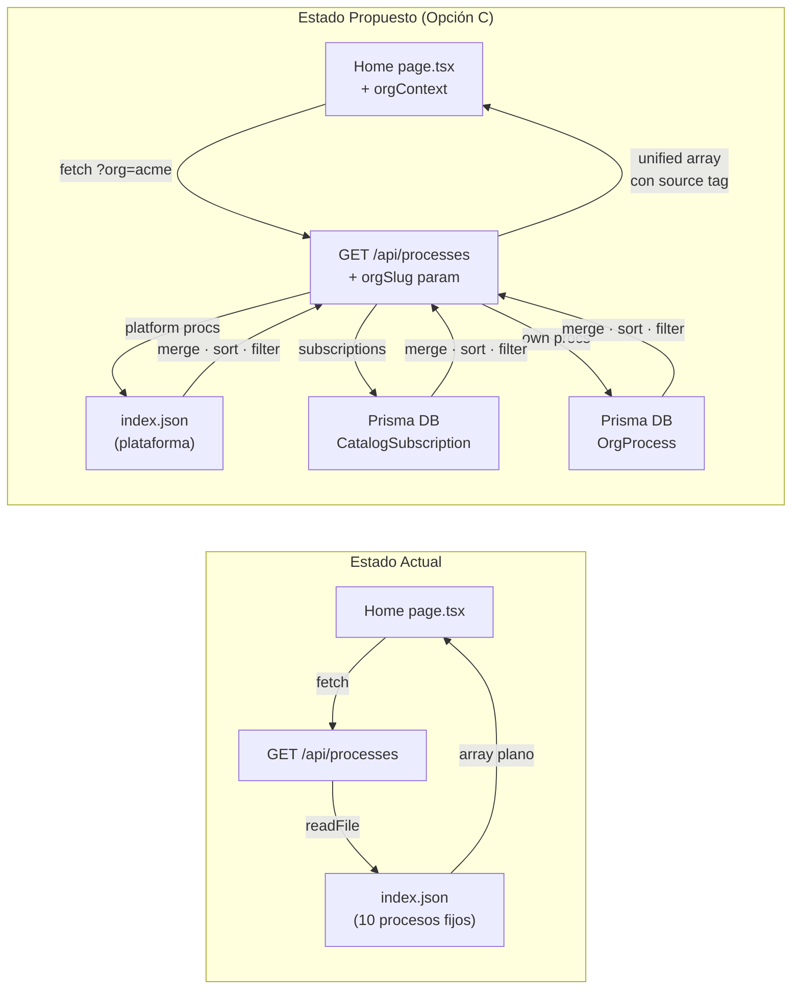
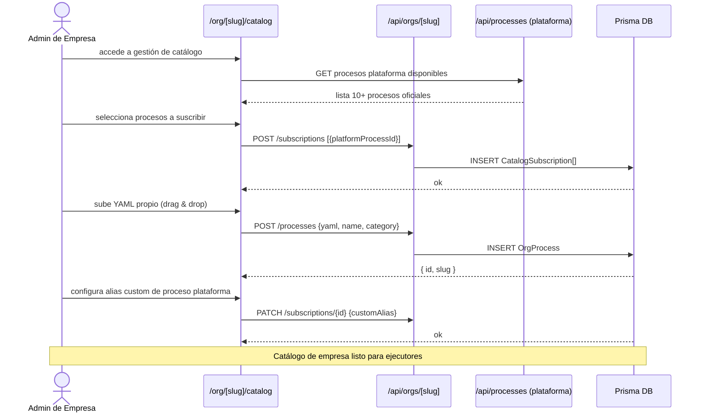
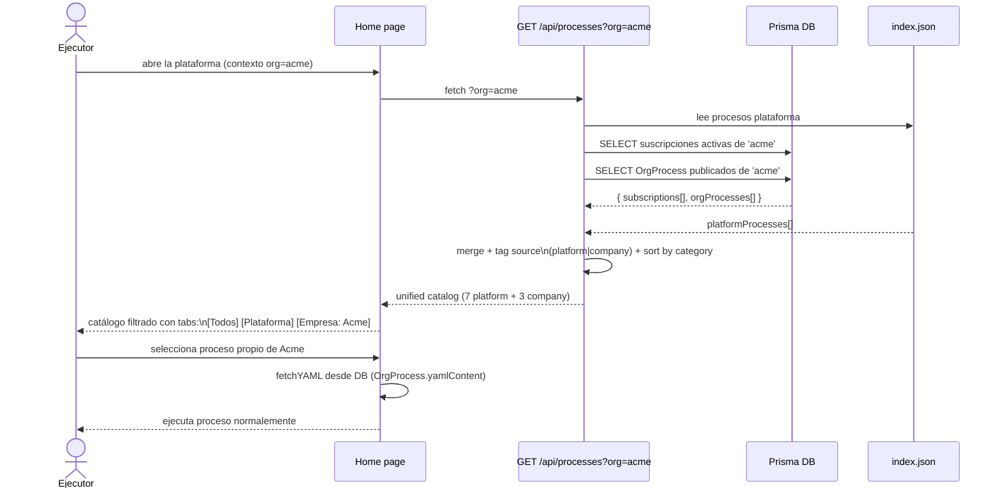

# Propuesta: Catálogo Empresarial — Company Process Catalog

**Estado:** 🔍 Análisis / Pre-diseño  
**Fecha:** 2026-06-02  
**Actualización:** 2026-06-02 v0.2 — estrategia de monetización + 4 perfiles de usuario incorporados  
**Versión base:** v3.0.3  
**Autor:** Cascade (a solicitud del mantenedor)

---

## 1. Resumen Ejecutivo

### ¿Qué es?

Un sistema que permite a **organizaciones (empresas)** crear su propio perfil dentro de la plataforma y gestionar un catálogo de procesos **personalizado**: una combinación curada de procesos propios (YAMLs privados) y procesos del catálogo oficial de la plataforma.

### ¿Por qué?

Hoy el catálogo es **global y único** para todos los usuarios: 10 procesos en `data/processes/index.json`, sin ningún contexto de empresa. Esto impide:

- Que una empresa muestre **solo sus procesos relevantes** sin ver los del resto.
- Que una empresa **agregue sus propios procesos** sin acceso al servidor.
- Que existan **variantes** de un proceso oficial adaptadas a su contexto.
- Que la plataforma pueda **escalar como SaaS** multi-tenant.

### ¿A quién beneficia?

| Perfil | Actor | Beneficio |
|---|---|---|
| 🟢 **Free** | Cualquier individuo | Acceso completo al catálogo oficial sin registro |
| 🟡 **Profesional** | Consultor / Auditor freelance | Catálogo propio + compartir procesos con clientes por link |
| 🟠 **Equipo** | Equipo DevOps/Seguridad (2-15 personas) | Catálogo compartido + branding de equipo |
| 🔴 **Empresarial** | Organización multi-equipo | Gobernanza centralizada + RBAC + SSO + analytics org |
| ⭐ **Plataforma** | Nosotros | Modelo SaaS freemium con márgenes > 99% (Turso) |

---

## 2. Estado Actual — Limitaciones

```
HOY
────────────────────────────────────────────────────────────
GET /api/processes
    └── lee data/processes/index.json (10 procesos fijos)
    └── sin contexto de tenant
    └── sin autenticación
    └── sin procesos privados

Catálogo en Home (page.tsx)
    └── muestra TODOS los procesos a TODOS los usuarios
    └── no hay concepto de "mi empresa"
    └── no hay filtro por organización

UserProfile (user-profile-store.ts)
    └── solo nombre + avatar Marvel
    └── sin vínculo a ninguna organización
    └── persiste solo en localStorage (no en servidor)

Prisma (db.ts / schema.prisma)
    └── PrismaClient instanciado
    └── schema.prisma SIN MODELOS definidos → base de datos vacía
```

---

## 3. ¿Se Necesita una Base de Datos? — Análisis de Turso

### 3.1 ¿Es la BD realmente necesaria?

Antes de elegir un proveedor, la pregunta correcta es si la base de datos es un **requisito real** para el MVP.

| Perspectiva | Sin BD (localStorage) | Con BD (server-side) |
|---|---|---|
| **Persistencia** | Solo en el navegador del admin | Compartida, sobrevive limpiar caché |
| **Multi-dispositivo** | ❌ Mismo usuario, mismo navegador | ✅ Accesible desde cualquier dispositivo |
| **Multi-usuario en org** | ❌ Imposible | ✅ Todo el equipo ve el mismo catálogo |
| **Deploy Vercel** | ✅ Sin cambios | ✅ Si la BD es serverless (no filesystem) |
| **Tiempo al MVP** | Días | Semanas |
| **Complejidad operacional** | Ninguna | Baja→Alta según proveedor |

**Conclusión:** Para un MVP de validación de UX (una empresa, un admin, un dispositivo) la BD **puede diferirse**. Para cualquier uso real en equipo, **la BD es necesaria**. La buena noticia: Turso hace que añadir una BD sea casi tan simple como no tenerla.

---

### 3.2 Qué es Turso

[Turso](https://turso.tech) es una base de datos **serverless edge** construida sobre **libSQL**, el fork open-source de SQLite mantenido por ChiselStrike. Su premisa central es radicalmente diferente a PostgreSQL/MySQL:

> _"Traditional databases were designed around a single shared instance. Turso is designed for the many-database architecture. Every agent, user, or tenant gets their own database."_

```
     PostgreSQL tradicional          Turso multi-tenant
     ───────────────────             ──────────────────
     Una sola instancia              Una DB por empresa
     tenant_id en cada tabla         Aislamiento total por fichero
     Borrar tenant = DELETE rows     Borrar tenant = DROP database
     Vecinos ruidosos posibles       Sin noisy-neighbor problems
     GDPR: auditoría compleja        GDPR: "este tenant = este archivo"
```

---

### 3.3 Precios (Mayo 2026)

| Plan | Precio | Bases de datos | Lecturas/mes | Storage | Notas |
|---|:---:|:---:|:---:|:---:|---|
| **Free** | $0 | 100 | 500M | 2 GB | PoC y proyectos personales |
| **Developer** | $4.99/mes | **Ilimitadas** ⭐ | 1B | 10 GB | El cambio de juego para multi-tenant |
| **Scaler** | $24.92/mes | Ilimitadas | 2B | 25 GB | Factura por DBs activas/mes |
| **Pro** | $416.58/mes | Ilimitadas | 5B | 100 GB | Producción con SLA |
| **Enterprise** | Custom | Ilimitadas | Custom | Custom | BYOC, soporte 24×7 |

> ⚠️ Verificar precios actuales en [turso.tech/pricing](https://turso.tech/pricing) antes de adoptar.

**Para este feature:**
- **Free** → cubre hasta 100 empresas (PoC perfecto).
- **Developer ($4.99/mes)** → ilimitadas empresas, cubre producción inicial.
- Comparado con RDS PostgreSQL (~$30-100/mes para instancia mínima): **Turso cuesta 6-20x menos** en escenarios multi-tenant.

---

### 3.4 Integración con Prisma (stack actual)

Prisma ya está instalado en el proyecto (`db.ts`). La integración con Turso requiere un adapter:

```typescript
// lib/db.ts — cambio mínimo
import { PrismaLibSQL } from '@prisma/adapter-libsql'
import { createClient } from '@libsql/client'
import { PrismaClient } from '@prisma/client'

const turso = createClient({
  url: process.env.TURSO_DATABASE_URL!,
  authToken: process.env.TURSO_AUTH_TOKEN!,
})

const adapter = new PrismaLibSQL(turso)
export const prisma = new PrismaClient({ adapter })
```

**Variables de entorno nuevas:**
```env
TURSO_DATABASE_URL=libsql://[org-slug].turso.io
TURSO_AUTH_TOKEN=eyJ...
```

**Migrations con Turso:**
```bash
# Generar SQL de migración (sin aplicar)
npx prisma migrate diff --from-empty --to-schema-datamodel prisma/schema.prisma --script > migration.sql

# Aplicar vía Turso CLI
turso db shell [db-name] < migration.sql
```

> **Nota:** Turso usa SQLite internamente → no soporta todos los tipos de Postgres. Los tipos del modelo propuesto (strings, booleans, datetime, text) son 100% compatibles con SQLite.

---

### 3.5 Patrón Database-per-Tenant para este Feature

Para el Catálogo Empresarial, el patrón óptimo con Turso es **una base de datos por organización**:



**Ventajas clave de este patrón:**
- ✅ **Aislamiento total**: los datos de Acme nunca tocan la DB de TechStartup.
- ✅ **GDPR / Derecho al olvido**: `turso db destroy org-acme` → datos eliminados al 100%.
- ✅ **Blast radius mínimo**: un problema en la DB de una org no afecta a las demás.
- ✅ **Free hasta 100 orgs**, ilimitadas con $4.99/mes.
- ✅ **Compatible con Vercel** (no filesystem, conexión HTTP al edge).
- ✅ **Sin cold starts** (SQLite es un archivo, siempre disponible).

---

### 3.6 Limitaciones de Turso a Considerar

| Limitación | Severidad | Mitigación |
|---|:---:|---|
| **SQLite: writes concurrentes limitados** | 🟡 Media | El catálogo es 95% lectura; writes son ocasionales (admin configura) |
| **Fan-out de migraciones**: schema change → aplicar en CADA org DB | 🟡 Media | Crear script `migrate-all-orgs.mjs` desde día 1 |
| **Cross-tenant analytics difíciles**: no hay JOIN entre DBs | 🟢 Baja | Métricas de uso son nice-to-have, no MVP |
| **Empresa pequeña** (~22 empleados, $7M seed 2022) | 🟡 Media | libSQL es OSS → exit path a self-host existe |
| **No es Postgres**: sin extensiones pg_trgm, PostGIS, etc. | 🟢 Baja | No se necesitan para este feature |
| **Prisma con Turso requiere driver adapter** (no estándar) | 🟢 Baja | 3 líneas de código, bien documentado |

---

### 3.7 Comparativa de Proveedores para este Feature

| Criterio | localStorage | Turso | Supabase/Neon (Postgres) | RDS Postgres |
|---|:---:|:---:|:---:|:---:|
| **Costo base** | $0 | $0–$4.99/mes | $0–$25/mes | ~$30/mes |
| **Multi-tenant nativo** | ❌ | ✅ DB-per-tenant | ⚠️ tabla-per-tenant | ⚠️ tabla-per-tenant |
| **Funciona en Vercel** | ✅ | ✅ edge HTTP | ✅ | ⚠️ connection pooling |
| **GDPR tenant deletion** | N/A | ✅ drop DB | ⚠️ DELETE rows | ⚠️ DELETE rows |
| **Sin cold starts** | ✅ | ✅ | ⚠️ Neon tiene cold start | ✅ |
| **Prisma compatible** | N/A | ✅ adapter | ✅ nativo | ✅ nativo |
| **Setup inicial** | Minutos | < 1 hora | 1-2 horas | Días |
| **Escalabilidad** | ❌ | ✅ | ✅ | ✅ |
| **Exit path** | N/A | libSQL OSS | Postgres estándar | Postgres estándar |

> **⭐ Recomendación:** Para este feature, **Turso es la elección óptima**. Combina costo mínimo, aislamiento multi-tenant real, compatibilidad con Vercel y el stack existente (Prisma), y un free tier que cubre todo el período de MVP sin costo.

---

## 4. Estrategia de Monetización

### Filosofía: Open Core

El **núcleo de la plataforma es y será siempre gratuito y open source** (GPL v3). La monetización ocurre exclusivamente en la capa SaaS de valor agregado para perfiles, equipos y organizaciones.

```
┌──────────────────────────────────────────────────────────┐
│   Capa Open Source (GPL v3) — SIEMPRE GRATIS         │
│   Motor de ejecución · 8 tipos de tarea · Catlogo    │
│   oficial · Export Word/Excel/JSON · BPMN Studio      │
│   Evidencias · Timer · Dependencias · i18n · Temas   │
└──────────────────────────────────────────────────────────┘
                         +
┌──────────────────────────────────────────────────────────┐
│   Capa SaaS — GENERA INGRESOS                         │
│   Procesos propios en nube · Catálogo compartido       │
│   Branding en reportes · Links de cliente (tokens)    │
│   Multi-usuario · RBAC · SSO · Analytics · SLA       │
└──────────────────────────────────────────────────────────┘
```

### Modelo de precios: Freemium por perfil (no por usuario)

El eje de monetización es **por perfil**, no por asiento. Esto es menos punitivo para equipos y más fácil de vender:

| Perfil | Precio mensual | Precio anual | Unidad de cobro |
|---|:---:|:---:|---|
| 🟢 Gratuito | $0 | $0 | Siempre gratis |
| 🟡 Profesional | $12 | $129 (−10%) | Por persona (1 usuario) |
| 🟠 Equipo | $39 | $399 (−14%) | Por equipo (hasta 15 personas) |
| 🔴 Empresarial | $149 | $1,499 (−16%) | Por organización (ilimitado) |

> 💡 **Margen operacional:** Turso Developer ($4.99/mes) cubre las DBs de **todas las organizaciones** en la plataforma. El costo marginal por nuevo cliente es prácticamente $0.

### Embudo de conversión



### Diferenciador clave: El Profesional como canal de distribución

El perfil **Profesional** convierte al consultor en **evangelizador orgánico** de la plataforma:

```
Consultor paga $12/mes
 └── Crea procesos con BPMN Studio (su propiedad intelectual)
 └── Los guarda en su catálogo personal (nube Turso)
 └── Genera link temporal con token para Cliente X
      └── Cliente X ejecuta el proceso sin cuenta ni pago
      └── Descarga reporte con logo del consultor
      └── Ve el valor → potencial conversión a cliente propio
```

### Proyección de ingresos (escenario conservador)

| Hito | Profesionales | Equipos | Empresas | MRR | ARR |
|---|:---:|:---:|:---:|:---:|:---:|
| **Lanzamiento (mes 6)** | 20 | 5 | 1 | $584 | — |
| **Tracción (mes 12)** | 80 | 20 | 5 | $2,495 | ~$30K |
| **Escala (mes 24)** | 250 | 75 | 20 | $8,975 | ~$108K |

---

## 5. Los 4 Perfiles

### 🟢 Gratuito — Free

**¿Quién es?** Cualquier persona: developer, SRE, auditor, estudiante. Sin registro ni tarjeta.

**Sus dolores:** ejecuta procesos manuales sin estandarización, sin evidencia auditable, sin reportes automáticos.

**Lo que obtiene:**
- Acceso completo al catálogo oficial (10+ procesos de plataforma).
- Ejecución con evidencias, timer y dependencias entre tareas.
- Export Word, Excel y JSON sin marca de plataforma.
- BPMN Studio en modo visualización (no creación).
- Funciona **sin cuenta** — 100% localStorage, completamente offline.

**Restricciones:** sin procesos propios en nube · sin catolog compartido · sin branding · sin BPMN Studio para crear/guardar.

**Precio:** $0 · Sin tarjeta · Sin registro · Para siempre

---

### 🟡 Profesional — Professional

**¿Quién es?** Consultor independiente, arquitecto DevSecOps, auditor freelance que **implementa procesos en organizaciones cliente** y trabaja con múltiples empresas simultáneamente.

**Sus dolores:**
- Recrea los mismos procesos para cada nuevo cliente desde cero.
- Los reportes que entrega no llevan su marca profesional.
- Para compartir un proceso con un cliente debe darle acceso a toda su cuenta.
- Sus clientes necesitan soporte para usar la herramienta.

**Lo que obtiene:**
- **Catálogo propio (nube):** hasta 10 procesos YAML guardados en su Turso DB personal.
- **BPMN Studio completo:** crear, editar y guardar sus propios procesos.
- **Compartir por link temporal (`ProcessShare`):** genera URL con token para que un cliente ejecute un proceso específico sin cuenta ni pago. Expira en N días, uso máximo configurable.
- **Branding personal:** su logo y nombre en portada Word y header Excel.
- **Suscripciones:** elige cuáles procesos del catálogo oficial incluir.
- **Historial cloud:** ejecuciones completadas persistidas en la nube.

**Precio:** $12/mes · $129/año · 1 usuario

---

### 🟠 Equipo — Team

**¿Quién es?** Equipo de DevOps, Seguridad, SRE o Compliance dentro de una organización (2-15 personas) que necesita un catálogo común y procesos estandarizados para todos.

**Sus dolores:**
- Cada miembro tiene su versión del proceso ("el YAML de María" vs "el YAML de Juan").
- Cuando alguien abandona el equipo, los procesos desaparecen con él.
- Los reportes de auditoría necesitan mostrar el branding corporativo.
- No hay fuente única de verdad para los procedimientos del equipo.

**Lo que obtiene:**
- Todo lo del plan Profesional, para todos los miembros.
- **Hasta 15 miembros** con roles: Admin · Editor · Viewer.
- **Catálogo compartido de equipo:** todos ven y ejecutan los mismos procesos.
- **Hasta 30 procesos propios** del equipo en la nube (Turso DB del equipo).
- **Admin de equipo:** gestiona miembros, procesos y suscripciones al catálogo oficial.
- **Branding del equipo:** logo único en reportes de todos los miembros.
- **Dashboard de equipo:** quién ejecutó qué proceso, cuándo y con qué resultado.

**Precio:** $39/mes · $399/año · Hasta 15 miembros (precio fijo por equipo, no por persona)

---

### 🔴 Empresarial — Enterprise

**¿Quién es?** Organización con múltiples equipos que requiere gobernanza centralizada. CTO, CISO, Director de TI que necesita estandarizar procedimientos a nivel corporativo.

**Sus dolores:**
- Múltiples equipos con catálogos separados y sin coherencia entre sí.
- Auditorías exigen evidencia de que TODOS los equipos siguen el mismo proceso aprobado.
- Sin control central sobre qué procesos están autorizados corporativamente.
- El logo y colores corporativos deben aparecer en TODOS los reportes, sin excepción.
- Los usuarios deben autenticarse con sus credenciales corporativas (SSO/Azure AD).

**Lo que obtiene:**
- Todo lo del plan Equipo, sin límites de tamaño.
- **Equipos ilimitados** bajo una organización central (una Turso DB por org).
- **Catálogo corporativo:** procesos aprobados a nivel org disponibles para todos los equipos.
- **Procesos ilimitados** propios de la organización.
- **Miembros ilimitados** con RBAC completo: Owner · Org-Admin · Team-Admin · Editor · Viewer.
- **Branding corporativo completo:** logo, colores primarios, template Word propio, dominio custom.
- **Analytics organizacional:** dashboard de uso por equipo, proceso y usuario.
- **Social Auth / SSO:** Google, GitHub, Azure Active Directory.
- **SLA de uptime 99.9%.**
- **Soporte prioritario** con tiempo de respuesta < 24h.

**Precio:** $149/mes · $1,499/año · Equipos y usuarios ilimitados

---

## 6. Tabla Comparativa de Features

| Feature | 🟢 Free | 🟡 Profesional | 🟠 Equipo | 🔴 Empresarial |
|---|:---:|:---:|:---:|:---:|
| **Catálogo oficial (10+ procesos)** | ✅ | ✅ | ✅ | ✅ |
| **Ejecución completa (timer, deps, evidencias)** | ✅ | ✅ | ✅ | ✅ |
| **Export Word · Excel · JSON sin límites** | ✅ | ✅ | ✅ | ✅ |
| **Modo offline / localStorage** | ✅ | ✅ | ✅ | ✅ |
| **BPMN Studio — visualización** | ✅ | ✅ | ✅ | ✅ |
| **BPMN Studio — crear y guardar** | ❌ | ✅ | ✅ | ✅ |
| **Procesos propios en la nube** | ❌ | ✅ Hasta 10 | ✅ Hasta 30 | ✅ Ilimitados |
| **Suscripción al catálogo oficial** | ❌ | ✅ Personal | ✅ Equipo | ✅ Org |
| **Compartir proceso por link (ProcessShare)** | ❌ | ✅ | ✅ | ✅ |
| **Catálogo compartido** | ❌ | ❌ Personal | ✅ Equipo | ✅ Org + Equipos |
| **Miembros** | 1 | 1 | Hasta 15 | Ilimitados |
| **Roles (RBAC)** | ❌ | ❌ | ✅ Básico | ✅ Completo |
| **Branding en reportes** | ❌ | ✅ Personal | ✅ Equipo | ✅ Corporativo |
| **Colores + logo + dominio custom** | ❌ | Logo | Logo + colores | Logo + colores + dominio |
| **Historial de ejecuciones (cloud)** | ❌ Local | ✅ Personal | ✅ Equipo | ✅ Org-wide |
| **Dashboard de uso** | ❌ | ✅ Personal | ✅ Equipo | ✅ Org + equipos |
| **Social Auth / SSO** | ❌ | Opcional | ✅ | ✅ + Azure AD |
| **SLA uptime** | ❌ | ❌ | ❌ | ✅ 99.9% |
| **Soporte** | Comunidad | Email | Email | Prioritario < 24h |
| **💰 Precio mensual** | **$0** | **$12** | **$39** | **$149** |
| **💰 Precio anual** | $0 | $129 | $399 | $1,499 |

```mermaid
graph LR
    subgraph FREE["🟢 Free · $0"]
        F1["✅ Catálogo oficial"]
        F2["✅ Ejecución completa"]
        F3["✅ Export Word/Excel"]
        F4["✅ Offline / sin registro"]
    end
    subgraph PRO["🟡 Profesional · $12/mes"]
        P1["+10 procesos propios en nube"]
        P2["+BPMN Studio (crear)"]
        P3["+Compartir por link al cliente"]
        P4["+Branding personal en reportes"]
    end
    subgraph TEAM["🟠 Equipo · $39/mes"]
        T1["+30 procesos + 15 miembros"]
        T2["+Catálogo compartido"]
        T3["+Dashboard de equipo"]
        T4["+Roles Admin/Editor/Viewer"]
    end
    subgraph ENT["🔴 Empresarial · $149/mes"]
        E1["+Equipos + usuarios ilimitados"]
        E2["+Catálogo corporativo"]
        E3["+SSO / Azure AD"]
        E4["+Analytics org + SLA 99.9%"]
    end
    FREE --> PRO --> TEAM --> ENT
```



---

## 7. Concepto Técnico de la Propuesta

### Concepto central

```
                   ┌─────────────────────────────┐
                   │     Catálogo de la Empresa   │
                   │                              │
  Procesos        │  ┌─────────┐  ┌───────────┐ │
  Plataforma ──►  │  │  📦 Sub │  │  🏢 Own   │ │
  (oficiales)     │  │  scripto │  │  procesos │ │
                  │  │  nes    │  │  privados │ │
                  │  └────┬────┘  └─────┬─────┘ │
                  │       └──────┬───────┘       │
                  │              ▼               │
                  │     Vista del Ejecutor        │
                  │     (filtrada por tenant)     │
                  └─────────────────────────────┘
```

Una **Organización** tiene:
1. **Perfil**: nombre, slug, logo URL, colores de marca (opcional).
2. **Suscripciones**: selección de procesos del catálogo oficial de la plataforma.
3. **Procesos propios**: YAMLs privados subidos o creados en BPMN Studio, visibles solo para la org.
4. **Miembros**: usuarios vinculados a la org (requiere Social Auth en fase futura).

---

## 8. Mapa de Impacto

Áreas del sistema afectadas por este feature:



---

## 9. Opciones de Implementación

Se proponen **tres enfoques** con diferentes niveles de complejidad y valor entregado:

### Opción A — File-based (sin backend) · Complejidad: Baja

```
data/
  organizations/
    acme/
      org.json          ← perfil: name, logo, colors
      subscriptions.json ← IDs de procesos plataforma seleccionados
      processes/
        index.json      ← índice de procesos propios
        mi-proceso.yaml ← YAML privado de la empresa
```

**GET /api/processes?org=acme** → merge de subscriptions + procesos propios de la carpeta.

| ✅ Ventajas | ❌ Desventajas |
|---|---|
| Sin base de datos | No escala para SaaS (requiere acceso al FS del servidor) |
| Rápido de implementar | No funciona en Vercel (filesystem efímero) |
| Funciona offline/local | Sin aislamiento real de seguridad |
| Facilita PR de contribución | Administración solo vía archivos |

**Indicado para:** instancias self-hosted, deploy propio (Docker), equipos técnicos.

---

### Opción B — Config + localStorage (sin servidor) · Complejidad: Muy Baja

La empresa configura su catálogo en la propia UI: el admin selecciona procesos del catálogo oficial y carga YAMLs propios → todo persiste en localStorage con lz-string.

**GET /api/processes** sin cambios (devuelve plataforma). El filtrado y los procesos propios viven en un nuevo `OrgCatalogStore` (Zustand + localStorage).

| ✅ Ventajas | ❌ Desventajas |
|---|---|
| Cero backend | No comparte entre usuarios/dispositivos |
| Implementable en días | Catálogo se pierde si el usuario borra datos |
| Sin dependencias externas | No es real "empresa" sino perfil local |
| Funciona en Vercel/Docker sin cambios | No apto para SaaS |

**Indicado para:** prototipo rápido, validación de UX, uso single-user empresarial.

---

### Opción D — Turso Database-per-Tenant · Complejidad: Media ⭐ Recomendada

Una base de datos Turso **por organización** + Prisma con driver adapter `@prisma/adapter-libsql`. La misma API que Opción C pero con SQLite/libSQL en lugar de PostgreSQL.

```
Turso Cloud
  ├── DB: platform          ← procesos oficiales (migración de index.json)
  ├── DB: org-{slug-A}      ← perfil + procesos + suscripciones de Empresa A
  ├── DB: org-{slug-B}      ← perfil + procesos + suscripciones de Empresa B
  └── DB: org-{slug-C}      ← ...

new Organization() → turso.db.create('org-{slug}') → apply migration.sql
del Organization() → turso.db.destroy('org-{slug}')
```

**Nuevas dependencias:**
```bash
npm install @libsql/client @prisma/adapter-libsql
```

| ✅ Ventajas | ❌ Desventajas |
|---|---|
| Free hasta 100 orgs, $4.99/mes ilimitadas | Fan-out de migraciones: schema change → N DBs |
| Aislamiento real: una DB por empresa | No es PostgreSQL (sin extensiones avanzadas) |
| GDPR: borrar org = `turso db destroy` | Empresa pequeña (~22 empleados) |
| Funciona en Vercel (HTTP, no filesystem) | Writes concurrentes limitados (SQLite) |
| Sin cold starts | Requiere script de migración fan-out desde día 1 |
| 3 líneas de cambio en `db.ts` | Cross-tenant analytics requiere app-layer |
| libSQL es OSS → exit path a self-host | |

**Indicada para:** MVP inmediato, SaaS con múltiples empresas, Vercel deployment, equipos que quieren escalar sin ops overhead.

---

### Opción C — Prisma + API Multi-tenant (PostgreSQL) · Complejidad: Alta

Modelo de datos completo con Prisma (PostgreSQL), API Routes multi-tenant, autenticación opcional por fases.

```
Prisma schema:
  Organization     ← perfil de empresa
  OrgMember        ← usuario ↔ org (con rol)
  OrgProcess       ← proceso propio de empresa (almacena YAML como string)
  CatalogSubscription ← org selecciona proceso de plataforma
```

**GET /api/processes?org={slug}** → join de subscripciones + procesos propios desde DB.

| ✅ Ventajas | ❌ Desventajas |
|---|---|
| Multi-tenant real, escala para SaaS | Requiere PostgreSQL (Prisma schema vacío hoy) |
| Compartido entre todos los usuarios de la org | Mayor esfuerzo de implementación |
| Habilita dashboard de uso por empresa | Requiere Social Auth para miembros completos |
| Base para licenciamiento y billing | Rompe el flujo 100% offline actual |

**Indicado para:** SaaS con analíticas complejas, workloads de escritura intensiva, equipos con infraestructura Postgres ya establecida.

---

## 10. Modelo de Datos (Turso + Prisma)



---

## 11. Cambios Arquitectónicos (Delta)

### Flujo actual vs. propuesto para cargar el catálogo:



### Nuevas rutas API requeridas:

| Ruta | Método | Descripción |
|---|---|---|
| `/api/orgs` | `POST` | Crear organización |
| `/api/orgs/[slug]` | `GET` | Perfil de la org |
| `/api/orgs/[slug]` | `PATCH` | Actualizar branding/config |
| `/api/orgs/[slug]/processes` | `GET` | Procesos propios de la org |
| `/api/orgs/[slug]/processes` | `POST` | Crear/subir proceso propio |
| `/api/orgs/[slug]/processes/[id]` | `PATCH/DELETE` | Editar o eliminar proceso propio |
| `/api/orgs/[slug]/subscriptions` | `GET/POST/DELETE` | Gestionar suscripciones al catálogo oficial |
| `/api/orgs/[slug]/members` | `GET/POST/DELETE` | Gestionar miembros (requiere Auth) |
| `/api/processes?org=[slug]` | `GET` | **Modificación** del endpoint actual + merge |

---

## 12. Nuevos Flujos de Usuario

### Flujo A — Admin configura catálogo de empresa



### Flujo B — Ejecutor ve catálogo de su empresa



---

## 13. Impacto en Features Existentes

| Feature | Impacto | Cambio requerido |
|---|---|---|
| **Home / Catálogo** | 🔴 Alto | Agregar `orgContext`, tabs de filtrado, fetch con `?org=` |
| **GET /api/processes** | 🔴 Alto | Aceptar `orgSlug`, hacer merge de fuentes |
| **BPMN Studio** | 🟡 Medio | Agregar botón "Guardar en catálogo de [Empresa]" → POST OrgProcess |
| **Process Executor** | 🟢 Bajo | Sin cambios (lee YAML, ejecuta) — solo origen del YAML cambia |
| **Export Word** | 🟢 Bajo | Opcional: incluir logo de empresa en portada del reporte |
| **UserProfileStore** | 🟡 Medio | Agregar `orgSlug` y `orgRole` al perfil local |
| **validate:processes** | 🟡 Medio | Extender script para validar YAMLs de empresas |
| **Social Auth (planificado)** | 🔴 Bloqueador | Para miembros reales, invitaciones y RBAC |
| **yaml-parser.ts** | 🟢 Ninguno | YAML es agnóstico al origen |
| **store.ts / session-store.ts** | 🟢 Ninguno | ProcessState no necesita saber de orgs |
| **Tests unitarios** | 🟡 Medio | Nuevos tests para API routes de orgs, merge logic |

---

## 14. Matriz de Riesgos

| Riesgo | Probabilidad | Impacto | Mitigación |
|---|---|:---:|:---:|
| **Prisma sin modelos** — schema vacío, requiere migración inicial | Alta | 🔴 Alto | Definir schema en PR dedicado antes de cualquier código de feature |
| **Filesystem efímero en Vercel** — Opción A incompatible con serverless | Alta | 🔴 Alto | Usar Turso (Opción D) o Opción B como puente; ambas compatibles con Vercel |
| **Fan-out de migraciones Turso** — schema change debe aplicarse en cada DB de org | Media | 🟡 Medio | Crear `scripts/migrate-all-orgs.mjs` desde el día 1; pocas orgs en MVP hacen esto trivial |
| **Vendor lock-in Turso** — empresa pequeña ($7M seed, ~22 empleados) | Baja | 🟡 Medio | libSQL es OSS → runbook de migración a SQLite self-host o Postgres como exit path |
| **Turso writes concurrentes** — SQLite tiene límites en escritura paralela | Baja | 🟢 Bajo | Catálogo es 95% lectura; admin configura en sesiones cortas, no concurrentes |
| **Aislamiento de datos entre orgs** — filtrado solo por `orgSlug` en query params sin auth es bypasseable | Alta | 🔴 Alto | Para MVP sin auth: solo read-only de org pública. Escritura requiere token |
| **Carga de YAML malicioso** — empresa sube YAML con scripts o referencias externas peligrosas | Media | 🟡 Medio | Validar contra `schemas/process.schema.json` (Ajv) + sanitizar texto libre |
| **Tamaño del YAML en DB** — YAMLs grandes (gestion-ambientes tiene 64.5 días) | Baja | 🟢 Bajo | Usar `TEXT` en Prisma, comprimir antes de almacenar |
| **Conflicto de IDs entre plataforma y empresa** — mismo `process.id` en ambos catálogos | Media | 🟡 Medio | Namespacing: `platform:{id}` vs `org:{slug}:{id}` |
| **Regresión en Home** — modificar el fetch puede romper el catálogo actual | Media | 🔴 Alto | Feature flag: si no hay `?org=` devuelve comportamiento actual sin cambios |
| **UX compleja** — usuarios no saben qué es "suscripción" vs "proceso propio" | Media | 🟡 Medio | UX clara: separar en dos secciones con labels evidentes |

---

## 15. Estimación de Esfuerzo por Fase

### Leyenda: `XS` < 2d · `S` 3-5d · `M` 1-2sem · `L` 3-4sem · `XL` > 1mes

| Fase | Descripción | ⌨️ Código | 🧪 Testing | Total estimado |
|---|---|:---:|:---:|:---:|
| **Fase 0** | Setup Turso: crear cuenta, instalar CLI, definir schema Prisma (SQLite types), script migrate-all-orgs | `S` | `XS` | ~3-5 días |
| **Fase 1 (MVP — Opción B)** | OrgCatalogStore en localStorage: tabs en Home, carga YAML custom, selección de plataforma (sin BD) | `M` | `S` | ~2-3 semanas |
| **Fase 2 (Turso — Opción D)** | Turso DB-per-tenant + Prisma adapter + API `?org=` + admin UI básica | `M` | `M` | ~3-4 semanas |
| **Fase 3 (Full API)** | CRUD completo de orgs + OrgProcess + subscriptions + Studio "Guardar en empresa" | `L` | `L` | ~4-6 semanas |
| **Fase 4 (Branding)** | Logo en Home + portada Word, colores de org en UI | `S` | `S` | ~1-2 semanas |
| **Fase 5 (Members)** | Invitaciones, RBAC, dashboard de org (requiere Social Auth) | `XL` | `XL` | Post Social Auth |

**Total MVP funcional (Fases 0+2):** ~4-5 semanas — usando Turso directamente, sin pasar por localStorage  
**Total Backend completo (Fases 0+2+3+4):** ~2.5-3 meses

---

## 16. Propuesta de Fases (Roadmap)

```
Fase 0        Fase 1 (opcional)     Fase 2               Fase 3               Fase 4       Fase 5
──●───────────────●───────────────────●────────────────────●────────────────────●────────────●──
Turso setup   OrgCatalogStore       Turso DB-per-tenant   Full API CRUD        Branding    Members
schema        localStorage          + Prisma adapter      + Studio "Guardar"   + Word       + Auth
prisma.schema tabs en Home          GET/POST orgs/        RBAC en API         logo        (requiere
migrate-all   YAML upload           subscriptions         OrgProcess CRUD                  Social
~3-5 días     ~2-3 sem              ~3-4 sem              ~4-6 sem             ~1-2 sem     Auth)
              ← puente rápido →     ← recomendado MVP →
```

---

## 17. Dependencias

```
Este feature REQUIERE (bloqueadores para fase completa):
    Social Authentication    → para RBAC, invitaciones, identidad de miembros
    Prisma con modelos       → para persistencia real (hoy schema.prisma está vacío)

Este feature HABILITA:
    Colaboración Multi-Usuario  → los "miembros de org" son la base del modelo multi-user
    Licenciamiento / Billing    → orgs con plan FREE/STARTER/ENTERPRISE
    Analytics por empresa       → qué procesos ejecuta cada org, tasas de completitud

Este feature ES COMPATIBLE CON (sin cambios):
    yaml-parser.ts          → agnóstico al origen
    store.ts                → ProcessState no depende de org
    schemas/process.schema.json → YAML schema no cambia
    BPMN Studio             → extiende con un botón, no modifica lo existente
    Export Word/Excel       → extensión opcional (logo)
```

---

## 18. Decisiones Pendientes

Antes de crear el plan de implementación, se deben resolver:

| # | Decisión | Opciones | Impacto |
|:---:|---|---|---|
**Tecnológicas:**

| # | Decisión | Opciones | Impacto |
|:---:|---|---|---|
| 1 | **¿Qué opción de BD?** | B (localStorage), D (Turso ★), C (Postgres) | **Define arquitectura entera** |
| 2 | **¿Self-hosted o SaaS?** | Docker propio → A/B viable · Vercel SaaS → D/C requerida | Define si filesystem es opción |
| 3 | **¿Procesos propios editables en UI?** | Solo upload YAML · BPMN Studio · Editor inline | Alcance del Studio |
| 4 | **¿Acceso sin autenticación?** | Pública por slug (read), protegida por token, solo con Auth | Seguridad del MVP |
| 5 | **¿Modificación de proceso oficial?** | No (solo alias) · Fork local · PR al repo | Modelo de suscripción |
| 6 | **¿Onboarding de nueva org?** | Config JSON manual · Formulario en UI · Invitación por email | UX del onboarding |

**De monetización (nuevas):**

| # | Decisión | Opciones | Impacto |
|:---:|---|---|---|
| 7 | **¿Precios finales?** | Propuesta: $12/$39/$149 · Validar contra competencia y disposición a pagar | Define plan de monetización |
| 8 | **¿Período de prueba gratuita?** | Sin trial · 7 días · 14 días · 30 días | Velocidad de conversión |
| 9 | **¿ProcessShare expiry?** | 7 días · 30 días · Configurable por profesional | Experiencia del cliente final |
| 10 | **¿Payment provider?** | Stripe · Paddle · LemonSqueezy | Implementación de billing |
| 11 | **¿Límite de procesos propios?** | Free=0 · Pro=10 · Team=30 · Enterprise=∞ (propuesto) | Valor diferenciador por plan |
| 12 | **¿Free puede subir YAMLs locales?** | Sí (solo localStorage) · No (solo catálogo oficial) | Complejidad del Free tier |

---

## 19. Próximos Pasos Recomendados

1. **Resolver decisiones de monetización** (sección 18, items 7-12): precios, trial, ProcessShare expiry y payment provider antes de comenzar implementación.
2. **Tomar decisión sobre BD** (sección 18, decisión #1): se recomienda **Turso Opción D** para MVP real o **Opción B** para validar UX en días.
3. **Si Turso:** crear cuenta en [turso.tech](https://turso.tech) → instalar CLI → provisionar DB `platform` + schema inicial.
4. **Definir Prisma schema** (`Organization`, `OrgProcess`, `CatalogSubscription`, `ProcessShare`) con tipos SQLite-compatibles + script `migrate-all-orgs.mjs`.
5. **Elegir payment provider** (decisión #10): integrar Stripe o LemonSqueezy para billing por perfil.
6. **Crear `plan-company-process-catalog.md`** con spec técnica detallada (API routes, UI flows, tests, billing hooks) tras tomar las decisiones del punto 18.
7. **Actualizar `README.features.md`** para incluir este feature con estado 📋 Planificado.
8. **Variables de entorno**: agregar `TURSO_DATABASE_URL`, `TURSO_AUTH_TOKEN` y `STRIPE_SECRET_KEY` al `.env.example`.

---

*Documento de análisis pre-diseño · v0.2 · 2026-06-02 — estrategia de monetización + 4 perfiles (Free, Profesional, Equipo, Empresarial) + Turso analysis*
