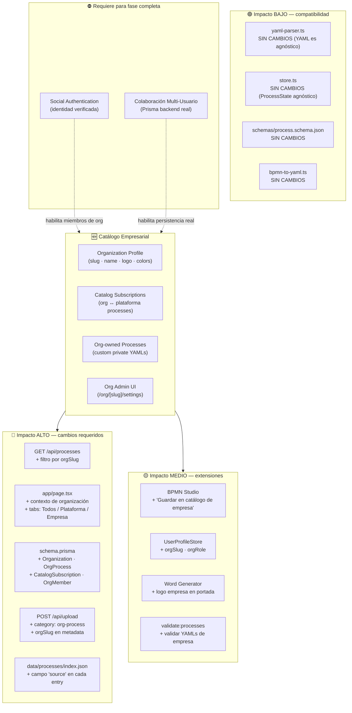
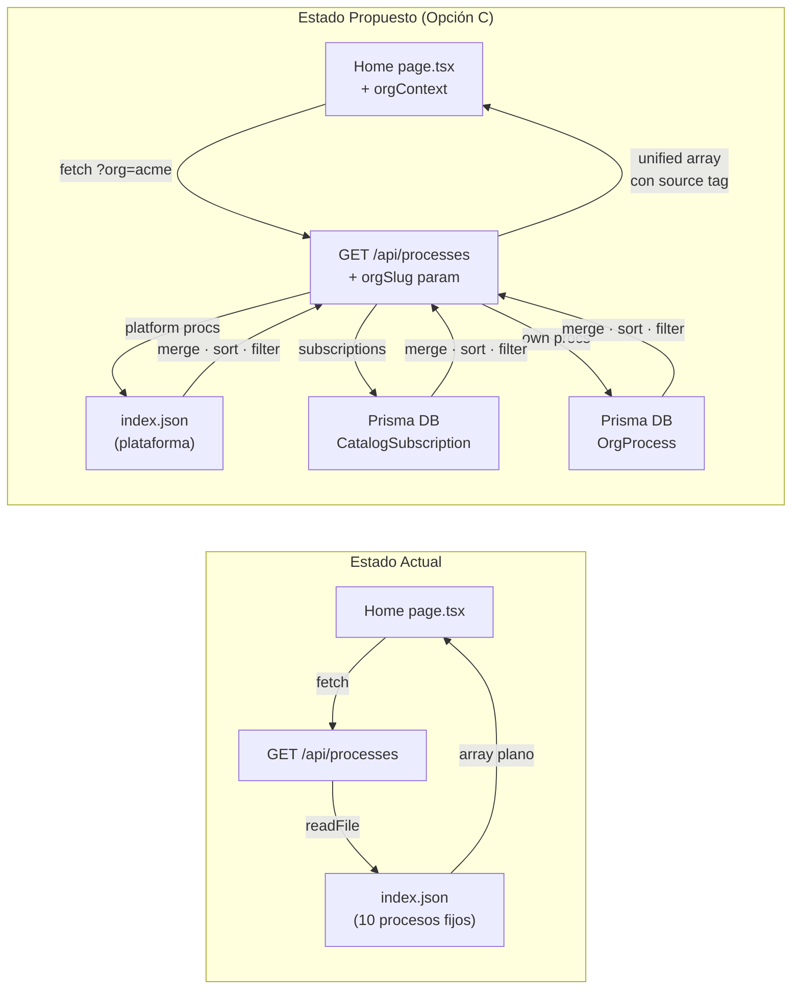
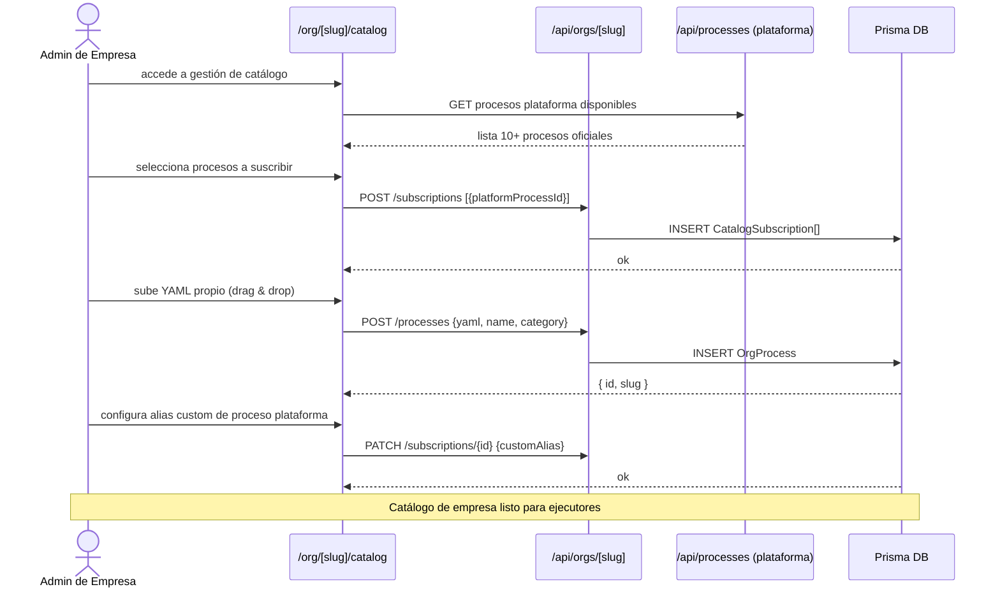
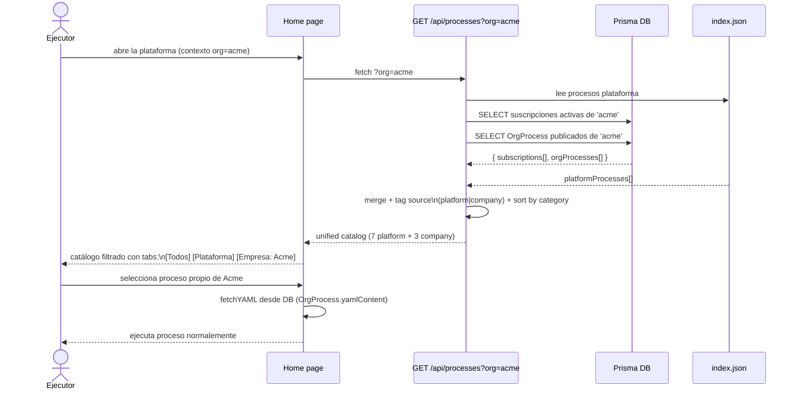

# Propuesta: Catálogo Empresarial — Company Process Catalog

**Estado:** 🔍 Análisis / Pre-diseño  
**Fecha:** 2026-06-02  
**Versión base:** v3.0.3  
**Autor:** Cascade (a solicitud del mantenedor)

---

## 1. Resumen Ejecutivo

### ¿Qué es?

Un sistema que permite a **organizaciones (empresas)** crear su propio perfil dentro de la plataforma y gestionar un catálogo de procesos **personalizado**: una combinación curada de procesos propios (YAMLs privados) y procesos del catálogo oficial de la plataforma.

### ¿Por qué?

Hoy el catálogo es **global y único** para todos los usuarios: 10 procesos en `data/processes/index.json`, sin ningún contexto de empresa. Esto impide:

- Que una empresa muestre **solo sus procesos relevantes** sin ver los del resto.
- Que una empresa **agregue sus propios procesos** sin acceso al servidor.
- Que existan **variantes** de un proceso oficial adaptadas a su contexto.
- Que la plataforma pueda **escalar como SaaS** multi-tenant.

### ¿A quién beneficia?

| Actor | Beneficio |
|---|---|
| **Empresa cliente** | Catálogo propio con branding, procesos privados + selección de oficiales |
| **Administrador de empresa** | Gestiona qué procesos están disponibles para su equipo |
| **Ejecutor de proceso** | Ve solo procesos relevantes a su organización |
| **Plataforma (nosotros)** | Habilitación de modelo SaaS multi-tenant con licenciamiento |

---

## 2. Estado Actual — Limitaciones

```
HOY
────────────────────────────────────────────────────────────
GET /api/processes
    └── lee data/processes/index.json (10 procesos fijos)
    └── sin contexto de tenant
    └── sin autenticación
    └── sin procesos privados

Catálogo en Home (page.tsx)
    └── muestra TODOS los procesos a TODOS los usuarios
    └── no hay concepto de "mi empresa"
    └── no hay filtro por organización

UserProfile (user-profile-store.ts)
    └── solo nombre + avatar Marvel
    └── sin vínculo a ninguna organización
    └── persiste solo en localStorage (no en servidor)

Prisma (db.ts / schema.prisma)
    └── PrismaClient instanciado
    └── schema.prisma SIN MODELOS definidos → base de datos vacía
```

---

## 3. Definición de la Propuesta

### Concepto central

```
                   ┌─────────────────────────────┐
                   │     Catálogo de la Empresa   │
                   │                              │
  Procesos        │  ┌─────────┐  ┌───────────┐ │
  Plataforma ──►  │  │  📦 Sub │  │  🏢 Own   │ │
  (oficiales)     │  │  scripto │  │  procesos │ │
                  │  │  nes    │  │  privados │ │
                  │  └────┬────┘  └─────┬─────┘ │
                  │       └──────┬───────┘       │
                  │              ▼               │
                  │     Vista del Ejecutor        │
                  │     (filtrada por tenant)     │
                  └─────────────────────────────┘
```

Una **Organización** tiene:
1. **Perfil**: nombre, slug, logo URL, colores de marca (opcional).
2. **Suscripciones**: selección de procesos del catálogo oficial de la plataforma.
3. **Procesos propios**: YAMLs privados subidos o creados en BPMN Studio, visibles solo para la org.
4. **Miembros**: usuarios vinculados a la org (requiere Social Auth en fase futura).

---

## 4. Mapa de Impacto

Áreas del sistema afectadas por este feature:



---

## 5. Opciones de Implementación

Se proponen **tres enfoques** con diferentes niveles de complejidad y valor entregado:

### Opción A — File-based (sin backend) · Complejidad: Baja

```
data/
  organizations/
    acme/
      org.json          ← perfil: name, logo, colors
      subscriptions.json ← IDs de procesos plataforma seleccionados
      processes/
        index.json      ← índice de procesos propios
        mi-proceso.yaml ← YAML privado de la empresa
```

**GET /api/processes?org=acme** → merge de subscriptions + procesos propios de la carpeta.

| ✅ Ventajas | ❌ Desventajas |
|---|---|
| Sin base de datos | No escala para SaaS (requiere acceso al FS del servidor) |
| Rápido de implementar | No funciona en Vercel (filesystem efímero) |
| Funciona offline/local | Sin aislamiento real de seguridad |
| Facilita PR de contribución | Administración solo vía archivos |

**Indicado para:** instancias self-hosted, deploy propio (Docker), equipos técnicos.

---

### Opción B — Config + localStorage (sin servidor) · Complejidad: Muy Baja

La empresa configura su catálogo en la propia UI: el admin selecciona procesos del catálogo oficial y carga YAMLs propios → todo persiste en localStorage con lz-string.

**GET /api/processes** sin cambios (devuelve plataforma). El filtrado y los procesos propios viven en un nuevo `OrgCatalogStore` (Zustand + localStorage).

| ✅ Ventajas | ❌ Desventajas |
|---|---|
| Cero backend | No comparte entre usuarios/dispositivos |
| Implementable en días | Catálogo se pierde si el usuario borra datos |
| Sin dependencias externas | No es real "empresa" sino perfil local |
| Funciona en Vercel/Docker sin cambios | No apto para SaaS |

**Indicado para:** prototipo rápido, validación de UX, uso single-user empresarial.

---

### Opción C — Prisma + API Multi-tenant · Complejidad: Alta ⭐ Recomendada a medio plazo

Modelo de datos completo con Prisma (PostgreSQL), API Routes multi-tenant, autenticación opcional por fases.

```
Prisma schema:
  Organization     ← perfil de empresa
  OrgMember        ← usuario ↔ org (con rol)
  OrgProcess       ← proceso propio de empresa (almacena YAML como string)
  CatalogSubscription ← org selecciona proceso de plataforma
```

**GET /api/processes?org={slug}** → join de subscripciones + procesos propios desde DB.

| ✅ Ventajas | ❌ Desventajas |
|---|---|
| Multi-tenant real, escala para SaaS | Requiere PostgreSQL (Prisma schema vacío hoy) |
| Compartido entre todos los usuarios de la org | Mayor esfuerzo de implementación |
| Habilita dashboard de uso por empresa | Requiere Social Auth para miembros completos |
| Base para licenciamiento y billing | Rompe el flujo 100% offline actual |

**Indicado para:** SaaS, múltiples equipos, gestión centralizada.

---

## 6. Modelo de Datos Propuesto (Opción C)

```mermaid
classDiagram
    class Organization {
        +id: string
        +slug: string
        +name: string
        +logoUrl: string
        +primaryColor: string
        +plan: OrgPlan
        +createdAt: DateTime
        +updatedAt: DateTime
    }

    class OrgMember {
        +id: string
        +orgId: string
        +userId: string
        +role: OrgRole
        +joinedAt: DateTime
    }

    class OrgProcess {
        +id: string
        +orgId: string
        +slug: string
        +name: string
        +description: string
        +category: string
        +yamlContent: string
        +version: string
        +isPublished: boolean
        +createdBy: string
        +createdAt: DateTime
        +updatedAt: DateTime
    }

    class CatalogSubscription {
        +id: string
        +orgId: string
        +platformProcessId: string
        +isActive: boolean
        +customAlias: string
        +subscribedAt: DateTime
    }

    class PlatformProcess {
        +id: string
        +name: string
        +description: string
        +category: string
        +file: string
        +version: string
        +isPublic: boolean
    }

    class OrgPlan {
        <<enumeration>>
        FREE
        STARTER
        PROFESSIONAL
        ENTERPRISE
    }

    class OrgRole {
        <<enumeration>>
        OWNER
        ADMIN
        EDITOR
        VIEWER
    }

    Organization "1" --> "*" OrgMember
    Organization "1" --> "*" OrgProcess
    Organization "1" --> "*" CatalogSubscription
    CatalogSubscription "*" --> "1" PlatformProcess
    OrgMember "*" --> "1" Organization
```



---

## 7. Cambios Arquitectónicos (Delta)

### Flujo actual vs. propuesto para cargar el catálogo:



### Nuevas rutas API requeridas:

| Ruta | Método | Descripción |
|---|---|---|
| `/api/orgs` | `POST` | Crear organización |
| `/api/orgs/[slug]` | `GET` | Perfil de la org |
| `/api/orgs/[slug]` | `PATCH` | Actualizar branding/config |
| `/api/orgs/[slug]/processes` | `GET` | Procesos propios de la org |
| `/api/orgs/[slug]/processes` | `POST` | Crear/subir proceso propio |
| `/api/orgs/[slug]/processes/[id]` | `PATCH/DELETE` | Editar o eliminar proceso propio |
| `/api/orgs/[slug]/subscriptions` | `GET/POST/DELETE` | Gestionar suscripciones al catálogo oficial |
| `/api/orgs/[slug]/members` | `GET/POST/DELETE` | Gestionar miembros (requiere Auth) |
| `/api/processes?org=[slug]` | `GET` | **Modificación** del endpoint actual + merge |

---

## 8. Nuevos Flujos de Usuario

### Flujo A — Admin configura catálogo de empresa



### Flujo B — Ejecutor ve catálogo de su empresa



---

## 9. Impacto en Features Existentes

| Feature | Impacto | Cambio requerido |
|---|---|---|
| **Home / Catálogo** | 🔴 Alto | Agregar `orgContext`, tabs de filtrado, fetch con `?org=` |
| **GET /api/processes** | 🔴 Alto | Aceptar `orgSlug`, hacer merge de fuentes |
| **BPMN Studio** | 🟡 Medio | Agregar botón "Guardar en catálogo de [Empresa]" → POST OrgProcess |
| **Process Executor** | 🟢 Bajo | Sin cambios (lee YAML, ejecuta) — solo origen del YAML cambia |
| **Export Word** | 🟢 Bajo | Opcional: incluir logo de empresa en portada del reporte |
| **UserProfileStore** | 🟡 Medio | Agregar `orgSlug` y `orgRole` al perfil local |
| **validate:processes** | 🟡 Medio | Extender script para validar YAMLs de empresas |
| **Social Auth (planificado)** | 🔴 Bloqueador | Para miembros reales, invitaciones y RBAC |
| **yaml-parser.ts** | 🟢 Ninguno | YAML es agnóstico al origen |
| **store.ts / session-store.ts** | 🟢 Ninguno | ProcessState no necesita saber de orgs |
| **Tests unitarios** | 🟡 Medio | Nuevos tests para API routes de orgs, merge logic |

---

## 10. Matriz de Riesgos

| Riesgo | Probabilidad | Impacto | Mitigación |
|---|---|:---:|:---:|
| **Prisma sin modelos** — schema vacío, requiere migración inicial | Alta | 🔴 Alto | Definir schema en PR dedicado antes de cualquier código de feature |
| **Filesystem efímero en Vercel** — Opción A incompatible con serverless | Alta | 🔴 Alto | Ir directo a Opción C (DB) o usar Opción B como puente temporal |
| **Aislamiento de datos entre orgs** — filtrado solo por `orgSlug` en query params sin auth es bypasseable | Alta | 🔴 Alto | Para MVP sin auth: solo read-only de org pública. Escritura requiere token |
| **Carga de YAML malicioso** — empresa sube YAML con scripts o referencias externas peligrosas | Media | 🟡 Medio | Validar contra `schemas/process.schema.json` (Ajv) + sanitizar texto libre |
| **Tamaño del YAML en DB** — YAMLs grandes (gestion-ambientes tiene 64.5 días) | Baja | 🟢 Bajo | Usar `TEXT` en Prisma, comprimir antes de almacenar |
| **Conflicto de IDs entre plataforma y empresa** — mismo `process.id` en ambos catálogos | Media | 🟡 Medio | Namespacing: `platform:{id}` vs `org:{slug}:{id}` |
| **Regresión en Home** — modificar el fetch puede romper el catálogo actual | Media | 🔴 Alto | Feature flag: si no hay `?org=` devuelve comportamiento actual sin cambios |
| **UX compleja** — usuarios no saben qué es "suscripción" vs "proceso propio" | Media | 🟡 Medio | UX clara: separar en dos secciones con labels evidentes |

---

## 11. Estimación de Esfuerzo por Fase

### Leyenda: `XS` < 2d · `S` 3-5d · `M` 1-2sem · `L` 3-4sem · `XL` > 1mes

| Fase | Descripción | ⌨️ Código | 🧪 Testing | Total estimado |
|---|---|:---:|:---:|:---:|
| **Fase 0** | Definir schema Prisma + migración inicial | `S` | `XS` | ~1 semana |
| **Fase 1 (MVP — Opción B)** | OrgCatalogStore en localStorage: tabs en Home, carga YAML custom, selección de plataforma | `M` | `S` | ~2-3 semanas |
| **Fase 2 (File-based — Opción A)** | API con soporte `?org=`, carpeta `data/organizations/`, admin UI básica | `M` | `M` | ~3-4 semanas |
| **Fase 3 (Backend — Opción C)** | Prisma models + API routes + DB multi-tenant + Studio "Guardar en empresa" | `L` | `L` | ~6-8 semanas |
| **Fase 4 (Branding)** | Logo en Home + portada Word, colores de org en UI, dominio custom | `S` | `S` | ~1-2 semanas |
| **Fase 5 (Members)** | Invitaciones, RBAC, dashboard de org (requiere Social Auth) | `XL` | `XL` | Depende de Auth |

**Total MVP funcional (Fases 0+1+2):** ~6-8 semanas  
**Total Backend completo (Fases 0+1+2+3+4):** ~3-4 meses

---

## 12. Propuesta de Fases (Roadmap)

```
Fase 0       Fase 1 (MVP)          Fase 2              Fase 3              Fase 4       Fase 5
──●──────────────●───────────────────●───────────────────●───────────────────●────────────●──
Prisma        OrgCatalogStore      File-based           Prisma backend      Branding    Members
schema        localStorage         API multi-org        completo            + Word       + Auth
              tabs en Home         data/organizations/  API routes          logo        (requiere
              YAML upload          admin UI básica      Org CRUD                        Social Auth)
              (Opción B)           (Opción A)           (Opción C)
              ~2-3 sem             ~3-4 sem             ~6-8 sem             ~1-2 sem    Post-Auth
```

---

## 13. Dependencias

```
Este feature REQUIERE (bloqueadores para fase completa):
    Social Authentication    → para RBAC, invitaciones, identidad de miembros
    Prisma con modelos       → para persistencia real (hoy schema.prisma está vacío)

Este feature HABILITA:
    Colaboración Multi-Usuario  → los "miembros de org" son la base del modelo multi-user
    Licenciamiento / Billing    → orgs con plan FREE/STARTER/ENTERPRISE
    Analytics por empresa       → qué procesos ejecuta cada org, tasas de completitud

Este feature ES COMPATIBLE CON (sin cambios):
    yaml-parser.ts          → agnóstico al origen
    store.ts                → ProcessState no depende de org
    schemas/process.schema.json → YAML schema no cambia
    BPMN Studio             → extiende con un botón, no modifica lo existente
    Export Word/Excel       → extensión opcional (logo)
```

---

## 14. Decisiones Pendientes

Antes de crear el plan de implementación, se deben resolver:

| # | Decisión | Opciones | Impacto |
|:---:|---|---|---|
| 1 | **¿Qué fase implementar primero?** | A (file-based), B (localStorage), C (DB) | Define arquitectura entera |
| 2 | **¿Self-hosted o SaaS?** | Docker propio vs. Vercel multi-tenant | Define si Opción A es viable |
| 3 | **¿Procesos propios son editables en la UI?** | Solo upload YAML, BPMN Studio, o editor inline | Alcance del Studio |
| 4 | **¿Acceso a orgs sin autenticación?** | Pública por slug (read), protegida por token, o solo con Auth | Seguridad del MVP |
| 5 | **¿Puede una empresa modificar un proceso de plataforma?** | No (solo alias), Fork local, o PR al repo | Modelo de suscripción |
| 6 | **¿Cómo se crea una org en MVP?** | Config JSON manual, formulario en UI, o invitación | UX del onboarding |
| 7 | **¿Cuántos procesos propios por plan?** | Ilimitado, cuota por plan | Modelo de negocio |

---

## 15. Próximos Pasos Recomendados

1. **Validar decisiones 1-6** con el mantenedor antes de comenzar diseño técnico.
2. **Definir MVP scope**: se recomienda Fase 0 + Fase 1 (localStorage) para validar UX sin backend.
3. **Crear `plan-company-process-catalog.md`** con spec técnica detallada tras tomar las decisiones.
4. **Actualizar `README.features.md`** para incluir este feature una vez aprobado.
5. **Definir Prisma schema** (`Organization`, `OrgProcess`, `CatalogSubscription`) en branch separado.

---

*Documento de análisis pre-diseño · v0.1 · 2026-06-02*
