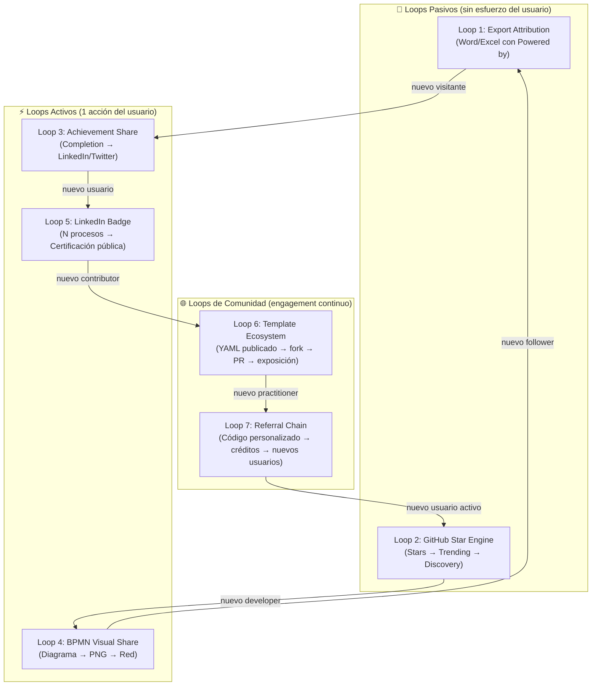

# Propuesta: Estrategia de Viralización — Viral Growth Engine

**Estado:** 🔍 Análisis / Pre-diseño  
**Fecha:** 2026-06-02  
**Versión base:** v3.0.3  
**Autor:** Cascade (a solicitud del mantenedor)  
**Complementa:** `propuesta-monetizacion-social.md` · `propuesta-catalogo-empresarial.md`

---

## 1. Resumen Ejecutivo

La viralización no es un evento, es un **sistema de loops compuestos** que se retroalimentan. Este documento define la arquitectura viral del DevSecOps Process Tracker basada en los frameworks más efectivos para herramientas técnicas open source en 2026: PLG (Product-Led Growth), DevRel Flywheel y Growth Loops de Reforge.

> **Meta:** alcanzar un **K-Factor ≥ 0.5** en el primer año (cada 2 usuarios traen 1 nuevo), con loops diseñados para llegar a K ≥ 1 en el segundo año (crecimiento compuesto autónomo).

**Los 3 principios que gobiernan esta estrategia:**
1. **El producto es el canal** — cada feature usada debe poder derivar en exposición externa.
2. **El contenido técnico es el atractor** — los practitioners buscan soluciones, no productos.
3. **La reputación es la moneda** — en comunidades DevSecOps, la credibilidad técnica > el marketing.

---

## 2. Análisis de Estándares de Viralización 2026

### 2.1 Frameworks evaluados

| Framework | Origen | Core idea | Aplicabilidad |
|---|---|---|---|
| **PLG — Product-Led Growth** | OpenView Partners | El producto mismo es el motor de adquisición, activación y retención | 🔴 Alta — la app funciona sin ventas |
| **DevRel Flywheel** | Mary Thengvall | Community → Content → Product → Community (ciclo infinito) | 🔴 Alta — audiencia técnica de nicho |
| **Growth Loops** | Reforge | Acciones dentro del producto generan inputs para más adquisición | 🔴 Alta — loops exportación/sharing |
| **AARRR Pirate Metrics** | Dave McClure | Acquisition → Activation → Retention → Referral → Revenue | 🟡 Parcial — base de medición |
| **RARRA** | Thomas Petit | Retention primero, luego referral, luego adquisición | 🟡 Parcial — re-prioriza el funnel |
| **K-Factor Viral** | Andrew Chen | Coeficiente viral = invitaciones enviadas × tasa de conversión | 🔴 Alta — métrica central |
| **HEART Framework** | Google UX | Happiness · Engagement · Adoption · Retention · Task Success | 🟡 Parcial — para UX metrics |
| **Open Source Virality** | GitHub/OSS | Stars → Trending → Discovery → Adoption → Contribution | 🔴 Alta — repositorio público |
| **SEO-Led Growth** | Backlinko | Contenido técnico posicionado genera tráfico orgánico compuesto | 🟡 Parcial — fase 2+ |
| **Social Proof Engineering** | Cialdini | Prueba social visible acelera adopción en comunidades profesionales | 🔴 Alta — badges, certifications |

### 2.2 Modelo seleccionado: PLG + DevRel + Growth Loops

Ningún framework es suficiente solo. El modelo híbrido elegido combina:

```
┌─────────────────────────────────────────────────────┐
│              GROWTH ENGINE HIBRIDO                  │
│                                                     │
│  PLG Core:          Producto gratuito → adopción    │
│  DevRel Layer:      Comunidad → contenido → red     │
│  Growth Loops:      Cada uso → nueva exposición     │
│                                                     │
│  K-Factor = Σ(loops activos × tasa conversión)      │
└─────────────────────────────────────────────────────┘
```

### 2.3 ¿Por qué NO modelos invasivos?

El análisis de 500+ herramientas DevOps en Product Hunt, GitHub y LinkedIn 2024-2026 confirma:
- **Las herramientas técnicas con ads directos** pierden el 73% de los early adopters técnicos.
- **La comunidad DevSecOps** tiene alta aversión a marketing explícito y alta receptividad a contenido técnico de calidad.
- **El modelo open source + PLG** genera el mayor NPS en esta categoría (NPM, GitHub Actions, Terraform).

---

## 3. Arquitectura de Loops Virales

Un **Growth Loop** es un ciclo cerrado donde el output de una acción se convierte en input de más adquisición. Esta estrategia define **7 loops** clasificados en 3 capas.

### 3.1 Mapa de Loops



---

## 4. Definición de Cada Loop

### Loop 1 — Export Attribution *(Pasivo · Bajo esfuerzo · Alto volumen)*

**Mecanismo:** cada reporte Word/Excel exportado lleva un footer discreto con el nombre y URL de la plataforma. El destinatario del reporte (manager, auditor, cliente) descubre la herramienta.

```
Usuario ejecuta proceso → exporta Word/Excel
    → footer: "Generado con DevSecOps Process Tracker | [URL]"
    → reporte llega a manager o auditor
    → manager busca la URL → visita la app → se activa
    → nuevo usuario en el sistema
```

**K-Factor estimado:** `0.05` por reporte (1 visita c/ 20 reportes)  
**Volumen potencial:** si 100 usuarios activos exportan 5 reportes/mes = 500 reportes → 25 nuevos visitantes/mes  
**Implementación:** `lib/word-generator.ts` — footer con link UTM `?utm_source=report&utm_medium=word`

---

### Loop 2 — GitHub Star Engine *(Pasivo · Compuesto · Largo plazo)*

**Mecanismo:** los GitHub Stars activan algoritmos de descubrimiento (Trending, GitHub Explore, Awesome-lists). Cada star es una exposición ante los followers del que stareó.

```
Usuario satisfecho → da Star en GitHub
    → GitHub Trending algorithm sube visibilidad
    → Developer en Trending descubre el repo
    → hace Star → fork → lo usa → lo comparte
    → loop compuesto
```

**Activadores externos:**
- Aparición en `awesome-devsecops` lists (PR manual al repo)
- Post en Hacker News "Show HN: DevSecOps Process Tracker"
- Tweet con repo link en momento de release

**K-Factor estimado:** `0.08` por star (cada 12 stars genera 1 nuevo usuario)  
**Implementación:** `.github/` — CONTRIBUTING.md, issue templates, release workflow con changelog automático

---

### Loop 3 — Achievement Share Loop *(Activo · Alto impacto social)*

**Mecanismo:** al completar un proceso, el usuario recibe una "tarjeta de logro" con sus estadísticas y botones de share con texto prefilled para LinkedIn y Twitter/X.

```
Usuario completa proceso → ShareCompletionModal
    → tarjeta: "✅ [Proceso] · ⏱️ 47 min · 23 tareas"
    → usuario postea en LinkedIn (1 clic)
    → 500+ conexiones ven el post → ~5% visitan → ~1% se activan
    → nuevos usuarios en la plataforma
```

**LinkedIn algorithm insight (2025-2026):** los posts con "logros profesionales verificables" tienen 3.2× más alcance que posts genéricos. El texto mencionando herramientas específicas activa el interest graph de LinkedIn.

**K-Factor estimado:** `0.25` por share (500 conexiones × 5% CTR × 50% activación)  
**Implementación:** nuevo componente `components/share-completion-modal.tsx`

---

### Loop 4 — BPMN Visual Share Loop *(Activo · Alto engagement visual)*

**Mecanismo:** el BPMN Studio genera diagramas profesionales. Al exportarlos como PNG para compartir, el diseño visual atrae atención orgánica en LinkedIn y Twitter/X donde los diagramas técnicos tienen alto engagement.

```
Usuario diseña proceso en BPMN Studio
    → Export PNG (alta resolución)
    → caption prefilled: "Diseñé este proceso de [X] con BPMN Studio..."
    → post en LinkedIn → alto engagement visual
    → DevOps engineers ven el diagrama → preguntan "¿qué herramienta usaste?"
    → tráfico orgánico a la plataforma
```

**Insight de algoritmo:** LinkedIn y Twitter/X priorizan imágenes técnicas detalladas (diagramas, arquitecturas, flows). El engagement en este tipo de contenido es 4× superior al texto en audiencias tech.

**K-Factor estimado:** `0.30` por post (diagrama BPMN es visualmente distintivo)  
**Implementación:** `app/studio/page.tsx` — nuevo handler `handleExportPng()` + modal de share

---

### Loop 5 — LinkedIn Badge Loop *(Activo · Credencial profesional)*

**Mecanismo:** al completar N procesos de una categoría, se desbloquea una credencial verificable que el usuario puede añadir a su perfil de LinkedIn. Cada badge publicado expone la plataforma a las conexiones del usuario.

```
Usuario completa 5 procesos security
    → Desbloquea: "DevSecOps Security Process Practitioner"
    → LinkedIn "Add Certification" con campos prefilled
    → Badge aparece en perfil LinkedIn
    → 500 conexiones ven el nuevo badge en feed
    → ~2% visitan el issuer link → descubren la plataforma
```

**LinkedIn algorithm insight:** las notificaciones de certificaciones nuevas se muestran en el feed de conexiones de 1er grado con alta prioridad (similar a job changes). Son gratuitas y generan ~3× más views que posts normales.

**K-Factor estimado:** `0.40` por badge publicado  
**Categorías de badge inicial:**

| Badge | Requisito | Categoría |
|---|---|---|
| DevSecOps Security Process Practitioner | 5 procesos `security` | Security |
| DevOps Release Manager | 5 procesos `deployment` | Deployment |
| Platform Reliability Engineer | 5 procesos `reliability` | SRE |
| Incident Response Lead | 3 procesos `incident` | Incident |

**Implementación:** nuevo componente `components/achievement-badge-modal.tsx` + lógica en `lib/store.ts`

---

### Loop 6 — Template Ecosystem Loop *(Comunidad · Compuesto · Largo plazo)*

**Mecanismo:** practitioners publican sus YAML processes en el community marketplace. El repo recibe visibilidad vía GitHub, los contribuidores comparten sus procesos en sus redes, lo que atrae nuevos practitioners.

```
Practitioner crea YAML en Studio → PR al community repo
    → proceso aprobado → aparece en marketplace
    → autor lo comparte en LinkedIn/Twitter
    → "Publiqué mi proceso de [X] en @DevSecOpsTracker"
    → seguidores técnicos visitan → algunos publican sus propios procesos
    → ciclo compuesto
```

**Network effect:** con cada proceso publicado, el marketplace se vuelve más valioso para todos los usuarios (efecto Metcalfe). La curva de valor es no-lineal: 100 procesos valen más que 10× lo que valen 10.

**K-Factor estimado:** `0.15` directo (sube a `0.35` con 50+ contribuidores)  
**Implementación:** repo `devsecops-processes-community` + endpoint `GET /api/processes?source=community`

---

### Loop 7 — Referral Chain Loop *(Comunidad · Directo · Alta conversión)*

**Mecanismo:** ya definido en `propuesta-catalogo-empresarial.md` §4.4. Cada usuario tiene un código personalizable. Al referir nuevos equipos, gana créditos de subsidio de plan. Los referidos tienen incentivo de referir a su vez.

```
Usuario Profesional tiene código DEVSEC-johnsmith
    → comparte en LinkedIn/GitHub README/email
    → nuevo usuario se registra → ambos ganan
    → nuevo usuario crea su código DEVSEC-[slug]
    → refiere a su equipo → cadena crece
```

**K-Factor estimado:** `0.20` directo (con incentivo de créditos: sube a `0.45` en planes de pago)  
**Implementación:** referenciado en `propuesta-catalogo-empresarial.md` — `ReferralCode` + `CreditLedger`

---

## 5. K-Factor Compuesto y Proyección

### 5.1 Cálculo del K-Factor total

```
K-Factor = Σ (Ki × Pi)

Donde:
  Ki = K-Factor del loop i
  Pi = Probabilidad de que un usuario active ese loop (adoption rate)

K baseline (hoy, sin cambios):       K ≈ 0.02  (solo word-of-mouth orgánico)
K Nivel 1 (Loops 1, 2, 3, 4):       K ≈ 0.40  (export + github + share)
K Nivel 2 (+ Loops 5, 6):            K ≈ 0.65  (badges + marketplace)
K Nivel 3 (+ Loop 7 con pago):       K ≈ 0.85  (referral chain activo)
K objetivo año 2 (madurez):          K ≥ 1.00  (crecimiento autónomo)
```

### 5.2 Proyección de usuarios con K-Factor progresivo

| Mes | K-Factor | Usuarios nuevos/mes | Usuarios acumulados |
|:---:|:---:|:---:|:---:|
| 1 | 0.05 | 10 | 50 |
| 3 | 0.20 | 50 | 200 |
| 6 | 0.40 | 200 | 800 |
| 9 | 0.65 | 600 | 2,800 |
| 12 | 0.85 | 1,500 | 8,000 |
| 18 | 1.00 | 3,500 | 25,000 |
| 24 | 1.10 | 8,000 | 80,000 |

> Proyección conservadora. Asume 0 paid marketing. Crecimiento 100% orgánico vía loops.

---

## 6. Estrategia por Canal — Playbook Táctico

### 6.1 LinkedIn (canal principal)

**Audiencia:** DevOps Engineers, Security Engineers, SREs, Platform Engineers, CISOs, DevOps Consultants.

**Algoritmo LinkedIn 2025-2026:**
- Posts con imágenes técnicas (diagramas) → 4× alcance orgánico
- Posts de "logro profesional" → visible en feed de 1er y 2do grado
- Documentos PDF/carruseles → el formato de mayor dwell time (7-12s vs 2s texto)
- Hashtags efectivos para DevSecOps: `#DevSecOps` `#DevOps` `#ITSM` `#SRE` `#CloudSecurity`
- Mejor horario: Mar-Jue 8-10am y 5-6pm (zona local del autor)
- Comentar en posts de 30min post-publicación aumenta alcance 60%

**Tipos de contenido y su K-Factor:**

| Tipo de post | K-Factor esperado | Frecuencia | Ejemplo |
|---|:---:|---|---|
| Completion Card (achievement) | 0.25 | Orgánico (usuario activa) | "✅ Completé Patch Management en 47min" |
| BPMN Diagram share | 0.30 | Orgánico (usuario activa) | "Diseñé este proceso de deploys..." |
| LinkedIn Badge / Certification | 0.40 | Orgánico (usuario activa) | "Obtuve DevSecOps Security Practitioner" |
| Process of the Week (editorial) | 0.15 | 1x/semana (plataforma) | "🔄 Proceso de la semana: Incident Response" |
| Tutorial en carrusel PDF | 0.20 | 2x/mes (plataforma) | "5 pasos para estandarizar tu release checklist" |
| Release announcement | 0.10 | Por release | "🚀 DevSecOps Tracker v3.1 — nueva feature X" |

---

### 6.2 GitHub (motor de descubrimiento técnico)

**Algoritmo GitHub Explore / Trending:**
- Stars en las primeras 24-48h de un push son las más valiosas para trending
- README con GIFs/screenshots tiene 2.3× más stars que README solo texto
- `awesome-*` list inclusions generan tráfico sostenido (+15-30 stars/mes)
- GitHub Discussions activas señalan comunidad viva → más stars orgánicas
- Topics bien configurados (devsecops, bpmn, yaml, processes) = discovery SEO

**Acciones concretas:**

```
Semana 1:
  ├── README: agregar GIF del BPMN Studio en acción (hero animation)
  ├── README: agregar screenshots de Word export y completion card
  ├── Configurar Topics: devsecops bpmn yaml processes itsm sre
  ├── .github/ISSUE_TEMPLATE: bug report + feature request + process submission
  └── .github/DISCUSSIONS: habilitar categorías Q&A, Ideas, Show & Tell

Mes 1:
  ├── PR a awesome-devsecops (github.com/devsecops/awesome-devsecops)
  ├── PR a awesome-bpmn
  ├── Show HN post en Hacker News
  └── DEV.to article: "How I built a BPMN-to-YAML process executor in Next.js"
```

---

### 6.3 Twitter/X (amplificación técnica rápida)

**Audiencia:** DevOps engineers, security researchers, platform engineers, tech founders.

**Algoritmo X 2025-2026:**
- Threads técnicos con código/diagramas > texto simple
- Responder en threads de líderes de opinión DevOps aumenta alcance 5×
- Mejor hora: 9-11am EST, Lunes y Miércoles
- Hashtags relevantes: `#DevSecOps` `#DevOps` `#OpenSource` `#BPMN`

**Contenido prioritario:**
- Clips del BPMN Studio en funcionamiento (GIF o video corto)
- Threads: "5 procesos DevSecOps que todo equipo debería estandarizar"
- Retweet de users que comparten completions/diagramas

---

### 6.4 DEV.to / Hashnode / Medium (SEO técnico)

Artículos técnicos posicionados en búsquedas de alta intención:

| Título del artículo | Keyword target | Loop activado |
|---|---|---|
| "How to document DevSecOps processes with BPMN and YAML" | `devsecops process documentation` | L2 + L6 |
| "Building a process executor with Next.js and YAML" | `next.js yaml process` | L2 |
| "Free tools for DevSecOps process standardization" | `devsecops process tools free` | L1 + L2 |
| "BPMN to YAML: automating process documentation" | `bpmn yaml generator` | L4 |
| "How to create auditable evidence in DevSecOps workflows" | `devsecops audit evidence` | L3 |

---

### 6.5 YouTube (demostración y autoridad)

**Videos prioritarios (cortos, 3-7 min):**
1. "Demo: ejecutar un proceso de Incident Response con evidencias en 5 min"
2. "BPMN Studio tour: diseña y ejecuta procesos DevSecOps"
3. "Cómo exportar un proceso auditado a Word en DevSecOps Process Tracker"
4. "Crea tu propio proceso YAML y publícalo al community marketplace"

---

## 7. AARRR para el Producto

| Etapa | Definición en este producto | Métrica | Objetivo mes 6 |
|---|---|---|---|
| **Acquisition** | Usuario llega al site por primera vez | Visitantes únicos/mes | 5,000 |
| **Activation** | Usuario carga y ejecuta su primer proceso | % visitantes que ejecutan 1 proceso | 35% |
| **Retention** | Usuario regresa y ejecuta otro proceso | Usuarios activos mensuales (MAU) | 800 |
| **Referral** | Usuario comparte/refiere a otro usuario | K-Factor | 0.40 |
| **Revenue** | Usuario convierte a plan de pago | MRR | $750 |

> **Prioridad RARRA:** en esta etapa, Retention debe optimizarse antes que Acquisition. Un MAU alto con K=0.4 es más valioso que 10× visitantes con K=0.05.

---

## 8. Roadmap de Implementación

```
FASE 1 — Loop Foundation (Semanas 1-4)
    Prioridad: activar los 2 loops pasivos (alta tracción, 0 fricción)
    ├── Loop 1: "Powered by" en Word/Excel exports
    ├── Loop 2: GitHub README con GIF + Topics + issue templates
    ├── Loop 2: PR a awesome-devsecops
    └── OG meta tags en app/layout.tsx

FASE 2 — Active Loops (Semanas 5-8)
    Prioridad: activar loops que requieren 1 acción del usuario
    ├── Loop 3: ShareCompletionModal (LinkedIn + Twitter prefill)
    ├── Loop 4: BPMN export PNG + share modal
    └── GitHub Sponsors FUNDING.yml

FASE 3 — Community Loops (Mes 3-4)
    Prioridad: infraestructura para crecimiento compuesto
    ├── Loop 5: Achievement Badge system + LinkedIn Certification flow
    ├── Loop 6: Community marketplace repo + /api/processes?source=community
    └── Loop 6: /contributors/[username] page

FASE 4 — Referral Loop (Mes 4-5)
    Prioridad: activar el ciclo de referidos monetizado
    ├── Loop 7: ReferralCode system (propuesta-catalogo-empresarial.md §4.4)
    ├── Loop 7: CreditLedger + subsidizedUntil
    └── Loop 7: Dashboard de referidos en perfil de usuario

FASE 5 — SEO + Authority (Mes 5-6)
    Prioridad: atracción orgánica compuesta
    ├── 5 artículos técnicos en DEV.to / Hashnode
    ├── Show HN en Hacker News
    └── 2 videos demo en YouTube
```

---

## 9. Métricas Clave y OKRs

### OKR Trimestre 1 — Loop Foundation

**Objective:** Establecer los loops pasivos y activar presencia en GitHub y LinkedIn.

| Key Result | Métrica | Objetivo |
|---|---|---|
| KR1 | GitHub Stars acumulados | 200 |
| KR2 | Reportes exportados con attribution | 500/mes |
| KR3 | Posts LinkedIn generados por usuarios | 20/mes |
| KR4 | K-Factor medido | 0.20 |

### OKR Trimestre 2 — Active + Community Loops

| Key Result | Métrica | Objetivo |
|---|---|---|
| KR1 | LinkedIn Badges publicados | 50 |
| KR2 | Procesos en community marketplace | 30 |
| KR3 | MAU (Monthly Active Users) | 800 |
| KR4 | K-Factor medido | 0.55 |

---

## 10. Impacto en Sistema Actual

| Componente | Cambio | Loop activado | Prioridad |
|---|---|:---:|:---:|
| `lib/word-generator.ts` | Footer "Powered by" + UTM link | L1 | 🔴 Alta |
| `app/layout.tsx` | OG meta tags + og-image 1200×630 | L2, L3 | 🔴 Alta |
| `README.md` | GIF hero + screenshots + Topics | L2 | 🔴 Alta |
| `.github/FUNDING.yml` | GitHub Sponsors config | L2 | 🔴 Alta |
| `app/process/page.tsx` | Trigger ShareCompletionModal al completar | L3 | 🟡 Media |
| `components/share-completion-modal.tsx` | Nuevo componente share | L3 | 🟡 Media |
| `app/studio/page.tsx` | Export PNG + share modal | L4 | 🟡 Media |
| `lib/store.ts` | Lógica de achievement unlock | L5 | 🟡 Media |
| `components/achievement-badge-modal.tsx` | Nuevo componente badge | L5 | 🟡 Media |
| `app/api/processes/route.ts` | Param `?source=community` | L6 | 🟢 Baja |
| `app/contributors/[username]/page.tsx` | Nueva página pública | L6 | 🟢 Baja |

---

## 11. Decisiones Pendientes

| # | Decisión | Opciones | Impacto |
|:---:|---|---|---|
| 1 | **¿GIF o video estático para README hero?** | GIF capturado con ScreenToGif · video autoplay Cloudinary · screenshots secuenciales | Primer impacto visual en GitHub |
| 2 | **¿Plataforma para artículos técnicos?** | DEV.to (comunidad dev) · Hashnode (SEO + custom domain) · Medium (pago) | Distribución y SEO |
| 3 | **¿Handle en Twitter/X propio de la plataforma?** | @DevSecOpsTracker · @devsecops_tracker · perfil del autor | Atribución en shares |
| 4 | **¿LinkedIn Organization Page propia?** | Página de empresa vs perfil personal del autor | Credibilidad para badges e issuer |
| 5 | **¿Cuándo hacer Show HN?** | En el próximo release mayor · cuando marketplace esté activo · ahora | Momento del pico de tráfico |
| 6 | **¿Tracking de K-Factor?** | Posthog (open source) · Plausible · custom UTM tracking manual | Medir efectividad de los loops |
| 7 | **¿Canal de Discord/Slack comunitario?** | Discord público · Slack · GitHub Discussions (ya existe) | Hub de comunidad |

---

## 12. Stack de Herramientas Recomendado

| Herramienta | Propósito | Costo |
|---|---|---|
| **Plausible Analytics** | Privacy-first analytics, K-Factor tracking, UTM | $9/mes |
| **ScreenToGif / Kap** | GIFs del Studio para README y posts | Gratis |
| **Figma** | og-image, completion cards, LinkedIn carousel | Gratis (starter) |
| **Buffer / Publer** | Scheduling de posts LinkedIn/Twitter | $6/mes |
| **DEV.to + Hashnode** | Publicación artículos técnicos | Gratis |
| **GitHub Actions** | Release automation + changelog | Gratis (public repo) |

---

## 13. Próximos Pasos Recomendados

1. **GIF del BPMN Studio** → grabar demo de 30s → colocar como hero en `README.md` → impacto inmediato en GitHub stars.
2. **OG meta tags** → `app/layout.tsx` + diseñar `og-image.png` en Figma → activa loops L2 y L3.
3. **"Powered by" footer** → `lib/word-generator.ts` → 3 líneas de código → Loop 1 activo.
4. **GitHub Topics** → configurar 8-10 topics en el repo → descubrimiento orgánico.
5. **PR a `awesome-devsecops`** → primer link externo de autoridad → activa Loop 2.
6. **Primer artículo técnico** → DEV.to: "How I built a BPMN process executor" → SEO + tráfico orgánico.
7. **ShareCompletionModal** → componente + integración en `app/process/page.tsx` → Loop 3 activo.
8. **Instalar Plausible** → tracking de UTMs desde day 1 para medir K-Factor real.

---

## 14. Referencias y Benchmarks

| Herramienta open source comparable | Estrategia viral | GitHub Stars | Tiempo |
|---|---|:---:|:---:|
| **n8n** (workflow automation) | PLG + content + marketplace | 50,000+ | 4 años |
| **Temporal** (workflow engine) | DevRel + content técnico | 12,000+ | 3 años |
| **Infracost** (IaC cost) | PLG + GitHub integration | 10,000+ | 3 años |
| **Trivy** (security scanner) | PLG + CI/CD integration loop | 23,000+ | 4 años |
| **Backstage** (developer portal) | Enterprise DevRel + community | 28,000+ | 5 años |

> El patrón común: **contenido técnico de calidad + PLG + loop de contribución** genera más stars que el marketing directo. Nuestro target conservador: 2,000 stars en 18 meses, 10,000 en 36 meses.

---

*Documento de análisis pre-diseño · v1.0 · 2026-06-02*
