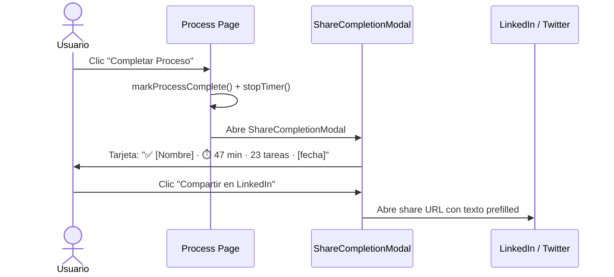

# Propuesta: Monetización Social — Social-First Revenue Engine

**Estado:** 🔍 Análisis / Pre-diseño  
**Fecha:** 2026-06-02  
**Versión base:** v3.0.3  
**Autor:** Cascade (a solicitud del mantenedor)

---

## 1. Resumen Ejecutivo

El DevSecOps Process Tracker posee 3 activos únicos monetizables sin degradar la experiencia gratuita:

| Activo | Potencial social |
|---|---|
| **Catálogo YAML curado** (10+ procesos profesionales) | Contenido único para comunidad DevSecOps |
| **Motor ejecución + BPMN** (pipeline único en el mercado) | Diferenciador técnico que justifica branding |
| **Audiencia de nicho** (practitioners que ejecutan procesos) | Base para comunidad y monetización |

> **Principio:** _"Monetizar el efecto de red, no la herramienta."_  
> Cada proceso completado es una historia compartible. Cada YAML publicado es contenido de valor. Las redes sociales son el canal de distribución **y** la superficie de monetización.

---

## 2. Análisis del Sistema Actual — Inventario de Activos Sociales

| Feature actual | Estado | Potencial social | Oportunidad |
|---|---|---|---|
| Export Word/Excel | ✅ Sin branding | 🔴 Sin explotar | Footer "Powered by" → cada reporte = publicidad pasiva |
| Export JSON | ✅ Sin atribución | 🟡 Parcial | Campo `_generator` con link técnico |
| BPMN Studio | ✅ Visual profesional | 🔴 Sin explotar | "Exportar PNG para LinkedIn" |
| Process Timer | ✅ Mide tiempo real | 🔴 Sin explotar | "Completé X en Y min" → stat compartible |
| Footer GitHub + LinkedIn | ✅ Links básicos | 🟡 Parcial | Sin GitHub Sponsors, sin CTAs |
| User profiles | ✅ localStorage | 🔴 Sin explotar | Sin perfil público ni página de contribuidor |

**Puntos de fricción identificados:**
- Sin OG meta tags → links compartidos no generan rich preview en LinkedIn/Twitter
- Sin completion share → el logro queda en localStorage sin viralidad
- Sin "Powered by" → cada reporte exportado es tráfico orgánico perdido
- Sin canal de donación → no hay forma de apoyar el proyecto aunque el usuario quiera
- Sin marketplace → los YAMLs que crea la comunidad no tienen canal de distribución

---

## 3. Panorama Completo de Modelos — Escala de Invasividad

> **Escala:** 1 = No perceptible · 10 = Degrada la experiencia

| # | Modelo | Inv. | Social | Revenue | Esfuerzo | Fit |
|:---:|---|:---:|:---:|:---:|:---:|:---:|
| 1 | **Open Source Sponsors** (GitHub Sponsors, Patreon, BMaC) | 🟢 1 | Alto | Medio | Bajo | Alto |
| 2 | **Social Attribution** ("Powered by" en reportes) | 🟢 1 | Alto | Indirecto | Bajo | Alto |
| 3 | **Referral Program** (ya propuesto en propuesta-catalogo) | 🟢 2 | Alto | Medio | Medio | Alto |
| 4 | **Creator Economy / Process Marketplace** | 🟢 3 | Alto | Alto | Medio | Alto |
| 5 | **Ambassador / Influencer Program** | 🟢 3 | Alto | Medio | Bajo | Alto |
| 6 | **Sponsored Process Templates** | 🟡 4 | Alto | Alto | Medio | Alto |
| 7 | **Certification Badges** (LinkedIn, skill verification) | 🟡 4 | Alto | Medio | Medio | Alto |
| 8 | **Freemium / SaaS** (ya en propuesta-catalogo) | 🟡 5 | Medio | Alto | Alto | Alto |
| 9 | **Community Platform** (Discord/Forum premium) | 🟡 5 | Alto | Medio | Medio | Medio |
| 10 | **Online Courses / Training** | 🟡 5 | Alto | Alto | Alto | Alto |
| 11 | **White-label / OEM** | 🟠 6 | Bajo | Alto | Alto | Medio |
| 12 | **API Monetization** | 🟠 7 | Bajo | Medio | Medio | Medio |
| 13 | **Pay-per-use / Credits** | 🟠 7 | Bajo | Medio | Medio | Bajo |
| 14 | **Data / Analytics Marketplace** | 🔴 8 | Bajo | Medio | Alto | Bajo |
| 15 | **Display Advertising** (AdSense) | 🔴 9 | Bajo | Medio | Bajo | Bajo |
| 16 | **Native Advertising** (contenido patrocinado disfrazado) | 🔴 10 | Bajo | Alto | Bajo | Bajo |

### Descripción de los primeros modelos

**Modelos 1-2 (Invasividad 1 — No perceptibles):**
- **Open Source Sponsors:** GitHub Sponsors / Patreon / Buy Me a Coffee permiten apoyo económico voluntario sin cambiar la UX. Es el modelo más alineado con la filosofía open source.
- **Social Attribution:** Texto discreto en reportes Word/Excel/BPMN ("Generado con DevSecOps Process Tracker"). Cada archivo compartido en una organización = publicidad orgánica gratuita.

**Modelos 3-5 (Invasividad 2-3 — Agregan valor, no fricción):**
- **Referral Program:** Ya definido en `propuesta-catalogo-empresarial.md` §4.4. Usuarios refieren → ganan créditos de plan.
- **Creator Economy:** Practitioners publican YAMLs al marketplace comunitario. Otros los ejecutan. Creadores ganan reputación + revenue share de sponsorships.
- **Ambassador Program:** Power users con audiencia en LinkedIn/GitHub actúan como evangelizadores a cambio de beneficios (plan gratis, acceso anticipado, co-marketing).

**Modelos 6-7 (Invasividad 4 — Valor contextual, mínima fricción):**
- **Sponsored Templates:** Vendors DevSecOps (HashiCorp, GitHub, Snyk) patrocinan templates relacionados a sus herramientas. Badge contextual, proceso 100% funcional e independiente.
- **Certification Badges:** Al completar N procesos de una categoría, el usuario genera una credencial verificable compartible en LinkedIn. Alta viralidad orgánica.

**Modelos 8-16:** Válidos a largo plazo pero contradicen la filosofía free-first o requieren base de usuarios sólida. Documentados por completitud, no parte de la estrategia inicial.

---

## 4. Estrategia: Los 2 Primeros Niveles

### Por qué estos 2 niveles primero

Los modelos 1-4 (Invasividad 1-3) son elegidos porque:
1. **No degradan la experiencia gratuita** — la app sigue 100% libre y funcional
2. **Amplifican el alcance orgánico** — cada uso genera marketing pasivo
3. **Crean la comunidad primero** — sin comunidad, ningún modelo mayor funciona
4. **Implementables hoy** — Nivel 1 sin backend. Nivel 2 usando GitHub como CDN

```
NIVEL 1 — Social Foundation (Semanas 1-4, sin backend):
    ├── "Powered by" en Word/Excel
    ├── OG meta tags para rich social previews
    ├── Shareable Completion Cards (LinkedIn/Twitter)
    ├── BPMN export to PNG compartible
    └── GitHub Sponsors + Buy Me a Coffee

NIVEL 2 — Creator Economy (Meses 2-4, GitHub como CDN):
    ├── Community Process Marketplace (GitHub repo público)
    ├── Contributor public profiles (/contributors/[username])
    ├── LinkedIn Certification Badges
    ├── "Process of the Week" editorial
    └── Sponsored slots en community catalog
```

---

## 5. Nivel 1 — Social Attribution + Open Source Economy

### 5.1 "Powered by" en Reportes Word y Excel

Línea de texto en el footer de cada reporte generado, con URL y repositorio de la plataforma.

**Implementación en `lib/word-generator.ts`:**
```typescript
new Paragraph({
  children: [new TextRun({
    text: "Generado con DevSecOps Process Tracker — https://devsecops-tracker.vercel.app",
    size: 16, color: "808080",
  })],
  alignment: AlignmentType.CENTER,
})
```
**Esfuerzo:** XS (< 2h) · **Impacto:** cada reporte exportado = 1 impresión pasiva en la organización del receptor.

---

### 5.2 Completion Share Card

Al completar un proceso, un modal muestra una "tarjeta de logro" con estadísticas y botones de compartir.



**Templates de texto prefilled:**
```
LinkedIn:
"✅ Completé '[ProcessName]' en [time] como parte de mi flujo DevSecOps.
Proceso estandarizado con evidencias y exportado como reporte auditado.
Herramienta: DevSecOps Process Tracker — [URL]
#DevSecOps #ITSM #ProcessManagement"

Twitter/X:
"✅ '[ProcessName]' completado en [time] ⚡
[X tareas] · [N fases] · evidencias incluidas
generado con @DevSecOpsTracker — #DevSecOps"
```
**Esfuerzo:** S (3-5 días) · **Impacto:** cada completion = potencial impresión en red del profesional.

---

### 5.3 OG Meta Tags — Rich Social Previews

```typescript
// app/layout.tsx — <head>
<meta property="og:title" content="DevSecOps Process Tracker" />
<meta property="og:description" content="Ejecuta procesos DevSecOps con evidencias, timer y exportación Word/Excel. Open Source." />
<meta property="og:image" content="https://[domain]/og-image.png" />
<meta name="twitter:card" content="summary_large_image" />
<meta name="twitter:creator" content="@habolanos" />
```

`/public/og-image.png`: Screenshot del BPMN Studio en acción (1200×630px).

**Esfuerzo:** XS (< 1 día) · **Impacto:** +30-50% conversión en cada link compartido.

---

### 5.4 GitHub Sponsors + Buy Me a Coffee

```yaml
# .github/FUNDING.yml
github: habolanos
buy_me_a_coffee: habolanos
```

**Niveles de sponsorship:**
| Tier | Precio/mes | Beneficio |
|---|:---:|---|
| ☕ Café | $5 | Badge en GitHub README |
| 🛡️ Contribuidor | $25 | Nombre en CONTRIBUTORS.md + badge especial |
| 🏢 Empresa patrocinadora | $100 | Logo en README + footer de la app |

**Esfuerzo:** XS (< 1 día) · **Impacto:** primer canal de ingresos directos, sin fricción de usuario.

---

### 5.5 BPMN Export to PNG — "Compartir Diagrama"

Botón en Studio toolbar que exporta el diagrama como PNG de alta calidad con caption prefilled para LinkedIn.

```
Studio toolbar → "📸 Exportar imagen"
    → genera PNG del diagrama
    → modal: Vista previa · Descargar · Compartir en LinkedIn
    → caption: "Diseñé este proceso de [nombre] con BPMN Studio en
      @DevSecOpsTracker. El diagrama genera YAML ejecutable
      automáticamente. #BPMN #DevSecOps"
```
**Esfuerzo:** S (3-4 días) · **Impacto:** diagramas BPMN son naturalmente virales en LinkedIn DevOps.

---

## 6. Nivel 2 — Creator Economy + Process Marketplace

### 6.1 Community Process Marketplace

**Arquitectura sin backend — GitHub como CDN:**

```
github.com/[org]/devsecops-processes-community
│
├── processes/
│   ├── harold-bolanos/
│   │   ├── patch-management-v2.yaml
│   │   └── meta.json   ← author, description, tags, downloads
│   └── index.json      ← catálogo completo del marketplace
└── CONTRIBUTING.md     ← cómo enviar un proceso (PR workflow)
```

**Flujo de publicación:**
1. Practitioner crea YAML en BPMN Studio → descarga
2. Fork del repo comunitario → agrega YAML + meta.json
3. PR → CI valida contra `schemas/process.schema.json` + review manual
4. Merged → aparece en el catálogo comunitario de la app

**El app carga community processes desde GitHub raw CDN:**
```typescript
// GET /api/processes?source=community
const COMMUNITY_INDEX =
  'https://raw.githubusercontent.com/[org]/devsecops-processes-community/main/processes/index.json';
```
**No requiere backend adicional.** GitHub actúa como CDN y el PR review como moderación.

---

### 6.2 Contributor Public Profiles

```
/contributors/harold-bolanos
    ├── Avatar + bio (GitHub API)
    ├── "Procesos publicados: 5"
    ├── "Ejecutado por: 1,234 usuarios"
    ├── Categorías: DevOps · Security · Incident
    ├── Lista de procesos con rating
    └── Links: GitHub · LinkedIn · Twitter
```

Viralidad: el contributor comparte su perfil en LinkedIn → sus conexiones descubren la plataforma.

---

### 6.3 LinkedIn Certification Badges

Al completar N procesos de una categoría, el usuario desbloquea una credencial compartible en LinkedIn.

```
Completó 5 procesos categoría "security"
    → Desbloqueó: "DevSecOps Security Process Practitioner"
    → Modal: "¡Logro desbloqueado! Agrega esta certificación a LinkedIn"
    → Link directo LinkedIn "Add Certification" con campos prefilled:
        Nombre: "DevSecOps Security Process Practitioner"
        Organización: "DevSecOps Process Tracker"
        URL verificación: https://[platform]/verify/[hash]
```

**URL prefill de LinkedIn:**
```
https://www.linkedin.com/profile/add?startTask=CERTIFICATION_NAME
  &name=DevSecOps+Security+Process+Practitioner
  &certUrl=https://platform/verify/[hash]
  &issueYear=[year]&issueMonth=[month]
```
**Impacto:** Cada badge publicado en LinkedIn = impresión ante las conexiones del usuario. Alto potencial viral en audiencia DevSecOps.

---

### 6.4 "Process of the Week" — Editorial Social

Programa semanal destacando un proceso del community marketplace en redes sociales:

```
🔄 Proceso de la Semana

📋 [Nombre del proceso]
👤 Por: @[author] | [categoría]
"[Descripción breve del problema que resuelve]"

[Screenshot del BPMN diagram]
✅ X fases · Y tareas · Z min estimado

🔗 [Link al proceso en el marketplace]
#DevSecOps #[categoría]
```
Para el autor: exposición a la audiencia de la plataforma.
Para la plataforma: contenido constante, engagement, crecimiento de followers.

---

### 6.5 Sponsored Slots en Community Catalog

Vendors de herramientas DevSecOps patrocinan templates relacionados con sus productos:

| Proceso | Sponsor potencial | Precio/mes |
|---|---|:---:|
| Rotación de Secretos | HashiCorp Vault | $300 |
| Code Review Process | GitHub Advanced Security | $300 |
| Container Security Scan | Snyk / Trivy | $250 |
| Release Checklist | JFrog Artifactory | $250 |

El proceso es 100% independiente y funcional. El sponsor solo agrega un badge contextual + link a su herramienta en el metadata.

---

## 7. Estrategia de Canales Sociales

| Canal | Audiencia target | Tipo de contenido | Frecuencia |
|---|---|---|---|
| **LinkedIn** | DevOps/Security professionals, CISOs | Completion cards, badges, casos de uso | 3x/semana |
| **GitHub** | Developers, DevOps engineers | Releases, templates, CI integrations | Por release |
| **Twitter/X** | Tech community, OSS | Tips, stats, anuncios de features | Diario |
| **YouTube** | Learners, consultants | Demos BPMN Studio, process walkthroughs | Mensual |

**4 Content Pillars:**
- **Educación** — "¿Cómo ejecutar [proceso] correctamente?" + BPMN diagrams explicativos
- **Comunidad** — "Process of the Week" + perfiles de contributors
- **Producto** — Demos del flujo completo YAML → Ejecución → Reporte Word
- **Social Proof** — Completion cards de usuarios + LinkedIn badges publicados

---

## 8. Métricas de Éxito

### Nivel 1 (Mes 3)
| Métrica | Objetivo |
|---|---|
| GitHub Stars ganados | +200 |
| GitHub Sponsors activos | 10 |
| MRR de sponsors | $250/mes |
| Shares en LinkedIn/Twitter | 20/mes |

### Nivel 2 (Mes 6)
| Métrica | Objetivo |
|---|---|
| Procesos en community marketplace | 30+ |
| Contributors activos | 15+ |
| LinkedIn badges publicados | 50 |
| MRR total (sponsors + sponsored slots) | $750/mes |

---

## 9. Roadmap

```
Semana 1-2: Social Foundation (sin backend)
    ├── OG meta tags → app/layout.tsx
    ├── "Powered by" → lib/word-generator.ts + excel generator
    ├── .github/FUNDING.yml (GitHub Sponsors)
    └── Buy Me a Coffee link en footer

Semana 3-4: Engagement Features
    ├── ShareCompletionModal component
    ├── BPMN export to PNG (Studio)
    ├── Pre-filled LinkedIn/Twitter share texts
    └── UTM tracking en todos los links

Mes 2: Community Infrastructure
    ├── Repo devsecops-processes-community
    ├── CONTRIBUTING.md + CI YAML validation
    ├── GET /api/processes?source=community
    ├── Home page: tabs [Oficial] [Comunidad]
    └── meta.json schema + index.json builder

Mes 3: Social Layer
    ├── /contributors/[username] page
    ├── LinkedIn Certification badge flow
    ├── "Process of the Week" editorial calendar
    └── Sponsored slot infrastructure + primer contacto a vendors
```

---

## 10. Impacto en Sistema Actual

| Componente | Cambio requerido | Impacto |
|---|---|---|
| `app/layout.tsx` | Agregar OG meta tags | 🟢 Bajo — solo metadatos |
| `lib/word-generator.ts` | Footer "Powered by" | 🟢 Bajo — 3 líneas |
| `app/process/page.tsx` | Abrir ShareModal al completar | 🟡 Medio — nuevo modal |
| `app/page.tsx` (footer) | Sponsor links + BMaC | 🟢 Bajo — UI only |
| `app/studio/page.tsx` | Botón export PNG | 🟡 Medio — nueva funcionalidad |
| `app/api/processes/route.ts` | Param `?source=community` | 🟡 Medio — nueva fuente |
| `app/page.tsx` (catálogo) | Tabs Oficial/Comunidad | 🟡 Medio — UI update |
| `.github/FUNDING.yml` | Nuevo archivo de config | 🟢 Bajo — sin código |

---

## 11. Modelo de Datos (Nivel 2 — Community Marketplace)

```json
// community/processes/[author]/meta.json
{
  "id": "harold-bolanos/patch-management-v2",
  "name": "Patch Management v2",
  "author": {
    "username": "harold-bolanos",
    "displayName": "Harold Bolaños",
    "github": "https://github.com/harold-bolanos",
    "linkedin": "https://linkedin.com/in/habolanos"
  },
  "description": "Proceso completo de gestión de parches con evidencias",
  "category": "security",
  "tags": ["patch", "vulnerability", "compliance"],
  "version": "2.0.0",
  "publishedAt": "2026-06-01",
  "downloads": 0,
  "rating": 0,
  "sponsoredBy": null,
  "file": "patch-management-v2.yaml"
}
```

```typescript
interface CommunityProcess {
  id: string; name: string; author: ContributorProfile;
  description: string; category: string; tags: string[];
  version: string; publishedAt: string;
  downloads: number; rating: number;
  sponsoredBy: Sponsor | null; file: string;
}
interface ContributorProfile {
  username: string; displayName: string;
  github: string; linkedin?: string; twitter?: string;
  bio?: string; processCount?: number; totalDownloads?: number;
}
interface Sponsor {
  name: string; logoUrl: string; url: string; badge: string;
}
```

---

## 12. Decisiones Pendientes

| # | Decisión | Opciones | Impacto |
|:---:|---|---|---|
| 1 | **¿Dominio propio?** | Vercel subdominio · dominio propio ($12/año) | Credibilidad OG tags + sponsors |
| 2 | **¿LinkedIn Organization Page?** | Perfil personal del autor · crear org page | "Process of the Week" + badges válidos |
| 3 | **¿Tiers de GitHub Sponsors?** | 3 tiers propuestos ($5/$25/$100) | Define programa de sponsorship |
| 4 | **¿Community repo separado o monorepo?** | Repo independiente (recomendado) · subdirectorio | Governance del marketplace |
| 5 | **¿Revenue share para contributors?** | Solo reputación · 30-50% de sponsored slot | Motivación de la comunidad |
| 6 | **¿Moderación del community catalog?** | Solo CI (schema validation) · revisión manual PR | Calidad vs. velocidad |
| 7 | **¿LinkedIn Organization ID para badges?** | Requiere registrar org en LinkedIn | Credibilidad de las certificaciones |

---

## 13. Próximos Pasos Recomendados

1. **GitHub Sponsors:** habilitar perfil `habolanos` → crear `.github/FUNDING.yml` → 0 código, ~1h de configuración.
2. **OG meta tags:** agregar a `app/layout.tsx` + diseñar `og-image.png` (1200×630px con screenshot del Studio).
3. **"Powered by" footer:** agregar a `lib/word-generator.ts` y al generador de Excel.
4. **ShareCompletionModal:** nuevo componente con LinkedIn/Twitter share texts prefilled.
5. **Community repo:** crear `devsecops-processes-community` con `CONTRIBUTING.md` y CI de validación YAML.
6. **LinkedIn Organization Page:** necesario para que los badges de certificación sean verificables.
7. **Editorial calendar:** comprometerse con 1 "Process of the Week" por semana en LinkedIn.
8. **Vendor outreach:** contactar 3 vendors DevSecOps para pilot de sponsored slots ($250-300/mes cada uno).

---

*Documento de análisis pre-diseño · v1.0 · 2026-06-02*
