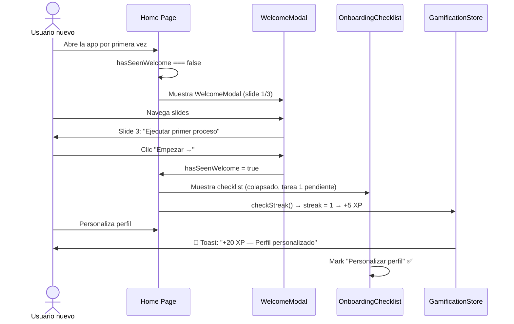
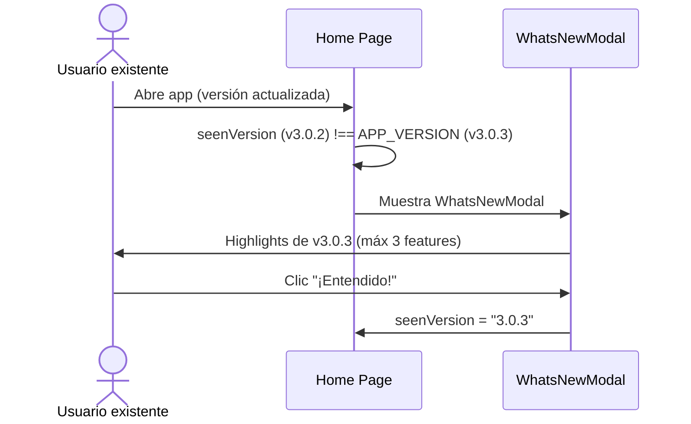
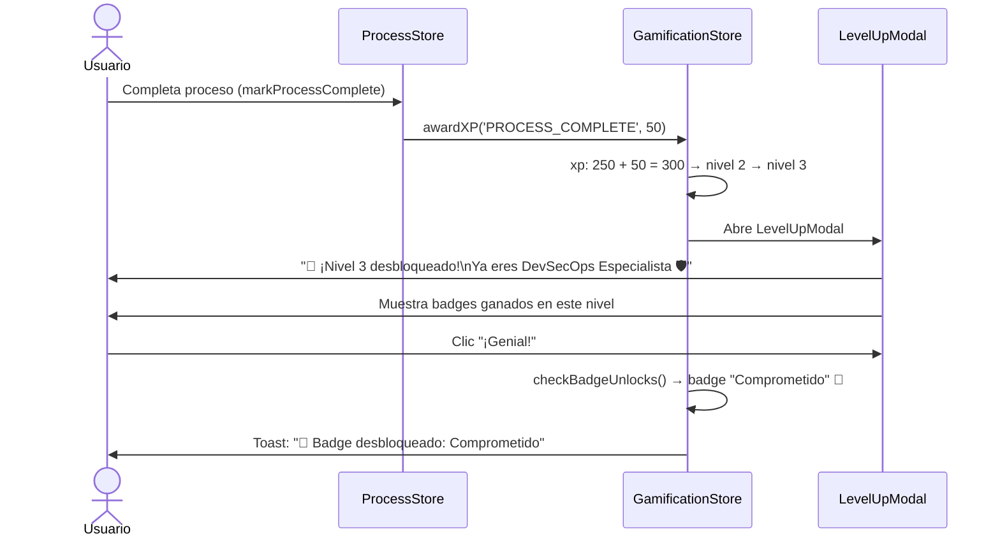

# Propuesta: Onboarding Interactivo + Gamificación — First-Time User Experience

**Estado:** 🔍 Análisis / Pre-diseño  
**Fecha:** 2026-06-02  
**Versión base:** v3.0.3  
**Autor:** Cascade (a solicitud del mantenedor)  
**Complementa:** `propuesta-monetizacion-social.md` · `propuesta-estrategia-viralizacion.md`

---

## 1. Resumen Ejecutivo

Los usuarios que entienden el valor de un producto en los primeros **90 segundos** tienen una tasa de retención 3× mayor (Appcues, 2025). El DevSecOps Process Tracker es una herramienta técnicamente poderosa pero sin ningún mecanismo de guía inicial: el usuario llega a la home page y enfrenta una lista de procesos sin contexto.

Este feature define **4 capas de experiencia de bienvenida** inspiradas en los mejores productos SaaS técnicos de 2025-2026 (Linear, Notion, GitHub, Figma, Duolingo):

1. **Welcome Modal** — primera visita: explica el producto en 3 slides animados.
2. **What's New Modal** — en actualizaciones de versión: highlights de la nueva versión.
3. **Onboarding Checklist** — lista de tareas iniciales persistente con progreso y XP.
4. **Gamificación** — sistema de XP, niveles, badges y streaks que dan sentido de progreso y activan el Loop 5 de Viralización (LinkedIn Badges).

> **Principio:** El onboarding no interrumpe. Cada componente es **opt-out** (skip en 1 clic), nunca bloquea el flujo de trabajo. La gamificación es un sistema de recompensa **no intrusivo** que celebra logros reales.

---

## 2. Estándares de FTUE 2026 — Benchmarks Analizados

| Producto | Patrón FTUE | Gamificación | Lección clave |
|---|---|---|---|
| **Linear** | Welcome modal 3 pasos + feature highlights en sidebar | No | Onboarding en contexto, no bloquea trabajo |
| **Notion** | Workspace pre-llenado con tutorial interactivo | No | El usuario aprende haciendo, no leyendo |
| **GitHub** | "Getting started" checklist dismissible en profile | Achievements (Arctic Code Vault, etc.) | Logros de hitos, visibles públicamente |
| **Figma** | Video tour corto + playground interactivo | No | Demo > explicación |
| **Duolingo** | Tutorial forzado + XP inmediato + streak | XP + Streaks + Leagues + Badges | El XP inmediato engancha; el streak retiene |
| **VS Code** | "Welcome" tab con secciones colapsables | No | Self-serve, sin interrupciones |
| **Vercel** | "Deploy your first project" checklist | No | Progress bar con recompensa visual |
| **Jira** | Wizard paso a paso (muy intrusivo) | No | **Anti-patrón:** no copiar, bloquea el trabajo |

**Patrones ganadores identificados:**
- **3-slide welcome** (no más): explica el _por qué_, el _qué_ y el _cómo_ en < 30s.
- **Checklist persistent but dismissible**: visible pero no bloqueante.
- **XP inmediato** en la primera acción: el refuerzo positivo instantáneo es clave (Duolingo data).
- **Badges públicos** (no solo internos): vincular al perfil LinkedIn amplifica el valor.
- **What's New** en cada release: mantiene a usuarios existentes engaged.

---

## 3. Arquitectura del Sistema

```
┌─────────────────────────────────────────────────────────────────┐
│                    ONBOARDING + GAMIFICATION SYSTEM             │
│                                                                 │
│  ┌─────────────────┐  ┌─────────────────┐  ┌───────────────┐  │
│  │  WelcomeModal   │  │  WhatsNewModal  │  │  ProductTour  │  │
│  │  (1ra visita)   │  │  (por versión)  │  │  (driver.js)  │  │
│  └────────┬────────┘  └────────┬────────┘  └───────┬───────┘  │
│           └────────────────────┴──────────────────┘           │
│                                │                               │
│                     useOnboardingStore                          │
│                    (Zustand + localStorage)                     │
│                                │                               │
│                                ▼                               │
│         ┌──────────────────────────────────────────┐           │
│         │        OnboardingChecklist               │           │
│         │   [ ] Perfil  [ ] Proceso  [ ] Evidencia │           │
│         │   [ ] Export  [ ] Studio   → XP → Badge  │           │
│         └──────────────────────────────────────────┘           │
│                                │                               │
│                     useGamificationStore                        │
│                  XP · Nivel · Badges · Streak                   │
│                                │                               │
│          ┌─────────────────────┴──────────────────┐            │
│          │                                        │            │
│  AchievementToast                         LevelUpModal          │
│  (toast sonner)                           (modal celebración)   │
└─────────────────────────────────────────────────────────────────┘
```

---

## 4. Componentes del Sistema

### 4.1 Welcome Modal — Primera Visita

**Trigger:** `useOnboardingStore.hasSeenWelcome === false`  
**Dismiss:** botón "Empezar" o "Saltar" → setea `hasSeenWelcome = true`

```
Slide 1: "¿Qué es DevSecOps Process Tracker?"
    Ícono: 🛡️ + animación
    Texto: "Tu kit de herramientas para ejecutar procesos DevSecOps con evidencias,
            timer y exportación auditada a Word y Excel."
    Visual: screenshot/GIF del proceso en ejecución

Slide 2: "¿Qué puedes hacer?"
    Cards de 3 acciones principales:
    ┌──────────────┐ ┌──────────────┐ ┌──────────────┐
    │ 📋 Ejecutar  │ │ 🎨 Diseñar   │ │ 📊 Exportar  │
    │  Procesos    │ │  en BPMN     │ │  Reportes    │
    │  con guía    │ │  Studio      │ │  Word/Excel  │
    └──────────────┘ └──────────────┘ └──────────────┘

Slide 3: "¿Por dónde empezar?"
    CTA principal: "Ejecutar mi primer proceso →"
    CTA secundario: "Tour interactivo"
    Link: "Saltar por ahora"
```

**Comportamiento:**
- Aparece solo 1 vez (hasta que el usuario lo ve o lo descarta)
- Animaciones suaves con Framer Motion (ya disponible en el proyecto)
- Dots de navegación entre slides
- No bloquea: presionar `Esc` o clic fuera → descarta

---

### 4.2 What's New Modal — Por Versión

**Trigger:** `useOnboardingStore.seenVersion !== APP_VERSION`  
**Dismiss:** "¡Entendido!" → `seenVersion = APP_VERSION`

```
Header: "🚀 Novedades en v3.0.3"

Feature highlights (máx 3 items):
  ├── 🎲 Animación slot-machine en selección de avatar
  │   "La selección aleatoria de héroe ahora tiene efecto de ruleta"
  ├── 🔧 Editor YAML inline en BPMN Studio
  │   "Edita el YAML generado directamente en el Studio"
  └── ✅ Tests de YAML enriquecido actualizados
      "Mayor cobertura de tests para las nuevas estructuras YAML"

Footer:
  [📋 Ver changelog completo]  [¡Entendido!]
```

**Comportamiento:**
- Solo aparece si el usuario ya completó la bienvenida (`hasSeenWelcome = true`)
- No aparece en la primera visita (se prioriza el WelcomeModal)
- El changelog en el README/GitHub se abre en nueva pestaña

---

### 4.3 Onboarding Checklist — Getting Started

**Ubicación:** panel lateral colapsable (derecha inferior) o widget en home page  
**Persistencia:** `useOnboardingStore.completedSteps[]`

```
┌─────────────────────────────────────────────┐
│  ✨ Primeros Pasos          3/5  ████░░  60% │
│  +100 XP al completar todo                  │
├─────────────────────────────────────────────┤
│  ✅ Personaliza tu perfil          +20 XP   │
│  ✅ Ejecuta tu primer proceso      +50 XP   │
│  ✅ Añade evidencia a una tarea    +15 XP   │
│  ○  Exporta un reporte             +20 XP   │
│  ○  Explora el BPMN Studio         +30 XP   │
├─────────────────────────────────────────────┤
│  [Ocultar]                  [Empezar →]     │
└─────────────────────────────────────────────┘
```

**Reglas:**
- Cada paso se marca automáticamente cuando la acción ocurre en el sistema
- Al completar todos los pasos: modal de celebración + badge 🏁 "Listo para el mundo" + 100 XP bonus
- Colapsable con estado persistido (no estorba al usuario avanzado)

---

### 4.4 Interactive Product Tour — driver.js

**Trigger:** botón "Tour interactivo" en WelcomeModal o en el header (ícono `?`)  
**Librería:** [`driver.js`](https://driverjs.com/) — 3.2kb gzip, sin dependencias, shadcn-compatible

```
Paso 1: Header → "Tu espacio de trabajo. Aquí encuentras todos los procesos disponibles."
Paso 2: Process card → "Selecciona un proceso para ejecutarlo paso a paso con evidencias."
Paso 3: User avatar → "Personaliza tu perfil: tu nombre aparecerá en los reportes exportados."
Paso 4: Process tray → "Maneja múltiples procesos a la vez. Pausa y retoma cuando necesites."
Paso 5: Theme toggle → "Modo oscuro/claro disponible. El sistema recuerda tu preferencia."
Paso 6: Footer GitHub → "El proyecto es Open Source. Contribuye o dale una ⭐ en GitHub."
[Fin] → "¡Listo! Ahora ejecuta tu primer proceso. +30 XP por completar el tour."
```

---

## 5. Sistema de Gamificación

### 5.1 Niveles y XP

| Nivel | Nombre | XP requerido | Ícono |
|:---:|---|:---:|:---:|
| 1 | Novato DevSecOps | 0 – 100 | 🌱 |
| 2 | Practicante | 101 – 300 | ⚙️ |
| 3 | Especialista | 301 – 700 | 🛡️ |
| 4 | DevSecOps Pro | 701 – 1,500 | 🚀 |
| 5 | Maestro | 1,500+ | 🏆 |

### 5.2 Tabla de XP por Acción

| Acción | XP | Primera vez |
|---|:---:|:---:|
| Completar el onboarding tour | +30 | — |
| Personalizar perfil (avatar + nombre) | +20 | — |
| Completar primera tarea | +10 | +2× |
| Completar proceso completo | +50 | +2× |
| Añadir evidencia con imagen | +15 | +2× |
| Exportar reporte Word | +20 | +2× |
| Exportar reporte Excel | +20 | +2× |
| Diseñar proceso en BPMN Studio | +30 | +2× |
| Exportar YAML desde Studio | +25 | +2× |
| Completar onboarding checklist (todos) | +100 | — |
| Streak diario (sesión en el día) | +5 | — |
| Compartir completion card (LinkedIn/Twitter) | +25 | — |

### 5.3 Badges (Logros)

| Badge | Nombre | Requisito | LinkedIn |
|:---:|---|---|:---:|
| 🚀 | Primer Despegue | Ejecutar el primer proceso | No |
| 🔍 | Primer Investigador | Añadir primera evidencia | No |
| 📊 | Analista | Exportar primer reporte Word o Excel | No |
| 🎨 | Arquitecto de Procesos | Crear primer diagrama en BPMN Studio | No |
| ⚡ | Velocista | Completar un proceso en < 30 min | No |
| 🏁 | Listo para el Mundo | Completar el onboarding checklist | No |
| 🏅 | Comprometido | Completar 5 procesos | Sí |
| 🛡️ | Guardian de la Seguridad | 5 procesos categoría `security` | Sí |
| ⭐ | DevOps Practitioner | 5 procesos categoría `deployment` o `reliability` | Sí |
| 🔥 | Racha Semanal | 7 días consecutivos de actividad | No |
| 🎯 | Maestro del Proceso | Completar 20 procesos | Sí |
| 🌐 | Contribuidor | Publicar proceso al Community Marketplace | Sí |

Los badges marcados con **Sí** en LinkedIn pueden compartirse como certificaciones (ver `propuesta-estrategia-viralizacion.md` Loop 5).

### 5.4 Streak — Rachas Diarias

```typescript
// Lógica de streak (en useGamificationStore)
interface StreakState {
  currentStreak: number;         // días consecutivos
  longestStreak: number;         // récord histórico
  lastActiveDate: string;        // 'YYYY-MM-DD'
  streakFreezeUsed: boolean;     // 1 congelación gratuita/semana (Duolingo pattern)
}

// Al cargar la app: comparar lastActiveDate con hoy
// - Mismo día → no sumar (ya contado)
// - Día anterior → streak++ + +5 XP
// - Diferencia > 1 día → streak = 1 (reset) o aplicar freeze
```

---

## 6. Flujos de Usuario

### 6.1 Primera visita



### 6.2 Retorno con nueva versión



### 6.3 Level Up



---

## 7. Modelo de Datos — Nuevos Zustand Stores

### 7.1 `useOnboardingStore` (`lib/onboarding-store.ts`)

```typescript
interface OnboardingStore {
  hasSeenWelcome: boolean;
  seenVersion: string;               // última versión cuyo WhatsNew fue visto
  completedSteps: OnboardingStep[];  // pasos del checklist completados
  tourCompleted: boolean;
  isChecklistCollapsed: boolean;

  // Actions
  completeWelcome: () => void;
  markVersionSeen: (version: string) => void;
  markStepCompleted: (step: OnboardingStep) => void;
  completeTour: () => void;
  setChecklistCollapsed: (collapsed: boolean) => void;
  isStepCompleted: (step: OnboardingStep) => boolean;
  getChecklistProgress: () => number; // 0-100
}

type OnboardingStep =
  | 'customize-profile'
  | 'execute-first-process'
  | 'add-evidence'
  | 'export-report'
  | 'explore-studio';
```

### 7.2 `useGamificationStore` (`lib/gamification-store.ts`)

```typescript
interface GamificationStore {
  xp: number;
  level: number;                  // 1-5
  badges: BadgeId[];              // IDs de badges desbloqueados
  streak: StreakState;
  stats: UserStats;
  pendingLevelUp: boolean;        // flag para abrir LevelUpModal
  pendingBadges: BadgeId[];       // badges recién ganados (para toast)

  // Actions
  awardXP: (action: XPAction, isFirstTime?: boolean) => void;
  checkStreakOnOpen: () => void;    // llamar al montar la app
  unlockBadge: (badge: BadgeId) => void;
  checkBadgeUnlocks: () => void;   // revisar condiciones post-XP
  dismissLevelUp: () => void;
  dismissPendingBadges: () => void;
  getXPForNextLevel: () => number;
  getProgressToNextLevel: () => number; // 0-100
}

interface UserStats {
  totalProcessesCompleted: number;
  totalTasksCompleted: number;
  totalEvidenceAdded: number;
  totalReportsExported: number;
  bpmnDiagramsCreated: number;
  totalTimeInvestedMs: number;
}

type XPAction =
  | 'TOUR_COMPLETED' | 'PROFILE_CUSTOMIZED'
  | 'FIRST_TASK' | 'PROCESS_COMPLETE'
  | 'EVIDENCE_WITH_IMAGE' | 'EXPORT_WORD'
  | 'EXPORT_EXCEL' | 'BPMN_DIAGRAM_CREATED'
  | 'YAML_EXPORTED' | 'ONBOARDING_COMPLETE'
  | 'DAILY_STREAK' | 'SHARE_COMPLETION';

type BadgeId =
  | 'first-launch' | 'first-investigator' | 'analyst'
  | 'architect' | 'speedster' | 'world-ready'
  | 'committed' | 'security-guardian' | 'devops-practitioner'
  | 'weekly-streak' | 'process-master' | 'contributor';
```

---

## 8. Stack Técnico

| Herramienta | Propósito | Tamaño | Ya en proyecto |
|---|---|:---:|:---:|
| **Framer Motion** | Animaciones WelcomeModal, LevelUpModal, badge pop | ~35kb | Por confirmar |
| **driver.js** | Product tour interactivo | 3.2kb gzip | ❌ Nueva dep. |
| **Zustand** | `useOnboardingStore` + `useGamificationStore` | — | ✅ |
| **lz-string** | Compresión de los nuevos stores | — | ✅ |
| **sonner** | Achievement toasts + XP toasts | — | ✅ |
| **shadcn/ui Dialog** | WelcomeModal, WhatsNewModal, LevelUpModal | — | ✅ |
| **Lucide icons** | Badge icons, XP icons | — | ✅ |

**`driver.js` integración:**
```bash
npm install driver.js
# tamaño: 3.2kb gzip, 0 dependencias, soporte TypeScript nativo
```

---

## 9. Impacto en Sistema Actual

| Componente | Cambio | Impacto |
|---|---|---|
| `app/layout.tsx` | Montar `<OnboardingController />` (lee stores, muestra modales) | 🟢 Bajo |
| `app/page.tsx` | Mostrar `<OnboardingChecklist />` y trigger `checkStreakOnOpen()` | 🟡 Medio |
| `app/process/page.tsx` | Llamar `awardXP` en `markProcessComplete`, `completeTask` | 🟡 Medio |
| `lib/word-generator.ts` | Llamar `awardXP('EXPORT_WORD')` tras exportar | 🟢 Bajo |
| `app/studio/page.tsx` | Llamar `awardXP('BPMN_DIAGRAM_CREATED')` y `awardXP('YAML_EXPORTED')` | 🟢 Bajo |
| `components/user-profile-popover.tsx` | Llamar `awardXP('PROFILE_CUSTOMIZED')` al guardar | 🟢 Bajo |
| `lib/onboarding-store.ts` | **Nuevo store** Zustand persistido | 🟢 Bajo |
| `lib/gamification-store.ts` | **Nuevo store** Zustand persistido | 🟢 Bajo |
| `components/welcome-modal.tsx` | **Nuevo componente** 3-slide modal | 🟡 Medio |
| `components/whats-new-modal.tsx` | **Nuevo componente** version highlights | 🟡 Medio |
| `components/onboarding-checklist.tsx` | **Nuevo componente** collapsible widget | 🟡 Medio |
| `components/gamification-hud.tsx` | **Nuevo componente** XP/level display en header | 🟡 Medio |
| `components/level-up-modal.tsx` | **Nuevo componente** celebración de nivel | 🟡 Medio |
| `hooks/useProductTour.ts` | **Nuevo hook** wrapper de driver.js | 🟢 Bajo |

**Sin breaking changes.** Todos los nuevos componentes se montan condicionalmente sobre el sistema existente.

---

## 10. Roadmap de Implementación

```
Fase 1 — Stores + WelcomeModal (Semanas 1-2)
    ├── lib/onboarding-store.ts
    ├── lib/gamification-store.ts
    ├── components/welcome-modal.tsx (3 slides, Framer Motion)
    └── app/layout.tsx: montar OnboardingController

Fase 2 — What's New + Checklist (Semanas 3-4)
    ├── components/whats-new-modal.tsx
    ├── components/onboarding-checklist.tsx (5 pasos + XP)
    ├── Integrar awardXP en process/page.tsx y studio/page.tsx
    └── components/gamification-hud.tsx (mini widget XP en header)

Fase 3 — Tour + Badges + Level Up (Mes 2)
    ├── npm install driver.js
    ├── hooks/useProductTour.ts (6 pasos del tour)
    ├── components/level-up-modal.tsx (Framer Motion celebración)
    ├── Integrar checkBadgeUnlocks en gamification-store
    └── Achievement toasts via sonner (ya configurado)

Fase 4 — LinkedIn Badge Integration (Mes 3)
    ├── Conectar badges calificados con LinkedIn "Add Certification"
    ├── URL prefill para los 4 badges LinkedIn-eligible
    └── Integración con Loop 5 de propuesta-estrategia-viralizacion.md
```

---

## 11. Métricas de Éxito

| Métrica | Baseline | Objetivo mes 3 |
|---|---|---|
| % usuarios que completan el onboarding checklist | 0% | 40% |
| % usuarios que ejecutan ≥ 1 proceso en primera sesión | ? | 65% |
| Retención a 7 días | ? | 30% |
| Retención a 30 días | ? | 15% |
| Badges LinkedIn publicados | 0 | 20 |
| Streak promedio | — | 4 días |
| NPS cualitativo | — | Medir en GitHub Discussions |

---

## 12. Decisiones Pendientes

| # | Decisión | Opciones | Impacto |
|:---:|---|---|---|
| 1 | **¿Framer Motion ya instalado?** | Confirmar en `package.json` · instalar si no | Animaciones welcome/level-up |
| 2 | **¿GamificationHUD en header o como fab?** | Badge pequeño junto al avatar · FAB bottom-right | UX y visibilidad del nivel |
| 3 | **¿Mostrar XP/nivel de otros usuarios?** | Solo local/privado · público en perfil | Alcance social vs privacidad |
| 4 | **¿Streak con congelación (streak freeze)?** | Solo conteo simple · con 1 freeze semanal (Duolingo) | Complejidad vs retención |
| 5 | **¿Contenido del WhatsNew hardcoded o desde JSON?** | Hardcoded por versión · `public/whats-new.json` | Mantenimiento al hacer releases |
| 6 | **¿Mostrar checklist en mobile?** | Oculto en mobile (bottom sheet) · visible siempre | Responsive design |
| 7 | **¿Agregar leaderboard en el futuro?** | Solo individual · ranking entre usuarios | Requiere auth + multi-user |

---

## 13. Próximos Pasos Recomendados

1. **Confirmar si Framer Motion está instalado** (`package.json`) — si no, evaluar `@formkit/auto-animate` (1kb) como alternativa.
2. **Crear `lib/onboarding-store.ts`** — mínimo: `hasSeenWelcome`, `seenVersion`, `completedSteps`. Esto habilita Welcome + What's New.
3. **Crear `lib/gamification-store.ts`** con XP, level, badges, streak. Persistir con `createCompressedStorage` (ya disponible).
4. **Implementar `WelcomeModal`** como primera iteración — 3 slides estáticos, sin animaciones. Shippeable en < 1 día.
5. **Integrar `awardXP`** en los 3 puntos de mayor frecuencia: `markProcessComplete`, `completeTask`, `handleExportWord`.
6. **Instalar `driver.js`** (`npm install driver.js`) y crear el tour de 6 pasos.
7. **Definir `public/whats-new.json`** como fuente de datos para el `WhatsNewModal` y actualizar en cada release.

---

*Documento de análisis pre-diseño · v1.0 · 2026-06-02*
